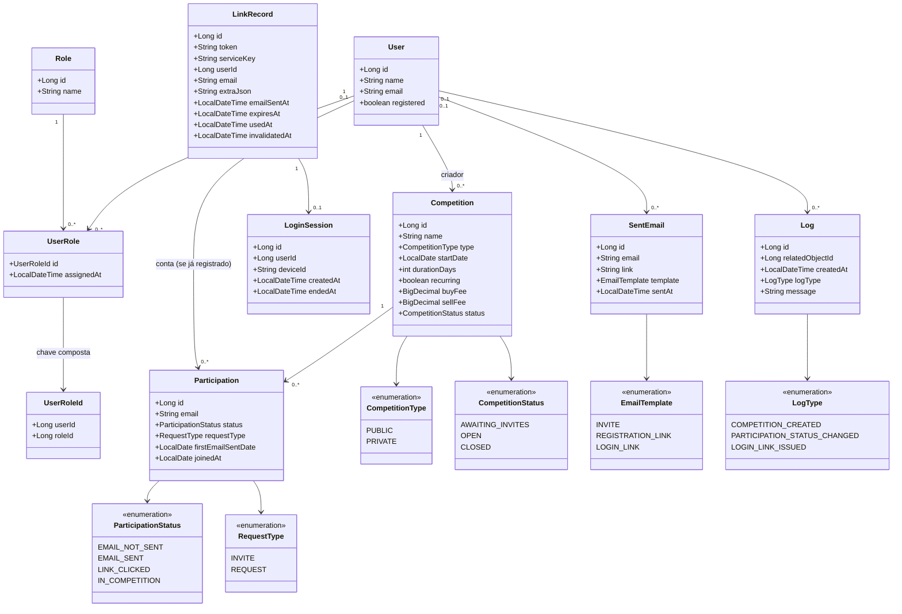
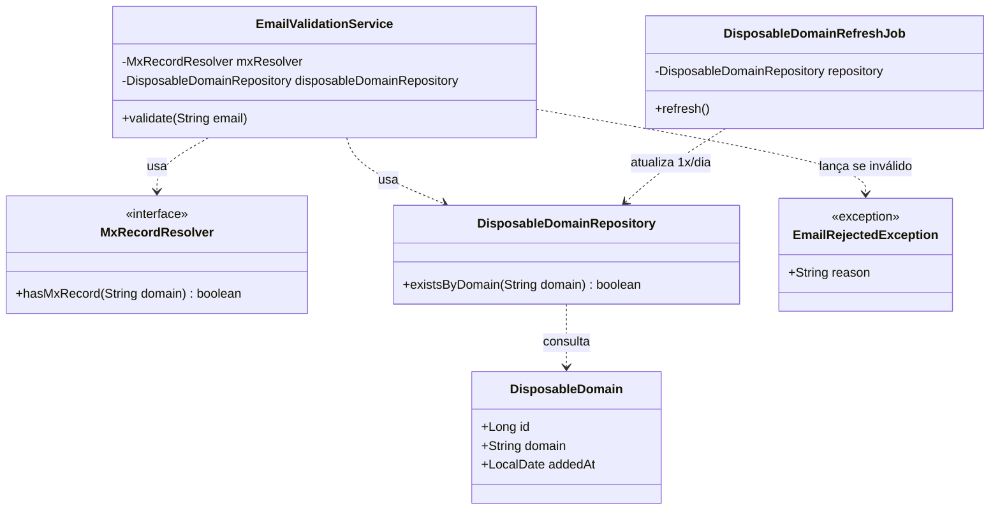
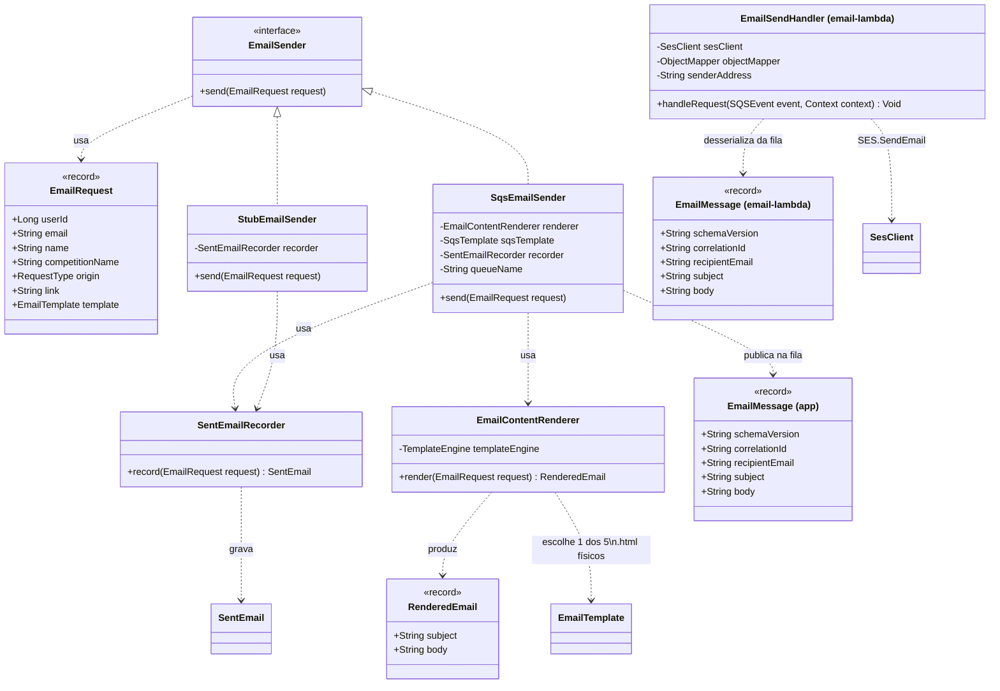

# Diagrama de classes — Jogo de Ações

Três partes: o domínio principal, o pacote de verificação de e-mail e o pacote de e-mail
assíncrono (produtor no sistema principal, consumidor numa AWS Lambda separada).
Getters/setters omitidos por brevidade; só os campos/relacionamentos que aparecem no
[DER](der.md) estão desenhados.

## Domínio principal

`RoleName` (não desenhada) não é entidade — é uma classe utilitária com as constantes de
string `ADMINISTRATOR`/`PLAYER`, evitando *magic strings* onde o código compara contra
`Role.name`; a tabela `role` continua sendo dados, não um enum Java, pra permitir novos papéis
sem alterar código (comentário original em `RoleName.java`).

`LinkRecord`/`LoginSession.userId` não têm relacionamento desenhado com `User` (nem
`LinkRecord.extraJson` com `Participation`) — desde a spec 05-003, ambas vivem no módulo
`link`, que não conhece `User`/`Participation` (módulos `login`/`competition`); ver
[`der.md`](der.md#notas-de-modelagem) para o raciocínio completo. `LinkRouter`/`LinkHandler`
(o mecanismo que desacopla `link` dos seus consumidores) e os diagramas de acoplamento
antes/depois vivem em `specs/05-003-desacoplamento-login-link/spec.md`, não aqui — este
diagrama cobre só as entidades JPA persistidas, alinhado ao DER.

## Verificação de e-mail

Checagem de MX/domínio descartável feita antes de aceitar um e-mail em qualquer ponto de
coleta (convite, pedido de entrada, pedido de login) — ver diagrama de sequência
correspondente em [`sequencia.md`](sequencia.md).

## E-mail assíncrono

Lado produtor (`app/`, pacote `io.deployo.jogoacoes.email`) e consumidor (`email-lambda/`,
pacote `io.deployo.jogoacoes.email.lambda`).

`EmailMessage` existe **duas vezes** — uma cópia em cada lado (`app/`/`email-lambda/`), de
propósito: é o contrato da fila, não um tipo compartilhado num módulo comum, pra nenhum dos
dois lados forçar release do outro se mudar. `StubEmailSender` é a implementação ativa em
`sandbox`/testes; `SqsEmailSender` em `docker`/`staging`/`production`.
