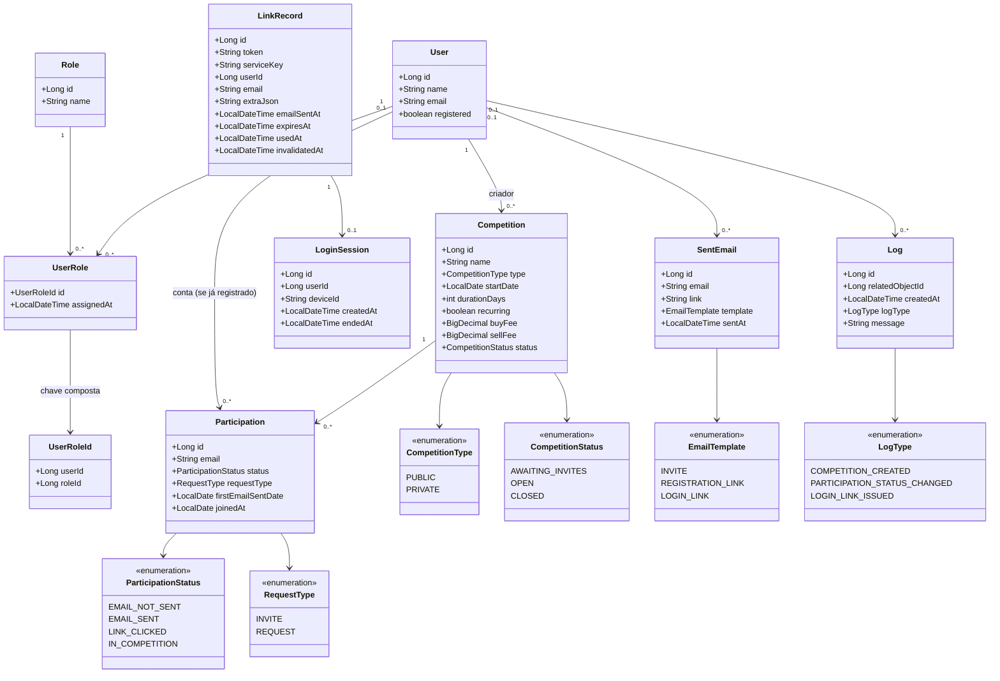
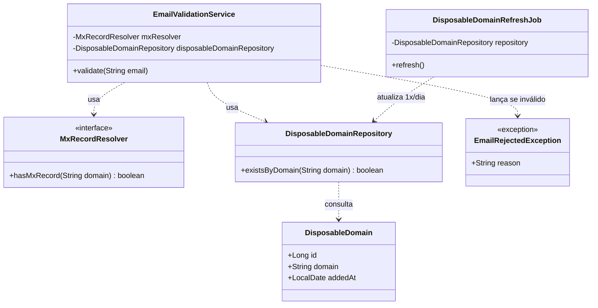
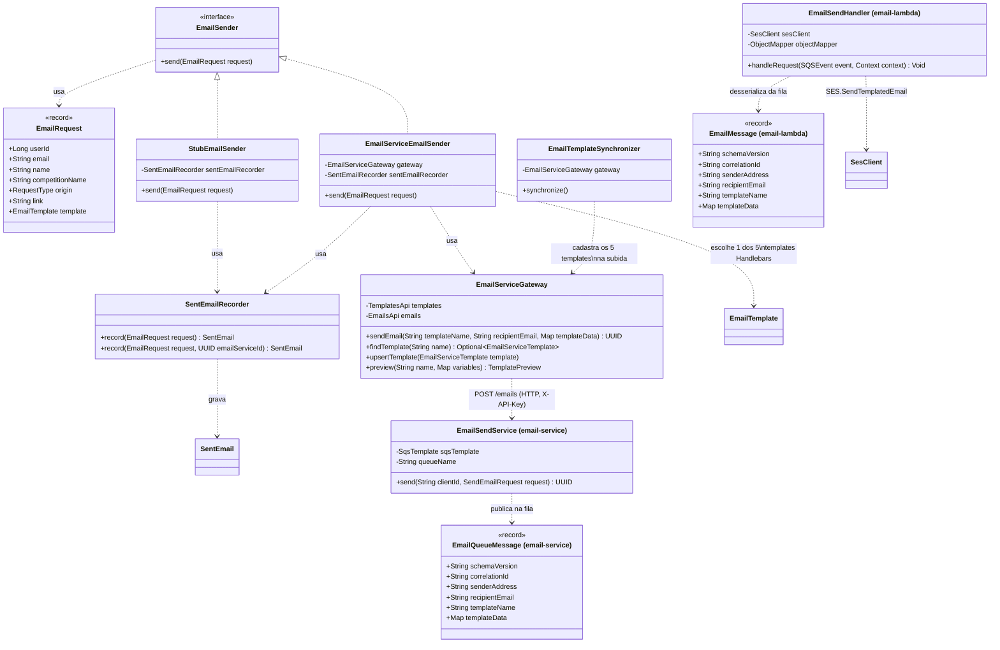

# Diagrama de classes — Jogo de Ações

Três partes: o domínio principal, o pacote de verificação de e-mail e o pacote de e-mail
assíncrono (produtor no sistema principal, consumidor numa AWS Lambda separada).
Getters/setters omitidos por brevidade; só os campos/relacionamentos que aparecem no
[DER](der.md) estão desenhados.

## Domínio principal

```mermaid
classDiagram
    class User {
        +Long id
        +String name
        +String email
        +boolean registered
    }
    class Role {
        +Long id
        +String name
    }
    class UserRoleId {
        +Long userId
        +Long roleId
    }
    class UserRole {
        +UserRoleId id
        +LocalDateTime assignedAt
    }
    class Competition {
        +Long id
        +String name
        +CompetitionType type
        +LocalDate startDate
        +int durationDays
        +boolean recurring
        +BigDecimal buyFee
        +BigDecimal sellFee
        +CompetitionStatus status
    }
    class Participation {
        +Long id
        +String email
        +ParticipationStatus status
        +RequestType requestType
        +LocalDate firstEmailSentDate
        +LocalDate joinedAt
    }
    class LinkRecord {
        +Long id
        +String token
        +String serviceKey
        +Long userId
        +String email
        +String extraJson
        +LocalDateTime emailSentAt
        +LocalDateTime expiresAt
        +LocalDateTime usedAt
        +LocalDateTime invalidatedAt
    }
    class LoginSession {
        +Long id
        +Long userId
        +String deviceId
        +LocalDateTime createdAt
        +LocalDateTime endedAt
    }
    class Log {
        +Long id
        +Long relatedObjectId
        +LocalDateTime createdAt
        +LogType logType
        +String message
    }
    class SentEmail {
        +Long id
        +String email
        +String link
        +EmailTemplate template
        +LocalDateTime sentAt
    }
    class CompetitionType {
        <<enumeration>>
        PUBLIC
        PRIVATE
    }
    class CompetitionStatus {
        <<enumeration>>
        AWAITING_INVITES
        OPEN
        CLOSED
    }
    class ParticipationStatus {
        <<enumeration>>
        EMAIL_NOT_SENT
        EMAIL_SENT
        LINK_CLICKED
        IN_COMPETITION
    }
    class RequestType {
        <<enumeration>>
        INVITE
        REQUEST
    }
    class EmailTemplate {
        <<enumeration>>
        INVITE
        REGISTRATION_LINK
        LOGIN_LINK
    }
    class LogType {
        <<enumeration>>
        COMPETITION_CREATED
        PARTICIPATION_STATUS_CHANGED
        LOGIN_LINK_ISSUED
    }

    User "1" --> "0..*" UserRole : papéis
    Role "1" --> "0..*" UserRole
    UserRole --> UserRoleId : chave composta
    User "1" --> "0..*" Competition : criador
    Competition "1" --> "0..*" Participation
    User "0..1" --> "0..*" Participation : conta (se já registrado)
    LinkRecord "1" --> "0..1" LoginSession
    User "0..1" --> "0..*" Log
    User "0..1" --> "0..*" SentEmail
    Competition --> CompetitionType
    Competition --> CompetitionStatus
    Participation --> ParticipationStatus
    Participation --> RequestType
    SentEmail --> EmailTemplate
    Log --> LogType
```

`RoleName` (não desenhada) não é entidade — é uma classe utilitária com as constantes de
string `ADMINISTRATOR`/`PLAYER`, evitando *magic strings* onde o código compara contra
`Role.name`; a tabela `role` continua sendo dados, não um enum Java, pra permitir novos papéis
sem alterar código (comentário original em `RoleName.java`).

`LinkRecord`/`LoginSession.userId` não têm relacionamento desenhado com `User` (nem
`LinkRecord.extraJson` com `Participation`) — desde a spec 05-003, `LinkRecord` vive no módulo
`link`, que não conhece `User`/`Participation` (módulos `user`/`competition`), e `LoginSession`
(em `loginsession` desde a spec 05-027, antes também em `link`) manteve a mesma decisão; ver
[`der.md`](der.md#notas-de-modelagem) para o raciocínio completo. `LinkRouter`/`LinkHandler`
(o mecanismo que desacopla `link` dos seus consumidores) e os diagramas de acoplamento
antes/depois vivem em `specs/05-003-desacoplamento-login-link/spec.md`, não aqui — este
diagrama cobre só as entidades JPA persistidas, alinhado ao DER.

## Verificação de e-mail

Checagem de MX/domínio descartável feita antes de aceitar um e-mail em qualquer ponto de
coleta (convite, pedido de entrada, pedido de login) — ver diagrama de sequência
correspondente em [`sequencia.md`](sequencia.md).

```mermaid
classDiagram
    class EmailValidationService {
        -MxRecordResolver mxResolver
        -DisposableDomainRepository disposableDomainRepository
        +validate(String email)
    }
    class MxRecordResolver {
        <<interface>>
        +hasMxRecord(String domain) boolean
    }
    class DisposableDomainRepository {
        +existsByDomain(String domain) boolean
    }
    class DisposableDomain {
        +Long id
        +String domain
        +LocalDate addedAt
    }
    class EmailRejectedException {
        <<exception>>
        +String reason
    }
    class DisposableDomainRefreshJob {
        -DisposableDomainRepository repository
        +refresh()
    }

    EmailValidationService ..> MxRecordResolver : usa
    EmailValidationService ..> DisposableDomainRepository : usa
    EmailValidationService ..> EmailRejectedException : lança se inválido
    DisposableDomainRepository ..> DisposableDomain : consulta
    DisposableDomainRefreshJob ..> DisposableDomainRepository : atualiza 1x/dia
```

## E-mail assíncrono

Três lados: o cliente no `app/` (pacote `dev.leilaalgarve.jogoacoes.email`), que chama o
`email-service` de forma síncrona (spec 05-034); o `email-service/` (pacote
`dev.leilaalgarve.jogoacoes.emailservice.send`), que publica na fila SQS; e o consumidor
`email-lambda/` (pacote `dev.leilaalgarve.jogoacoes.email.lambda`), que pede ao Amazon SES o
envio do template (spec 05-031).

```mermaid
classDiagram
    class EmailSender {
        <<interface>>
        +send(EmailRequest request)
    }
    class EmailRequest {
        <<record>>
        +Long userId
        +String email
        +String name
        +String competitionName
        +RequestType origin
        +String link
        +EmailTemplate template
    }
    class StubEmailSender {
        -SentEmailRecorder sentEmailRecorder
        +send(EmailRequest request)
    }
    class EmailServiceEmailSender {
        -EmailServiceGateway gateway
        -SentEmailRecorder sentEmailRecorder
        +send(EmailRequest request)
    }
    class EmailServiceGateway {
        -TemplatesApi templates
        -EmailsApi emails
        +sendEmail(String templateName, String recipientEmail, Map templateData) UUID
        +findTemplate(String name) Optional~EmailServiceTemplate~
        +upsertTemplate(EmailServiceTemplate template)
        +preview(String name, Map variables) TemplatePreview
    }
    class EmailTemplateSynchronizer {
        -EmailServiceGateway gateway
        +synchronize()
    }
    class SentEmailRecorder {
        +record(EmailRequest request) SentEmail
        +record(EmailRequest request, UUID emailServiceId) SentEmail
    }

    EmailSender <|.. StubEmailSender
    EmailSender <|.. EmailServiceEmailSender
    EmailSender ..> EmailRequest : usa
    StubEmailSender ..> SentEmailRecorder : usa
    EmailServiceEmailSender ..> EmailServiceGateway : usa
    EmailServiceEmailSender ..> SentEmailRecorder : usa
    EmailServiceEmailSender ..> EmailTemplate : escolhe 1 dos 5\ntemplates Handlebars
    EmailTemplateSynchronizer ..> EmailServiceGateway : cadastra os 5 templates\nna subida
    SentEmailRecorder ..> SentEmail : grava

    class EmailSendService["EmailSendService (email-service)"] {
        -SqsTemplate sqsTemplate
        -String queueName
        +send(String clientId, SendEmailRequest request) UUID
    }
    class EmailQueueMessage["EmailQueueMessage (email-service)"] {
        <<record>>
        +String schemaVersion
        +String correlationId
        +String senderAddress
        +String recipientEmail
        +String templateName
        +Map templateData
    }
    EmailServiceGateway ..> EmailSendService : POST /emails (HTTP, X-API-Key)
    EmailSendService ..> EmailQueueMessage : publica na fila

    class EmailSendHandler["EmailSendHandler (email-lambda)"] {
        -SesClient sesClient
        -ObjectMapper objectMapper
        +handleRequest(SQSEvent event, Context context) Void
    }
    class EmailMessage_lambda["EmailMessage (email-lambda)"] {
        <<record>>
        +String schemaVersion
        +String correlationId
        +String senderAddress
        +String recipientEmail
        +String templateName
        +Map templateData
    }
    EmailSendHandler ..> EmailMessage_lambda : desserializa da fila
    EmailSendHandler ..> SesClient : SES.SendTemplatedEmail
```

O contrato da fila existe **duas vezes**, uma cópia em cada lado (`EmailQueueMessage` no
`email-service/`, `EmailMessage` no `email-lambda/`), de propósito: é o contrato da fila, não um
tipo compartilhado num módulo comum, pra nenhum dos dois lados forçar release do outro se mudar.
Entre `app/` e `email-service/` o contrato é o OpenAPI `docs/openapi-email-service.yaml`, do qual
o cliente OpenFeign do `app/` é gerado; não há nenhuma classe Java compartilhada. `templateName`
na fila é o nome com namespace no SES (`jogo-acoes__<nome>`), e o SES renderiza o template com
`templateData` na hora do envio. `StubEmailSender` é a implementação padrão (`email.sender`
ausente ou `stub`: testes e suítes Cucumber); `EmailServiceEmailSender` ativa com
`email.sender=email-service` (container `app` do `docker-compose.yml`, `staging`, `production`).
