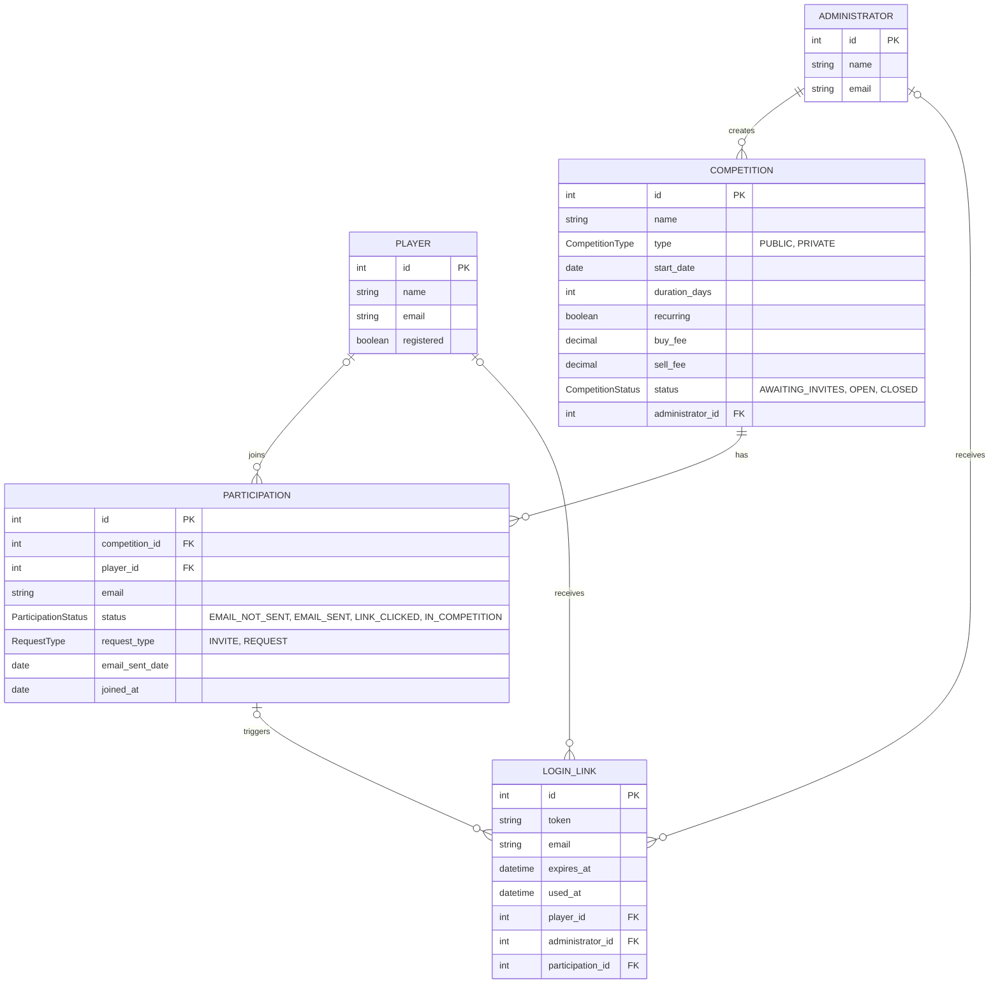

# DER — Jogo de Ações

Modelo de entidades e relacionamentos derivado dos arquivos `.feature` em `src/test/resources/features`:
`create_competition`, `login`, `manage_competition_players`, `request_competition_entry`.

## Notas de modelagem

- **PARTICIPATION** é a entidade associativa entre `PLAYER` e `COMPETITION` — carrega o e-mail e o status do convite/pedido de entrada (`manage_competition_players.feature`, linhas 11–75), por isso `player_id` é opcional: um convidado pode existir na lista antes de ter uma conta `PLAYER` registrada.
- `request_type` distingue convite do administrador (competição privada) de pedido de entrada do próprio jogador (competição pública), conforme `request_competition_entry.feature` e `create_competition.feature` (envio de convites).
- **LOGIN_LINK** modela o link mágico de `login.feature`. Pode estar associado a um `PARTICIPATION` específico (confirmação de entrada numa competição) ou ser um pedido de login genérico de um `PLAYER`/`ADMINISTRATOR` já registrado.
- Regras de validação (data no passado, taxa negativa, e-mail duplicado/ inválido, captcha) são regras de negócio, não entidades, e por isso não aparecem no DER.

## Enums

Campos String com conjunto fixo de valores viraram tipos `enum`, com constantes na convenção Java (`UPPER_SNAKE_CASE`):

| Enum | Constantes |
|---|---|
| `CompetitionType` | `PUBLIC`, `PRIVATE` |
| `CompetitionStatus` | `AWAITING_INVITES`, `OPEN`, `CLOSED` |
| `ParticipationStatus` | `EMAIL_NOT_SENT`, `EMAIL_SENT`, `LINK_CLICKED`, `IN_COMPETITION` |
| `RequestType` | `INVITE`, `REQUEST` |
