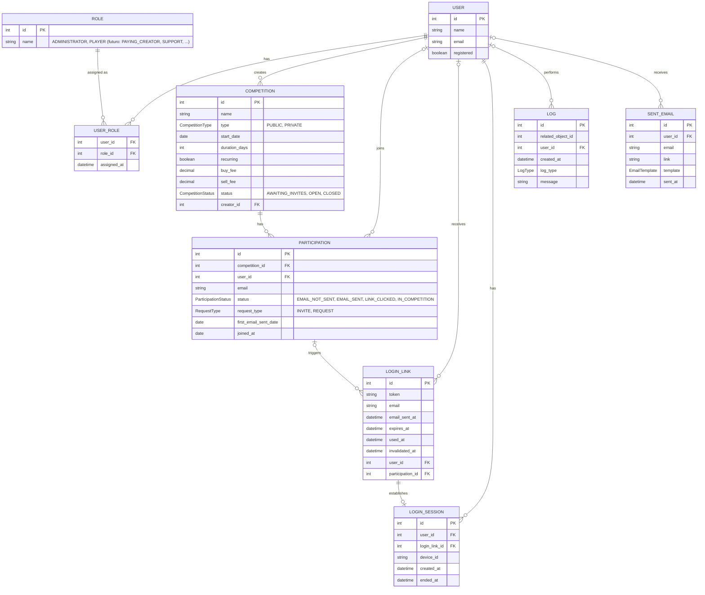

# DER — Jogo de Ações

Modelo de entidades e relacionamentos derivado dos arquivos `.feature` em `src/test/resources/features`:
`create_competition`, `login`, `manage_competition_players`, `request_competition_entry`.

## Notas de modelagem

- **USER** unifica o que antes eram `ADMINISTRATOR` e `PLAYER` — as duas entidades tinham praticamente os mesmos atributos, e hoje o único papel que pode criar competições é o administrador, mas a regra de negócio já prevê evoluir para usuários pagantes e, futuramente, suporte. Modelar isso como atributo fixo do usuário exigiria migração de schema a cada novo papel; com **ROLE** + **USER_ROLE** (N:N), um usuário pode acumular papéis (ex.: jogador que também é criador pagante) sem alterar a estrutura.
- Quem pode acessar a tela de criação de competição (`create_competition.feature`, cenário "Non-administrator tries to access...") é uma regra de permissão avaliada sobre `USER_ROLE`, não uma restrição estrutural do DER — por isso `COMPETITION.creator_id` aponta para `USER`, não para um tipo específico.
- **PARTICIPATION** continua sendo a entidade associativa entre `USER` e `COMPETITION` — carrega o e-mail e o status do convite/pedido de entrada (`manage_competition_players.feature`, linhas 11–75). `user_id` é opcional porque um convidado/solicitante pode existir na lista antes de ter uma conta registrada.
- `request_type` distingue convite do administrador (competição privada) de pedido de entrada do próprio jogador (competição pública), conforme `request_competition_entry.feature` e `create_competition.feature` (envio de convites).
- **LOGIN_LINK** modela o link mágico de `login.feature`. Unificar `ADMINISTRATOR`/`PLAYER` em `USER` também simplificou esta entidade: antes tinha três FKs opcionais mutuamente exclusivas (`player_id`, `administrator_id`, `participation_id`); agora são só duas — `user_id` (pedido de login direto de um usuário já registrado, qualquer papel) ou `participation_id` (confirmação de entrada numa competição, inclusive para quem ainda não tem conta).
- `PARTICIPATION.first_email_sent_date` guarda só a data do **primeiro** e-mail (não é mais atualizada a reenvios) — cada reenvio agora gera um novo `LOGIN_LINK`, e é o `email_sent_at` **desse** link que registra quando aquele envio específico aconteceu. `LOGIN_LINK.invalidated_at` marca quando um link deixou de valer antes do vencimento natural (`expires_at`) — por ser substituído por um link mais novo, ou por ter sido usado no dispositivo errado (ver regras abaixo).
- **Um link só pode logar no dispositivo que o usou primeiro.** Usar o mesmo link novamente em outro dispositivo é rejeitado — a exceção é quando o jogador já está logado no dispositivo atual: nesse caso não há erro, já que não é um login de fato (só redireciona para onde ele já está). Isso é avaliado combinando `LOGIN_LINK.used_at`/`invalidated_at` com `LOGIN_SESSION.device_id`, não uma restrição estrutural do DER.
- **Só um `LOGIN_LINK` fica ativo por vez por jogador** — gerar um novo (ex.: reenvio) invalida qualquer link anterior ainda não usado/expirado desse jogador (`invalidated_at` preenchido no anterior).
- **LOGIN_SESSION** é o log de sessões/dispositivos logados, criado para sustentar um limite de dispositivos simultâneos por usuário (`login.feature`). Cada uso bem-sucedido de um `LOGIN_LINK` cria no máximo uma `LOGIN_SESSION` (por isso `LOGIN_LINK ||--o| LOGIN_SESSION`). O **valor do limite** é configuração do sistema, não um dado modelado aqui; o que acontece ao ser excedido (ex.: encerrar a sessão mais antiga) é regra de negócio a confirmar antes da Iteração 3 — ver `docs/iteracao-2.md`.
- **LOG** é o registro de auditoria do sistema. `related_object_id` aponta pro registro que originou o evento (qual tabela é dada pelo `log_type`, não por uma FK — a referência é polimórfica, então não há restrição estrutural de integridade referencial nesse campo). `user_id` é opcional: nem todo evento de log é iniciado por um usuário (ex.: um job de sistema). O papel de banco da aplicação (`jogo_acoes_app`, ver `docker-compose.yml`) só tem `SELECT`/`INSERT` em `LOG` — nunca `UPDATE`/`DELETE`, pra manter o log imutável.
- **SENT_EMAIL** registra cada envio de e-mail (Iteração 3: `EmailSender`/`StubEmailSender` só grava aqui, não envia de verdade — a geração de texto via Thymeleaf fica pra outra iteração). `user_id` é opcional pelo mesmo motivo de `PARTICIPATION`/`LOGIN_LINK`: o destinatário pode ainda não ter conta. `link` é o link enviado (convite, confirmação de registro ou login) e `template` (`EmailTemplate`) identifica qual modelo foi usado. Mesma regra de imutabilidade de `LOG`: `jogo_acoes_app` só tem `SELECT`/`INSERT`.
- Regras de validação (data no passado, taxa negativa, e-mail duplicado/inválido, captcha) são regras de negócio, não entidades, e por isso não aparecem no DER.
- Não modelado (fora do escopo atual): unicidade de `(competition_id, email)` em `PARTICIPATION` e o relacionamento entre edições de uma competição recorrente — ambos regras/decisões de implementação a definir antes da próxima iteração.

## Enums

Campos String com conjunto fixo de valores viraram tipos `enum`, com constantes na convenção Java (`UPPER_SNAKE_CASE`):

| Enum | Constantes |
|---|---|
| `CompetitionType` | `PUBLIC`, `PRIVATE` |
| `CompetitionStatus` | `AWAITING_INVITES`, `OPEN`, `CLOSED` |
| `ParticipationStatus` | `EMAIL_NOT_SENT`, `EMAIL_SENT`, `LINK_CLICKED`, `IN_COMPETITION` |
| `RequestType` | `INVITE`, `REQUEST` |
| `LogType` | catálogo inicial/placeholder — ver nota abaixo |
| `EmailTemplate` | `INVITE`, `REGISTRATION_LINK`, `LOGIN_LINK` |

`ROLE` não é um enum fixo (é uma tabela) justamente para permitir adicionar novos papéis sem alterar código; hoje o catálogo tem apenas `ADMINISTRATOR` e `PLAYER`.

`LogType` é diferente dos outros enums: cada constante carrega, além do nome, uma descrição
e a tabela relacionada (`related_object_id` refere-se a ela). Catálogo por tabela sofreria o
mesmo problema — adicionar um tipo novo exige alterar código de qualquer forma, já que o
`log_type` decide como interpretar `related_object_id` — então um enum é mais simples que
uma tabela de catálogo aqui. O conjunto de valores em `docs/iteracao-2.md`/`LogType.java` é
um placeholder mínimo: o catálogo real de eventos auditáveis é uma decisão de negócio da
Iteração 3.
