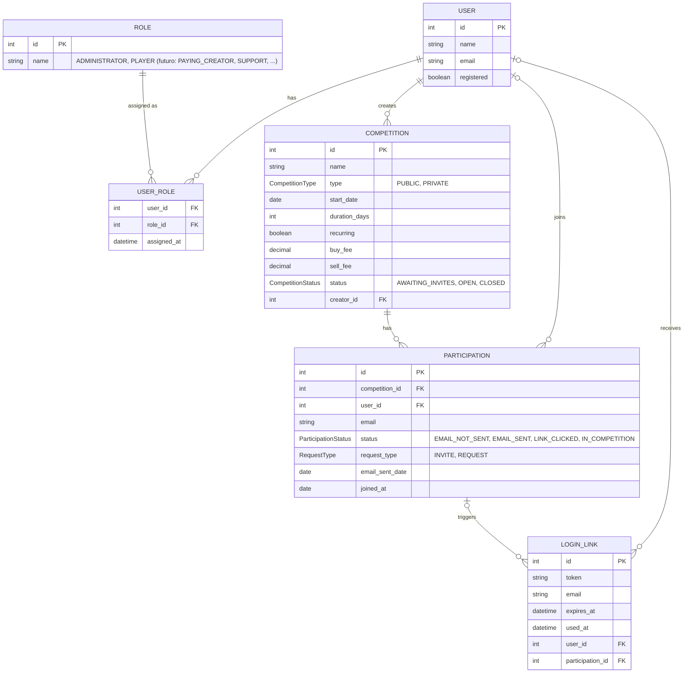

# DER — Jogo de Ações

Modelo de entidades e relacionamentos derivado dos arquivos `.feature` em `src/test/resources/features`:
`create_competition`, `login`, `manage_competition_players`, `request_competition_entry`.

## Notas de modelagem

- **USER** unifica o que antes eram `ADMINISTRATOR` e `PLAYER` — as duas entidades tinham praticamente os mesmos atributos, e hoje o único papel que pode criar competições é o administrador, mas a regra de negócio já prevê evoluir para usuários pagantes e, futuramente, suporte. Modelar isso como atributo fixo do usuário exigiria migração de schema a cada novo papel; com **ROLE** + **USER_ROLE** (N:N), um usuário pode acumular papéis (ex.: jogador que também é criador pagante) sem alterar a estrutura.
- Quem pode acessar a tela de criação de competição (`create_competition.feature`, cenário "Non-administrator tries to access...") é uma regra de permissão avaliada sobre `USER_ROLE`, não uma restrição estrutural do DER — por isso `COMPETITION.creator_id` aponta para `USER`, não para um tipo específico.
- **PARTICIPATION** continua sendo a entidade associativa entre `USER` e `COMPETITION` — carrega o e-mail e o status do convite/pedido de entrada (`manage_competition_players.feature`, linhas 11–75). `user_id` é opcional porque um convidado/solicitante pode existir na lista antes de ter uma conta registrada.
- `request_type` distingue convite do administrador (competição privada) de pedido de entrada do próprio jogador (competição pública), conforme `request_competition_entry.feature` e `create_competition.feature` (envio de convites).
- **LOGIN_LINK** modela o link mágico de `login.feature`. Unificar `ADMINISTRATOR`/`PLAYER` em `USER` também simplificou esta entidade: antes tinha três FKs opcionais mutuamente exclusivas (`player_id`, `administrator_id`, `participation_id`); agora são só duas — `user_id` (pedido de login direto de um usuário já registrado, qualquer papel) ou `participation_id` (confirmação de entrada numa competição, inclusive para quem ainda não tem conta).
- Regras de validação (data no passado, taxa negativa, e-mail duplicado/inválido, captcha) são regras de negócio, não entidades, e por isso não aparecem no DER.
- Não modelado (fora do escopo atual): unicidade de `(competition_id, email)` em `PARTICIPATION` e o relacionamento entre edições de uma competição recorrente — ambos regras/decisões de implementação a definir antes da próxima iteração.

## Enums

Campos String com conjunto fixo de valores viraram tipos `enum`, com constantes na convenção Java (`UPPER_SNAKE_CASE`):

| Enum | Constantes |
|---|---|
| `CompetitionType` | `PUBLIC`, `PRIVATE` |
| `CompetitionStatus` | `AWAITING_INVITES`, `OPEN`, `CLOSED` |
| `ParticipationStatus` | `EMAIL_NOT_SENT`, `EMAIL_SENT`, `LINK_CLICKED`, `IN_COMPETITION` |
| `RequestType` | `INVITE`, `REQUEST` |

`ROLE` não é um enum fixo (é uma tabela) justamente para permitir adicionar novos papéis sem alterar código; hoje o catálogo tem apenas `ADMINISTRATOR` e `PLAYER`.
