# Módulos — Jogo de Ações

Este documento complementa [`classes.md`](classes.md) (corte por entidade/dado) e
[`sequencia.md`](sequencia.md) (corte por fluxo): aqui o corte é por **módulo** — o pacote Java
(`dev.leilaalgarve.jogoacoes.<módulo>`) que a modularização das specs 05-001/05-002/05-003/05-006
introduziu no lugar do antigo pacote único em camadas técnicas (`web`/`service`/`domain`/
`repository`). Levantado lendo o código-fonte atual em `app/src/main/java/dev/leilaalgarve/jogoacoes/`
nesta sessão (2026-09-18) — todo import cruzado citado abaixo foi conferido, não presumido.

## Introdução

O sistema principal (`app/`) tem sete módulos hoje:

- **`link`** — o mecanismo genérico de link mágico (`LinkRecord`/`LinkService`/`LinkRouter`).
  Não importa nenhum tipo de outro módulo — é o módulo mais desacoplado do sistema, o núcleo
  estável em torno do qual `login` e `competition` se organizam. Ele define duas interfaces
  (`LinkHandler`, `LinkSessionService`) que os módulos consumidores implementam, invertendo a
  dependência que antes existia como FK direta de `LoginLink` para `User`/`Participation` (spec
  05-003).
- **`captcha`** — verificação de prova-de-trabalho self-hosted (ALTCHA) usada no pedido de
  entrada em competição pública. Também não importa nada de outro módulo; é consumido só por
  `competition` (`EntryRequestService`).
- **`log`** — auditoria imutável (`Log`/`AuditLogService`). Só depende de `login` (para
  associar um `User` como ator do evento) — `login`, por sua vez, depende de volta em `log` para
  registrar seus próprios eventos (link de login emitido), formando um dos três pares de módulos
  mutuamente dependentes descritos no diagrama abaixo.
- **`email`** — envio assíncrono de e-mail (produtor; o consumidor mora num deployable separado,
  `email-lambda/`, fora desta árvore de pacotes). Depende de `login` (para gravar o destinatário
  em `sent_email`) e de `competition` (só o enum `RequestType`, pra escolher entre os três
  templates físicos de `LOGIN_LINK`) — outros dois pares mutuamente dependentes.
- **`login`** — identidade (`User`/`Role`/`UserRole`), o endpoint de pedido de login avulso, e a
  implementação de `LinkHandler`/`LinkSessionService` que dá suporte a login (`LoginLinkHandler`/
  `LoginLinkSessionService`). Também define `SecurityConfigContributor`, a interface que cada
  módulo com rotas HTTP implementa para declarar suas próprias regras de autorização — `login`
  monta o `SecurityFilterChain` final agregando todos os contributors, mas nunca declara regra de
  rota de outro módulo.
- **`competition`** — o maior módulo: competições, participações, convite, pedido de entrada,
  gerência de jogadores, e a implementação de `LinkHandler` para o link de competição
  (`CompetitionLinkHandler`, que também é o único ponto do sistema que cria um `User` novo — na
  conclusão do cadastro). Depende de `link`, `login`, `email`, `captcha` e `log`.
- **`common`** — não é um módulo de domínio, é a camada de tradução HTTP: um único
  `@RestControllerAdvice` (`ApiExceptionHandler`) que mapeia as exceções de negócio de
  `captcha`/`competition`/`link` para o formato `Error` do contrato OpenAPI. Por isso é o único
  módulo cujas dependências apontam só "para dentro" (para os tipos de exceção de outros
  módulos), nunca o contrário. Os testes de arquitetura (`ArchitectureTest`, `RouteOwnershipTest`,
  `OpenApiRolesConsistencyTest`, `OpenApiRoutesConsistencyTest`) também moram no pacote de teste
  de `common` — verificam, respectivamente, que todo `@RestController` tem um
  `SecurityConfigContributor` no mesmo pacote, que nenhum módulo mapeia `/` nem rotas de outro
  módulo, e que `docs/openapi.yaml` continua batendo com os papéis/rotas reais.

Um oitavo pacote, `dev.leilaalgarve.jogoacoes.api` (`*Api`/`api.model.*`), aparece em quase todo
import acima mas **não é um módulo escrito à mão** — é gerado em build time pelo
`openapi-generator-maven-plugin` a partir de [`docs/openapi.yaml`](../openapi.yaml) (configurado em
`app/pom.xml`). Por isso ele fica de fora do diagrama de dependências abaixo, do mesmo jeito que
[`classes.md`](classes.md) não desenha os DTOs gerados — cada controller citado nas seções
seguintes implementa uma interface `*Api` desse pacote.

### Diagrama de dependências entre módulos

Seta cheia = depende de uma classe/entidade concreta do outro módulo. Seta tracejada = a
dependência é só através de uma interface que o outro módulo declara (o módulo de origem a
implementa, ou só a invoca através dela — nunca referencia a implementação concreta). Três pares
de módulos são mutuamente dependentes (`login`↔`link` não é um deles — só `login` depende de
`link`, nunca o contrário): `login`↔`email`, `email`↔`competition` e `login`↔`log`.

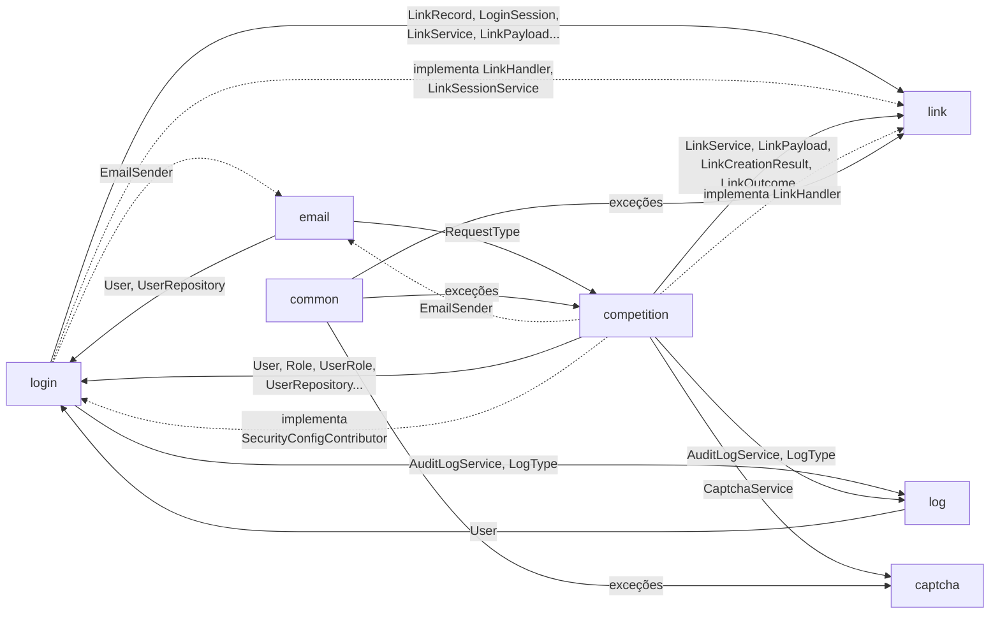

`link` e `captcha` não têm nenhuma seta saindo deles — são os dois módulos "folha" da
modularização (nenhum import de outro módulo do domínio). `common` só tem setas saindo — nenhum
módulo importa nada de `common`.

## Módulo `link`

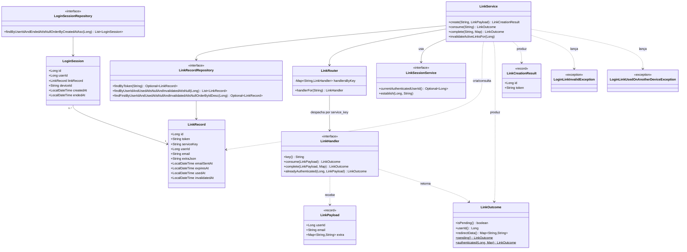

Nenhuma classe deste diagrama implementa `LinkHandler`/`LinkSessionService` — de propósito
(javadoc de `LinkHandler`: "implemented by each consumer module, never by `link` itself"). As
implementações (`LoginLinkHandler`/`LoginLinkSessionService` em `login`,
`CompetitionLinkHandler` em `competition`) aparecem nas seções desses módulos.

`LoginLinkInvalidException`/`LoginLinkUsedOnAnotherDeviceException` moram em
`dev.leilaalgarve.jogoacoes.link.exception` (spec 05-008): a partir de duas exceções próprias, um
módulo ganha esse subpacote em vez de deixá-las soltas na raiz — convenção documentada desde a
spec 05-002, aplicada por enquanto só a `link` e `competition` (ver a seção desse módulo).
`captcha`, com uma exceção só, fica de fora da regra.

### Criação de um link

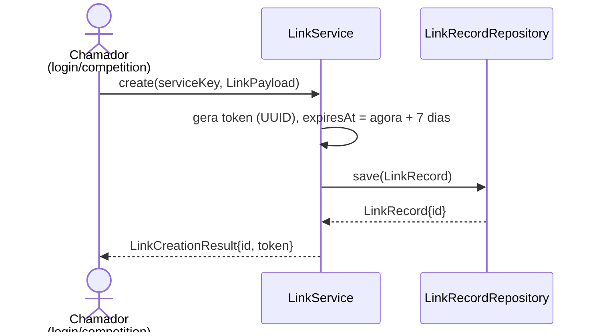

### Consumo de um link (genérico)

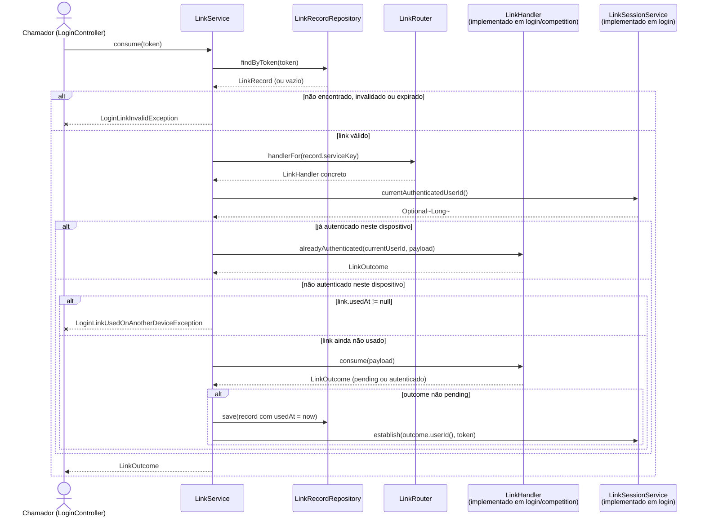

`LinkService.complete(token, extra)` (segunda fase, usada só pelo registro de competição — ver
seção do módulo `competition`) segue a mesma estrutura, chamando `H.complete(payload, extra)` no
lugar de `H.consume(payload)`.

## Módulo `captcha`

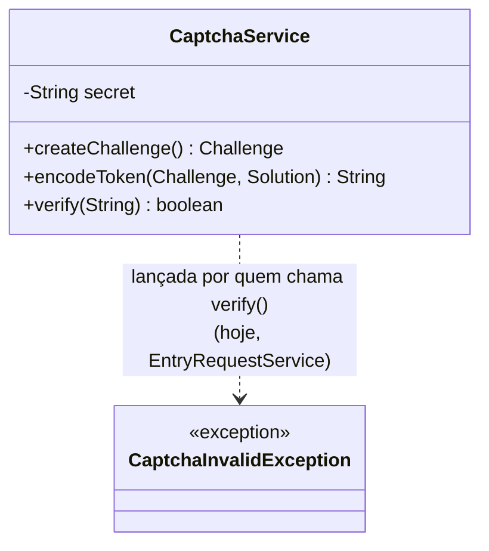

`CaptchaService` usa a biblioteca `org.altcha.altcha.v2.Altcha` diretamente (HMAC real, sem
serviço terceirizado — decisão 6 em `docs/context/iteracao-3.md`); não há classe própria do
módulo modelando o desafio/solução, só o tipo da biblioteca. `createChallenge()`/`encodeToken()`
existem mas não estão ligados a nenhum endpoint ainda — não há widget de frontend para consumir o
desafio (comentário do próprio `CaptchaService`); só `verify(String)` é chamado hoje, por
`EntryRequestService` (módulo `competition`).

### Verificação de captcha num pedido de entrada

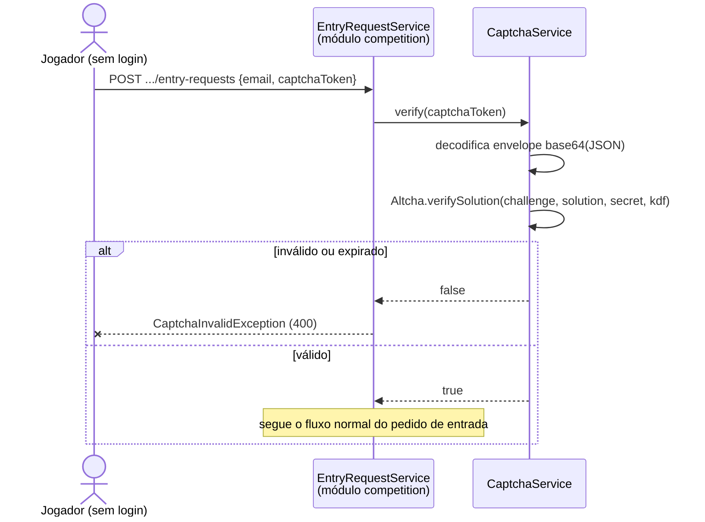

## Módulo `log`

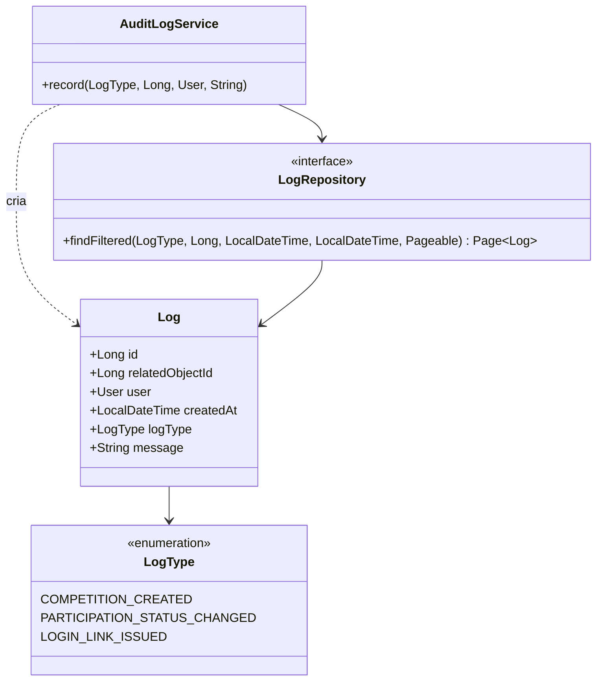

`LogRepository.findFiltered` existe (filtra por tipo/usuário/intervalo de datas, paginado) mas
nenhum controller o chama hoje — conferido nesta sessão (`grep` por `LogRepository`/
`findFiltered` no código principal só retorna a própria declaração e `AuditLogService`). Não há
rota `/logs` em `docs/openapi.yaml`: o módulo é só escrita por enquanto, a leitura filtrada existe
pronta para uma futura tela administrativa de auditoria.

### Registro de um evento de auditoria

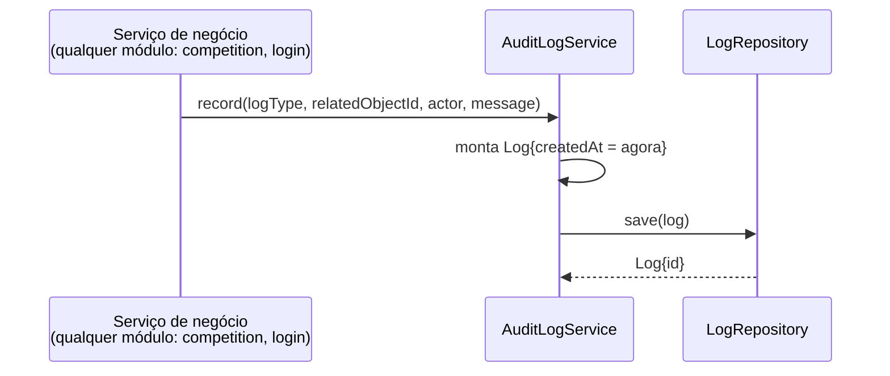

`actor` pode ser `null` — nem todo evento auditável é iniciado por um usuário logado (comentário
de `AuditLogService.record`).

## Módulo `email`

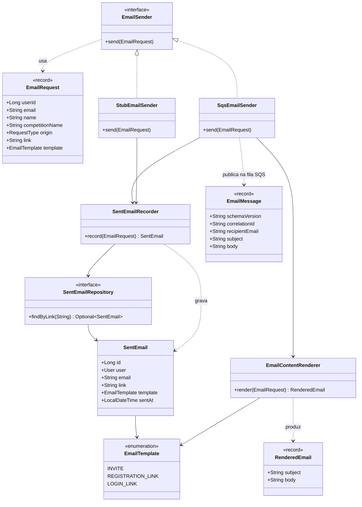

`StubEmailSender`/`SqsEmailSender` são mutuamente exclusivos via `@ConditionalOnProperty
(email.sender)` — `stub` é o padrão (`sandbox`/testes), `sqs` ativa em `docker`/`staging`/
`production`. `EmailMessage` desta classe é a cópia do lado produtor; o consumidor
(`EmailSendHandler`, que chama Amazon SES) mora em `email-lambda/`, um módulo Maven/deployable
separado — fora da árvore `dev.leilaalgarve.jogoacoes` deste app, por isso fora do diagrama de
dependências da Introdução.

### Envio de e-mail (produtor)

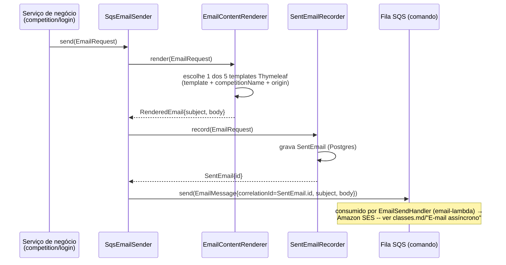

## Módulo `login`

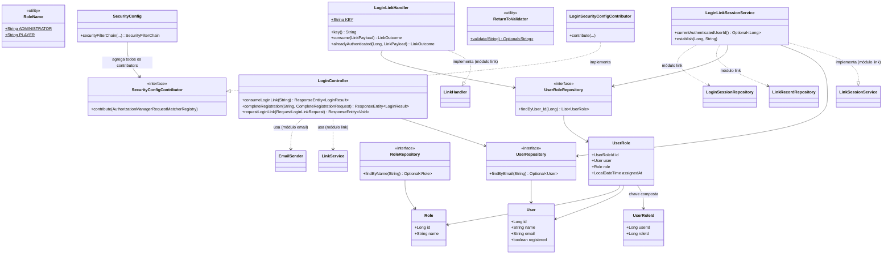

`LinkService`/`EmailSender`/`LinkRecordRepository`/`LoginSessionRepository` pertencem ao módulo
`link`/`email` — aparecem aqui só como o ponto de fronteira que `login` atravessa (ver diagrama de
dependências). `LoginLinkHandler` nunca sobrescreve `complete()` (link de login é sempre uma
única fase) — só `CompetitionLinkHandler` (módulo `competition`) o faz, para o registro em duas
fases.

### Pedido de login avulso

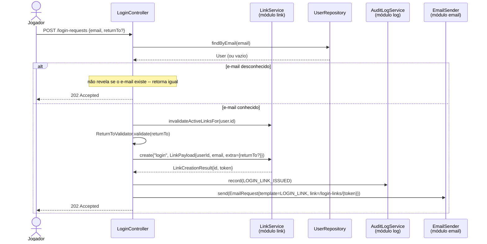

### Consumo de um link de login (`LoginLinkHandler`)

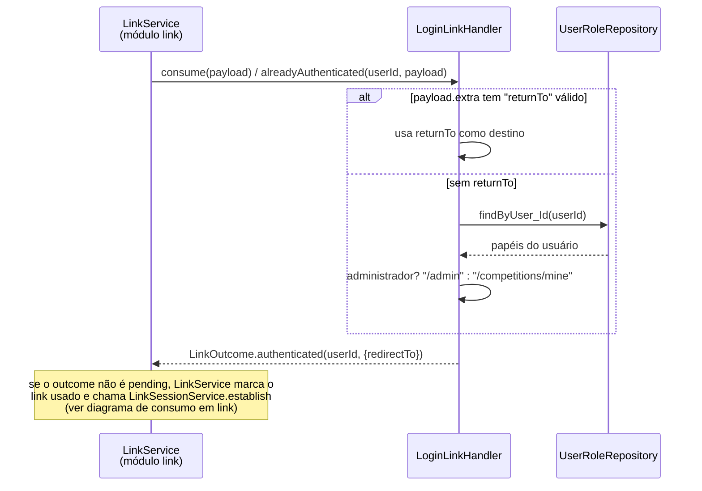

## Módulo `competition`

```mermaid
classDiagram
    class Competition {
        +Long id
        +String name
        +CompetitionType type
        +LocalDate startDate
        +int durationDays
        +boolean recurring
        +BigDecimal buyFee
        +BigDecimal sellFee
        +CompetitionStatus status
        +User creator
    }
    class Participation {
        +Long id
        +Competition competition
        +User user
        +String email
        +ParticipationStatus status
        +RequestType requestType
        +LocalDate firstEmailSentDate
        +LocalDate joinedAt
    }
    class CompetitionType {
        <<enumeration>>
        PUBLIC
        PRIVATE
    }
    class CompetitionStatus {
        <<enumeration>>
        AWAITING_INVITES
        OPEN
        CLOSED
    }
    class ParticipationStatus {
        <<enumeration>>
        EMAIL_NOT_SENT
        EMAIL_SENT
        LINK_CLICKED
        IN_COMPETITION
    }
    class RequestType {
        <<enumeration>>
        INVITE
        REQUEST
    }
    class CompetitionRepository {
        <<interface>>
        +findByTypeAndStatus(CompetitionType, CompetitionStatus) List~Competition~
    }
    class ParticipationRepository {
        <<interface>>
        +findByCompetition_IdAndStatus(...) List~Participation~
        +findByCompetition_IdAndUser_Id(...) Optional~Participation~
        +findByCompetition_IdAndEmailAndStatusNot(...) Optional~Participation~
        +findByCompetition_Id(Long) List~Participation~
        +findByIdAndCompetition_Id(...) Optional~Participation~
        +findByUser_Id(Long) List~Participation~
    }
    class CompetitionService {
        +create(CompetitionCreateRequest) Competition
        +decideInviteEmailTiming(Long, TimingEnum)
    }
    class CompetitionViewService {
        +listPublicCompetitions() List~CompetitionSummary~
        +listMyCompetitions(Long) MyCompetitions
        +getCompetitionDetail(Long, Long, boolean) Optional~CompetitionDetail~
    }
    class CompetitionAccessResolver {
        <<utility>>
        +resolve(Competition, Participation, boolean)$ Optional~AccessLevel~
    }
    class EntryRequestService {
        +confirmEntry(Long) Participation
        +requestEntry(Long, EntryRequest)
    }
    class PlayerManagementService {
        +listPlayers(Long, ParticipationStatus) List~Participation~
        +invitePlayers(Long, List~String~)
        +updateEmail(Long, Long, String) Participation
        +removePlayer(Long, Long)
        +resendInviteEmail(Long, Long)
        +resendInviteEmails(Long, List~Long~)
    }
    class CompetitionLinkHandler {
        +String KEY$
        +String PARTICIPATION_ID_EXTRA_KEY$
        +key() String
        +consume(LinkPayload) LinkOutcome
        +alreadyAuthenticated(Long, LinkPayload) LinkOutcome
        +complete(LinkPayload, Map) LinkOutcome
    }
    class CompetitionSecurityConfigContributor {
        +contribute(...)
    }
    class CompetitionsController {
        +createCompetition(...) ResponseEntity~Competition~
        +decideInviteEmailTiming(...) ResponseEntity~Void~
        +listPublicCompetitions() ResponseEntity~List~
        +listMyCompetitions() ResponseEntity~MyCompetitions~
        +getCompetitionDetail(Long) ResponseEntity~CompetitionDetail~
    }
    class EntryRequestsController {
        +requestOrConfirmEntry(Long, EntryRequest) ResponseEntity~Participation~
    }
    class PlayersController {
        +listPlayers(...) ResponseEntity~List~
        +invitePlayers(...) ResponseEntity~Void~
        +updatePlayerEmail(...) ResponseEntity~Participation~
        +removePlayer(...) ResponseEntity~Void~
        +resendPlayerInviteEmail(...) ResponseEntity~Void~
        +resendPlayerInviteEmails(...) ResponseEntity~Void~
    }
    class ParticipationMapper {
        <<utility>>
        +toApiModel(Participation)$ Participation
    }
    class CompetitionNotFoundException { <<exception>> }
    class CompetitionValidationException { <<exception>> }
    class EntryRequestValidationException { <<exception>> }
    class PlayerNotFoundException { <<exception>> }
    class PlayerValidationException { <<exception>> }

    Competition "1" --> "0..*" Participation
    Competition --> CompetitionType
    Competition --> CompetitionStatus
    Participation --> ParticipationStatus
    Participation --> RequestType
    CompetitionRepository --> Competition
    ParticipationRepository --> Participation
    CompetitionService --> CompetitionRepository
    CompetitionService --> ParticipationRepository
    CompetitionService ..> CompetitionValidationException : lança
    CompetitionService ..> CompetitionNotFoundException : lança
    CompetitionViewService --> CompetitionRepository
    CompetitionViewService --> ParticipationRepository
    CompetitionViewService ..> CompetitionAccessResolver : usa
    EntryRequestService --> CompetitionRepository
    EntryRequestService --> ParticipationRepository
    EntryRequestService ..> EntryRequestValidationException : lança
    PlayerManagementService --> CompetitionRepository
    PlayerManagementService --> ParticipationRepository
    PlayerManagementService ..> PlayerNotFoundException : lança
    PlayerManagementService ..> PlayerValidationException : lança
    CompetitionLinkHandler ..|> LinkHandler : implementa (módulo link)
    CompetitionLinkHandler --> ParticipationRepository
    CompetitionSecurityConfigContributor ..|> SecurityConfigContributor : implementa (módulo login)
    CompetitionsController --> CompetitionService
    CompetitionsController --> CompetitionViewService
    EntryRequestsController --> EntryRequestService
    EntryRequestsController ..> ParticipationMapper : usa
    PlayersController --> PlayerManagementService
    PlayersController ..> ParticipationMapper : usa
```

`CompetitionLinkHandler` é o único ponto do sistema que cria um `User` (em `complete()`, na
conclusão do registro) — todo o resto do módulo só lê usuários já existentes via
`login.UserRepository`.

As 5 exceções (`CompetitionNotFoundException`, `CompetitionValidationException`,
`EntryRequestValidationException`, `PlayerNotFoundException`, `PlayerValidationException`) moram
em `dev.leilaalgarve.jogoacoes.competition.exception`, não na raiz do pacote — mesmo subpacote
`exception/` da spec 05-008 descrito na seção do módulo `link`.

### Criação de competição privada + convite

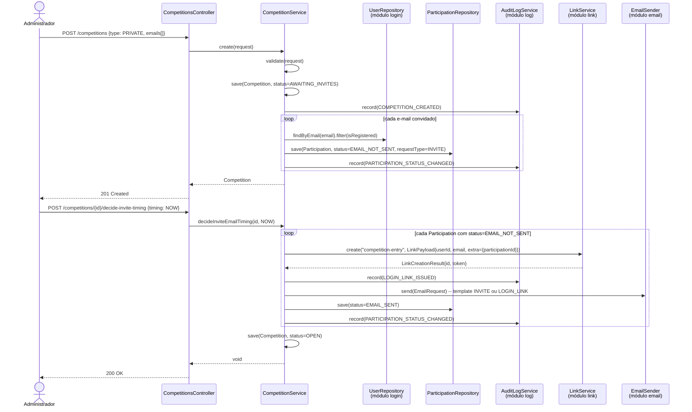

### Pedido de entrada em competição pública + consumo do link

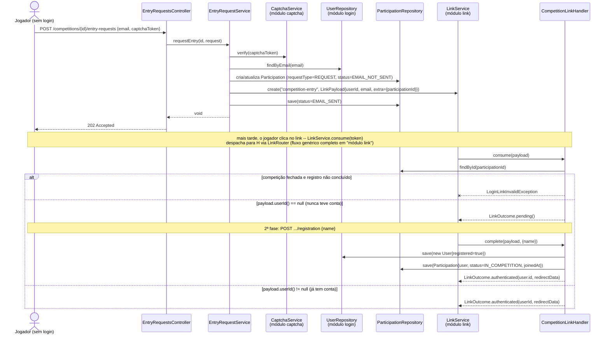

### Gerência de jogadores — reenvio e remoção

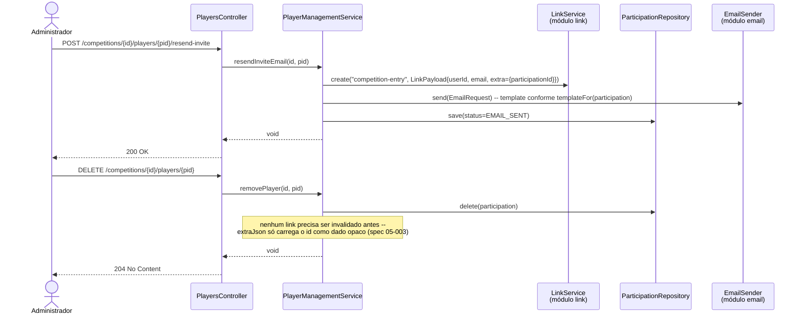

## Módulo `common`

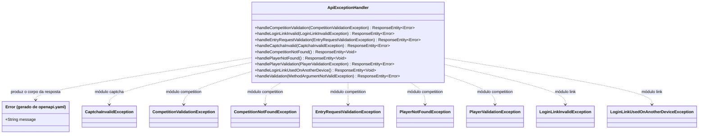

Os imports reais (spec 05-008) apontam para `competition.exception.*` e `link.exception.*`, não
para a raiz desses pacotes — ver a nota sobre o subpacote `exception/` nas seções `link` e
`competition`. `CaptchaInvalidException` (módulo `captcha`) é a única exceção que `common`
importa que ainda está na raiz do seu pacote — `captcha` tem uma exceção só, abaixo do limiar da
convenção.

### Tradução de uma exceção de negócio em resposta HTTP

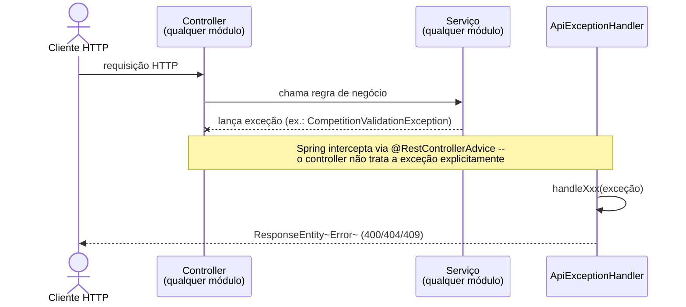
