# Módulos — Jogo de Ações

Este documento complementa [`classes.md`](classes.md) (corte por entidade/dado) e
[`sequencia.md`](sequencia.md) (corte por fluxo): aqui o corte é por **módulo** — o pacote Java
(`dev.leilaalgarve.jogoacoes.<módulo>`) que a modularização das specs 05-001/05-002/05-003/05-006
introduziu no lugar do antigo pacote único em camadas técnicas (`web`/`service`/`domain`/
`repository`). Levantado lendo o código-fonte atual em `app/src/main/java/dev/leilaalgarve/jogoacoes/`
nesta sessão (2026-09-18) — todo import cruzado citado abaixo foi conferido, não presumido.

## Introdução

O sistema principal (`app/`) tem nove módulos hoje (o antigo `login` foi dividido em `user`,
`loginsession` e `loginsecurity` pela spec 05-027):

- **`link`** — o mecanismo genérico de link mágico (`LinkRecord`/`LinkService`/`LinkRouter`).
  Não importa nenhum tipo de outro módulo — é o módulo mais desacoplado do sistema, o núcleo
  estável em torno do qual `loginsession` e `competition` se organizam. Ele define duas interfaces
  (`LinkHandler`, `LinkSessionService`) que os módulos consumidores implementam, invertendo a
  dependência que antes existia como FK direta de `LoginLink` para `User`/`Participation` (spec
  05-003).
- **`captcha`** — verificação de prova-de-trabalho self-hosted (ALTCHA) usada no pedido de
  entrada em competição pública. Também não importa nada de outro módulo; é consumido só por
  `competition` (`EntryRequestService`).
- **`log`** — auditoria imutável (`Log`/`AuditLogService`). Só depende de `user` (para
  associar um `User` como ator do evento). `loginsession` usa `log` para registrar seus próprios
  eventos (link de login emitido), mas `log` não depende de `loginsession` — sem ciclo.
- **`email`** — envio assíncrono de e-mail (produtor; o consumidor mora num deployable separado,
  `email-lambda/`, fora desta árvore de pacotes). Depende de `user` (para gravar o destinatário
  em `sent_email`) e de `competition` (só o enum `RequestType`, pra escolher entre os três
  templates físicos de `LOGIN_LINK`) — este último forma o único par de módulos mutuamente
  dependentes descrito no diagrama abaixo.
- **`user`** — identidade (`User`/`Role`/`RoleName`/`UserRole`/`UserRoleId` e seus repositórios)
  e os dois serviços pelos quais os outros módulos chegam a esses dados: `UserService` (leitura,
  spec 05-029) e `UserProvisioningService` (criação de usuário com papéis, usado pelo bootstrap do
  administrador, spec 05-026, e pela conclusão de cadastro em `competition`). Módulo-base: não
  depende de nenhum outro módulo do domínio.
- **`loginsecurity`** — `SecurityConfigContributor`, a interface que cada módulo com rotas HTTP
  implementa para declarar suas próprias regras de autorização, e `SecurityConfig`, que monta o
  `SecurityFilterChain` final agregando todos os contributors, mas nunca declara regra de rota de
  outro módulo. Também módulo-base: não depende de nenhum outro módulo do domínio.
- **`loginsession`** — o endpoint de pedido de login avulso e de consumo do link de login
  (`LoginController`), a implementação de `LinkHandler`/`LinkSessionService` que dá suporte a
  login (`LoginLinkHandler`/`LoginLinkSessionService`), a gestão de sessões ativas
  (`LoginSession`/`LoginSessionRepository`, movidas de `link`, e `SessionsController`/
  `SessionsService`), o "usuário logado nesta requisição" que os outros módulos consultam
  (`CurrentUserService`, spec 05-029) e o apoio a Client Hints/redirecionamento (`AcceptChFilter`,
  `DeviceLabelResolver`, `ReturnToValidator`). Depende de `user`, `link`, `loginsecurity`, `email`
  e `log`; nenhum deles depende de volta.
- **`competition`** — o maior módulo: competições, participações, convite, pedido de entrada,
  gerência de jogadores, e a implementação de `LinkHandler` para o link de competição
  (`CompetitionLinkHandler`, que na conclusão do cadastro cria o `User` novo via
  `UserProvisioningService`). Depende de `link`, `user`, `loginsession` (só `CurrentUserService`),
  `loginsecurity`, `email`, `captcha` e `log`.
- **`common`** — não é um módulo de domínio, é a camada de tradução HTTP: um único
  `@RestControllerAdvice` (`ApiExceptionHandler`) que mapeia as exceções de negócio de
  `captcha`/`competition`/`link` para o formato `Error` do contrato OpenAPI. Por isso é o único
  módulo cujas dependências apontam só "para dentro" (para os tipos de exceção de outros
  módulos), nunca o contrário. Os testes de arquitetura (`ArchitectureTest`, `RouteOwnershipTest`,
  `OpenApiRolesConsistencyTest`, `OpenApiRoutesConsistencyTest`) também moram no pacote de teste
  de `common` — verificam, respectivamente, que todo `@RestController` tem um
  `SecurityConfigContributor` no mesmo pacote, que nenhum módulo mapeia `/` nem rotas de outro
  módulo, e que `docs/openapi.yaml` continua batendo com os papéis/rotas reais.

Um oitavo pacote, `dev.leilaalgarve.jogoacoes.api` (`*Api`/`api.model.*`), aparece em quase todo
import acima mas **não é um módulo escrito à mão** — é gerado em build time pelo
`openapi-generator-maven-plugin` a partir de [`docs/openapi.yaml`](../openapi.yaml) (configurado em
`app/pom.xml`). Por isso ele fica de fora do diagrama de dependências abaixo, do mesmo jeito que
[`classes.md`](classes.md) não desenha os DTOs gerados — cada controller citado nas seções
seguintes implementa uma interface `*Api` desse pacote.

### Diagrama de dependências entre módulos

Seta cheia = depende de uma classe/entidade concreta do outro módulo. Seta tracejada = a
dependência é só através de uma interface que o outro módulo declara (o módulo de origem a
implementa, ou só a invoca através dela — nunca referencia a implementação concreta). Só um par
de módulos é mutuamente dependente: `email`↔`competition`. Os pares `login`↔`email` e
`login`↔`log` de antes da spec 05-027 desapareceram com a divisão — `email` e `log` dependem só de
`user`, e quem usa `email`/`log` é `loginsession`. `ArchitectureTest` verifica que `user`,
`loginsecurity` e `link` não dependem de `loginsession` nem uns dos outros, e (spec 05-029) que
nenhum módulo acessa o repositório de outro: toda seta abaixo passa por serviço, interface,
entidade ou enum, nunca por um `*Repository`.

A seta `competition → loginsession` (spec 05-029) fecha um ciclo de três módulos,
`competition → loginsession → email → competition`, que passa pelo mesmo `email → competition`
(`RequestType`) do par mutuamente dependente acima. Não é ciclo novo entre pares, mas é por ali
que ele se desfaz se um dia `RequestType` sair de `competition`.

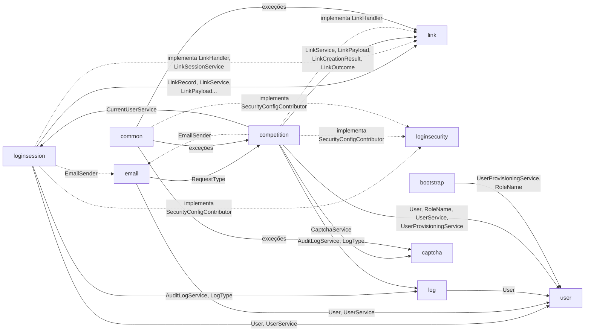
```mermaid
graph LR
    loginsession -->|"LinkRecord, LinkService,<br/>LinkPayload..."| link
    loginsession -.->|"implementa LinkHandler,<br/>LinkSessionService"| link
    competition -->|"LinkService, LinkPayload,<br/>LinkCreationResult, LinkOutcome"| link
    competition -.->|"implementa LinkHandler"| link

    loginsession -->|"User, UserService"| user
    loginsession -.->|"implementa<br/>SecurityConfigContributor"| loginsecurity

    loginsession -.->|"EmailSender"| email
    email -->|"User, UserService"| user

    competition -.->|"EmailSender"| email
    email -->|"RequestType"| competition

    loginsession -->|"AuditLogService, LogType"| log
    log -->|"User"| user

    competition -->|"AuditLogService, LogType"| log

    competition -->|"User, RoleName, UserService,<br/>UserProvisioningService"| user
    competition -->|"CurrentUserService"| loginsession
    competition -.->|"implementa<br/>SecurityConfigContributor"| loginsecurity
    common -.->|"implementa<br/>SecurityConfigContributor"| loginsecurity

    bootstrap -->|"UserProvisioningService,<br/>RoleName"| user

    competition -->|"CaptchaService"| captcha

    common -->|"exceções"| captcha
    common -->|"exceções"| competition
    common -->|"exceções"| link
```

`link`, `captcha`, `user` e `loginsecurity` não têm nenhuma seta saindo deles — são os módulos
"folha" da modularização (nenhum import de outro módulo do domínio). `common` e `bootstrap` só têm
setas saindo — nenhum módulo importa nada deles.

## Módulo `link`

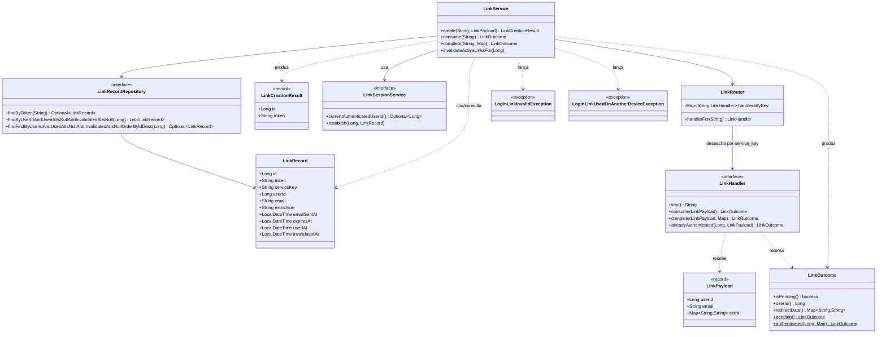
```mermaid
classDiagram
    class LinkRecord {
        +Long id
        +String token
        +String serviceKey
        +Long userId
        +String email
        +String extraJson
        +LocalDateTime emailSentAt
        +LocalDateTime expiresAt
        +LocalDateTime usedAt
        +LocalDateTime invalidatedAt
    }
    class LinkRecordRepository {
        <<interface>>
        +findByToken(String) Optional~LinkRecord~
        +findByUserIdAndUsedAtIsNullAndInvalidatedAtIsNull(Long) List~LinkRecord~
        +findFirstByUserIdAndUsedAtIsNullAndInvalidatedAtIsNullOrderByIdDesc(Long) Optional~LinkRecord~
    }
    class LinkPayload {
        <<record>>
        +Long userId
        +String email
        +Map~String,String~ extra
    }
    class LinkOutcome {
        +isPending() boolean
        +userId() Long
        +redirectData() Map~String,String~
        +pending()$ LinkOutcome
        +authenticated(Long, Map)$ LinkOutcome
    }
    class LinkCreationResult {
        <<record>>
        +Long id
        +String token
    }
    class LinkHandler {
        <<interface>>
        +key() String
        +consume(LinkPayload) LinkOutcome
        +complete(LinkPayload, Map) LinkOutcome
        +alreadyAuthenticated(Long, LinkPayload) LinkOutcome
    }
    class LinkSessionService {
        <<interface>>
        +currentAuthenticatedUserId() Optional~Long~
        +establish(Long, LinkRecord)
    }
    class LinkRouter {
        -Map~String,LinkHandler~ handlersByKey
        +handlerFor(String) LinkHandler
    }
    class LinkService {
        +create(String, LinkPayload) LinkCreationResult
        +consume(String) LinkOutcome
        +complete(String, Map) LinkOutcome
        +invalidateActiveLinksFor(Long)
    }
    class LoginLinkInvalidException {
        <<exception>>
    }
    class LoginLinkUsedOnAnotherDeviceException {
        <<exception>>
    }

    LinkService --> LinkRecordRepository
    LinkService --> LinkRouter
    LinkService --> LinkSessionService : usa
    LinkService ..> LinkRecord : cria/consulta
    LinkService ..> LinkOutcome : produz
    LinkService ..> LinkCreationResult : produz
    LinkService ..> LoginLinkInvalidException : lança
    LinkService ..> LoginLinkUsedOnAnotherDeviceException : lança
    LinkRouter --> LinkHandler : despacha por service_key
    LinkHandler ..> LinkPayload : recebe
    LinkHandler ..> LinkOutcome : retorna
    LinkRecordRepository --> LinkRecord
```

Nenhuma classe deste diagrama implementa `LinkHandler`/`LinkSessionService` — de propósito
(javadoc de `LinkHandler`: "implemented by each consumer module, never by `link` itself"). As
implementações (`LoginLinkHandler`/`LoginLinkSessionService` em `loginsession`,
`CompetitionLinkHandler` em `competition`) aparecem nas seções desses módulos. `LoginSession`/
`LoginSessionRepository` moravam aqui até a spec 05-027 (só por causa do `@OneToOne` com
`LinkRecord`); hoje estão em `loginsession`, junto com quem as manipula.

`LoginLinkInvalidException`/`LoginLinkUsedOnAnotherDeviceException` moram em
`dev.leilaalgarve.jogoacoes.link.exception` (spec 05-008): a partir de duas exceções próprias, um
módulo ganha esse subpacote em vez de deixá-las soltas na raiz — convenção documentada desde a
spec 05-002, aplicada por enquanto só a `link` e `competition` (ver a seção desse módulo).
`captcha`, com uma exceção só, fica de fora da regra.

### Criação de um link

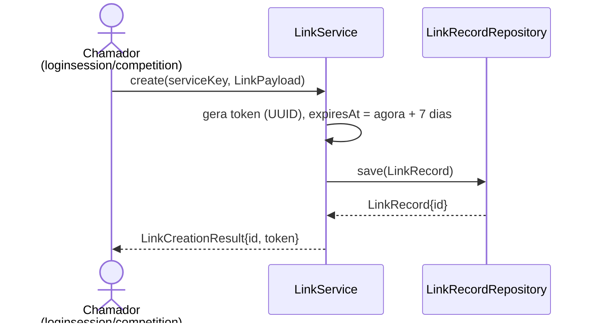
```mermaid
sequenceDiagram
    actor C as Chamador<br/>(loginsession/competition)
    participant LiS as LinkService
    participant LRR as LinkRecordRepository

    C->>LiS: create(serviceKey, LinkPayload)
    LiS->>LiS: gera token (UUID), expiresAt = agora + 7 dias
    LiS->>LRR: save(LinkRecord)
    LRR-->>LiS: LinkRecord{id}
    LiS-->>C: LinkCreationResult{id, token}
```

### Consumo de um link (genérico)

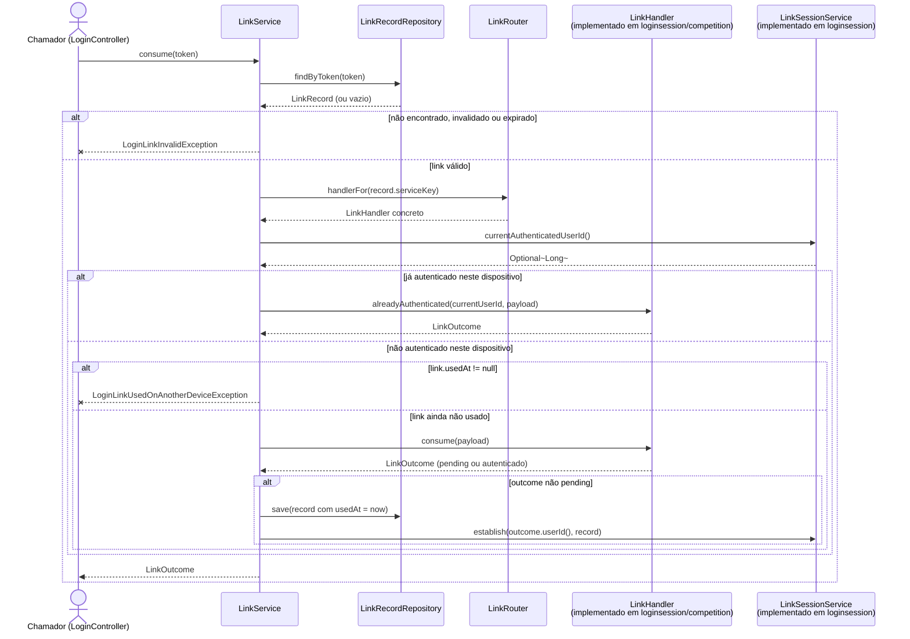
```mermaid
sequenceDiagram
    actor C as Chamador (LoginController)
    participant LiS as LinkService
    participant LRR as LinkRecordRepository
    participant Router as LinkRouter
    participant H as LinkHandler<br/>(implementado em loginsession/competition)
    participant SS as LinkSessionService<br/>(implementado em loginsession)

    C->>LiS: consume(token)
    LiS->>LRR: findByToken(token)
    LRR-->>LiS: LinkRecord (ou vazio)
    alt não encontrado, invalidado ou expirado
        LiS--xC: LoginLinkInvalidException
    else link válido
        LiS->>Router: handlerFor(record.serviceKey)
        Router-->>LiS: LinkHandler concreto
        LiS->>SS: currentAuthenticatedUserId()
        SS-->>LiS: Optional~Long~
        alt já autenticado neste dispositivo
            LiS->>H: alreadyAuthenticated(currentUserId, payload)
            H-->>LiS: LinkOutcome
        else não autenticado neste dispositivo
            alt link.usedAt != null
                LiS--xC: LoginLinkUsedOnAnotherDeviceException
            else link ainda não usado
                LiS->>H: consume(payload)
                H-->>LiS: LinkOutcome (pending ou autenticado)
                alt outcome não pending
                    LiS->>LRR: save(record com usedAt = now)
                    LiS->>SS: establish(outcome.userId(), record)
                end
            end
        end
        LiS-->>C: LinkOutcome
    end
```

`LinkService.complete(token, extra)` (segunda fase, usada só pelo registro de competição — ver
seção do módulo `competition`) segue a mesma estrutura, chamando `H.complete(payload, extra)` no
lugar de `H.consume(payload)`.

## Módulo `captcha`

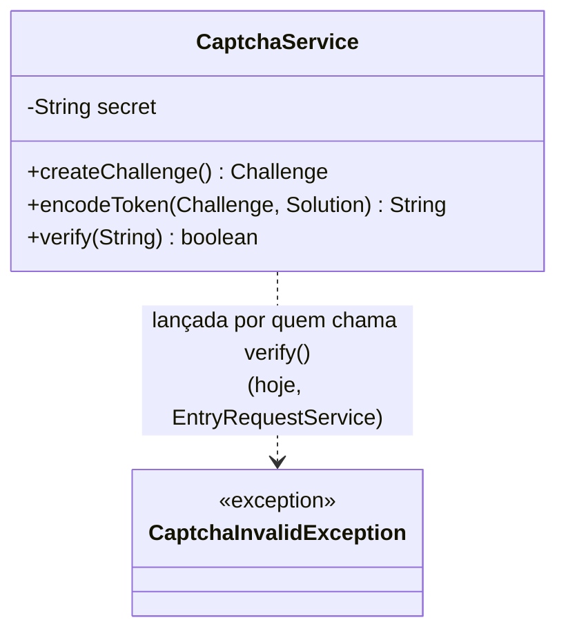
```mermaid
classDiagram
    class CaptchaService {
        -String secret
        +createChallenge() Challenge
        +encodeToken(Challenge, Solution) String
        +verify(String) boolean
    }
    class CaptchaInvalidException {
        <<exception>>
    }

    CaptchaService ..> CaptchaInvalidException : lançada por quem chama verify()<br/>(hoje, EntryRequestService)
```

`CaptchaService` usa a biblioteca `org.altcha.altcha.v2.Altcha` diretamente (HMAC real, sem
serviço terceirizado — decisão 6 em `docs/context/iteracao-3.md`); não há classe própria do
módulo modelando o desafio/solução, só o tipo da biblioteca. `createChallenge()`/`encodeToken()`
existem mas não estão ligados a nenhum endpoint ainda — não há widget de frontend para consumir o
desafio (comentário do próprio `CaptchaService`); só `verify(String)` é chamado hoje, por
`EntryRequestService` (módulo `competition`).

### Verificação de captcha num pedido de entrada

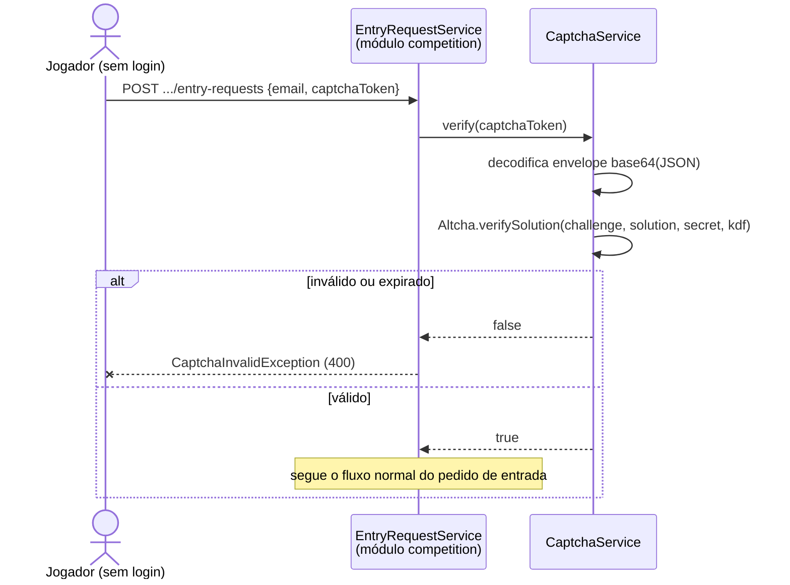
```mermaid
sequenceDiagram
    actor J as Jogador (sem login)
    participant ERS as EntryRequestService<br/>(módulo competition)
    participant Cap as CaptchaService

    J->>ERS: POST .../entry-requests {email, captchaToken}
    ERS->>Cap: verify(captchaToken)
    Cap->>Cap: decodifica envelope base64(JSON)
    Cap->>Cap: Altcha.verifySolution(challenge, solution, secret, kdf)
    alt inválido ou expirado
        Cap-->>ERS: false
        ERS--xJ: CaptchaInvalidException (400)
    else válido
        Cap-->>ERS: true
        Note over ERS: segue o fluxo normal do pedido de entrada
    end
```

## Módulo `log`

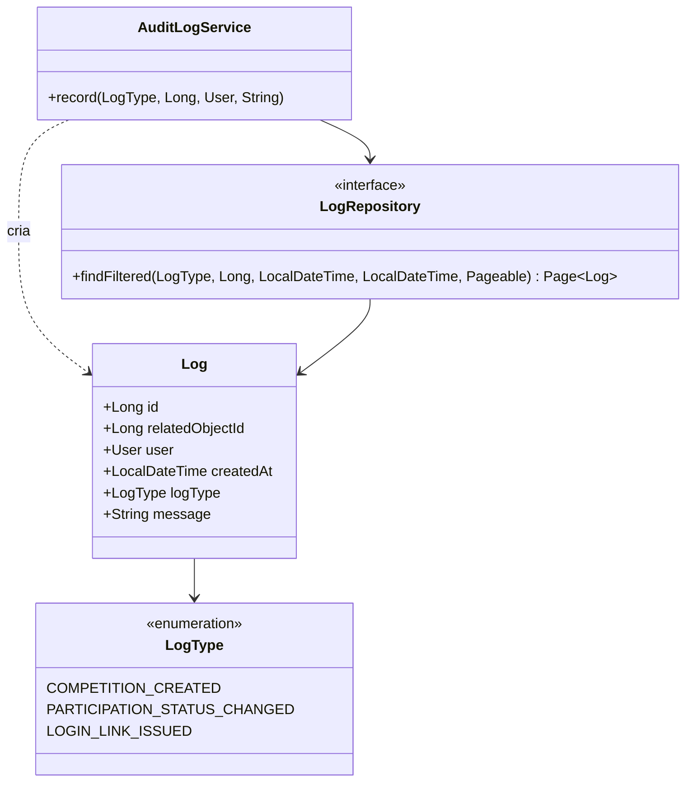
```mermaid
classDiagram
    class Log {
        +Long id
        +Long relatedObjectId
        +User user
        +LocalDateTime createdAt
        +LogType logType
        +String message
    }
    class LogType {
        <<enumeration>>
        COMPETITION_CREATED
        PARTICIPATION_STATUS_CHANGED
        LOGIN_LINK_ISSUED
    }
    class LogRepository {
        <<interface>>
        +findFiltered(LogType, Long, LocalDateTime, LocalDateTime, Pageable) Page~Log~
    }
    class AuditLogService {
        +record(LogType, Long, User, String)
    }

    AuditLogService --> LogRepository
    AuditLogService ..> Log : cria
    Log --> LogType
    LogRepository --> Log
```

`LogRepository.findFiltered` existe (filtra por tipo/usuário/intervalo de datas, paginado) mas
nenhum controller o chama hoje — conferido nesta sessão (`grep` por `LogRepository`/
`findFiltered` no código principal só retorna a própria declaração e `AuditLogService`). Não há
rota `/logs` em `docs/openapi.yaml`: o módulo é só escrita por enquanto, a leitura filtrada existe
pronta para uma futura tela administrativa de auditoria.

### Registro de um evento de auditoria

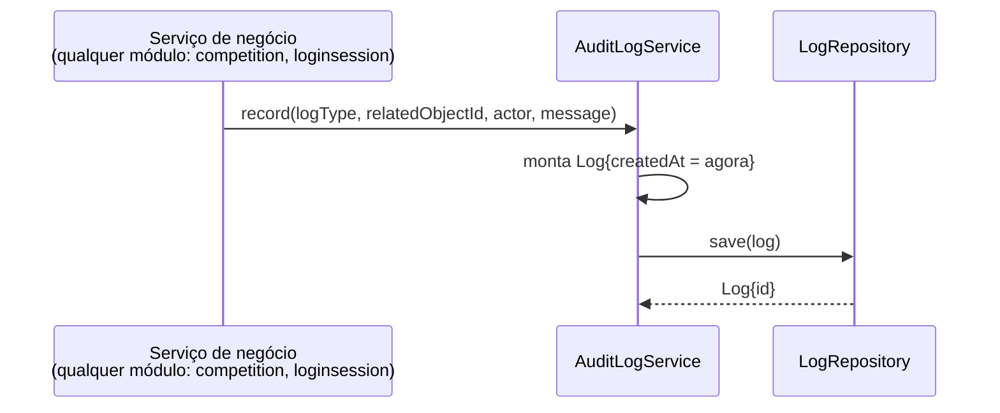
```mermaid
sequenceDiagram
    participant Svc as Serviço de negócio<br/>(qualquer módulo: competition, loginsession)
    participant AL as AuditLogService
    participant LR as LogRepository

    Svc->>AL: record(logType, relatedObjectId, actor, message)
    AL->>AL: monta Log{createdAt = agora}
    AL->>LR: save(log)
    LR-->>AL: Log{id}
```

`actor` pode ser `null` — nem todo evento auditável é iniciado por um usuário logado (comentário
de `AuditLogService.record`).

## Módulo `email`

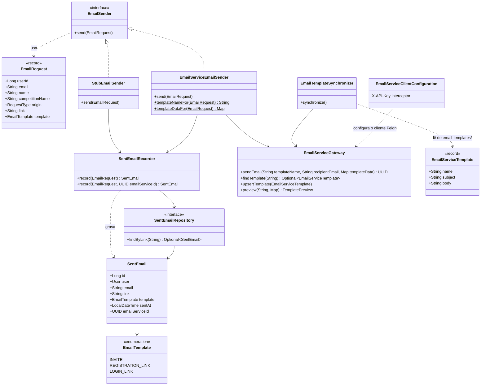
```mermaid
classDiagram
    class EmailSender {
        <<interface>>
        +send(EmailRequest)
    }
    class EmailRequest {
        <<record>>
        +Long userId
        +String email
        +String name
        +String competitionName
        +RequestType origin
        +String link
        +EmailTemplate template
    }
    class EmailTemplate {
        <<enumeration>>
        INVITE
        REGISTRATION_LINK
        LOGIN_LINK
    }
    class SentEmail {
        +Long id
        +User user
        +String email
        +String link
        +EmailTemplate template
        +LocalDateTime sentAt
        +UUID emailServiceId
    }
    class SentEmailRepository {
        <<interface>>
        +findByLink(String) Optional~SentEmail~
    }
    class SentEmailRecorder {
        +record(EmailRequest) SentEmail
        +record(EmailRequest, UUID emailServiceId) SentEmail
    }
    class StubEmailSender {
        +send(EmailRequest)
    }
    class EmailServiceEmailSender {
        +send(EmailRequest)
        +templateNameFor(EmailRequest)$ String
        +templateDataFor(EmailRequest)$ Map
    }
    class EmailServiceGateway {
        +sendEmail(String templateName, String recipientEmail, Map templateData) UUID
        +findTemplate(String) Optional~EmailServiceTemplate~
        +upsertTemplate(EmailServiceTemplate)
        +preview(String, Map) TemplatePreview
    }
    class EmailTemplateSynchronizer {
        +synchronize()
    }
    class EmailServiceTemplate {
        <<record>>
        +String name
        +String subject
        +String body
    }
    class EmailServiceClientConfiguration {
        X-API-Key interceptor
    }

    EmailSender <|.. StubEmailSender
    EmailSender <|.. EmailServiceEmailSender
    EmailSender ..> EmailRequest : usa
    StubEmailSender --> SentEmailRecorder
    EmailServiceEmailSender --> EmailServiceGateway
    EmailServiceEmailSender --> SentEmailRecorder
    EmailTemplateSynchronizer --> EmailServiceGateway
    EmailTemplateSynchronizer ..> EmailServiceTemplate : lê de email-templates/
    EmailServiceClientConfiguration ..> EmailServiceGateway : configura o cliente Feign
    SentEmailRecorder --> SentEmailRepository
    SentEmailRecorder ..> SentEmail : grava
    SentEmailRepository --> SentEmail
    SentEmail --> EmailTemplate
```

`StubEmailSender`/`EmailServiceEmailSender` são mutuamente exclusivos via
`@ConditionalOnProperty(email.sender)`: `stub` (ou a propriedade ausente) é o padrão, usado
pelos testes e pelas suítes Cucumber; `email-service` ativa o envio de verdade, e é o valor que o
container `app` do `docker-compose.yml` (`EMAIL_SENDER`) e os perfis `staging`/`production`
definem. As classes de `email/client/` (`EmailServiceClientConfiguration`,
`EmailServiceGateway`, `EmailTemplateSynchronizer`) só existem com `email-service.base-url`
configurado. `EmailServiceGateway` é a única classe que usa a API gerada (OpenFeign, a partir de
`docs/openapi-email-service.yaml`) e traduz `FeignException` em exceções do módulo: indisponível
ou 5xx vira `EmailServiceUnavailableException` (503 na API do `app`), 401 vira
`EmailServiceAuthenticationException` e o resto vira `EmailServiceRejectedException`. Só
`GET`/`PUT`/preview são repetidos em caso de falha; `POST /emails` nunca, porque uma repetição
depois de uma resposta perdida poderia enviar o e-mail duas vezes (spec 05-034).

`app` não renderiza mais e-mail nem fala com fila: os 5 templates Handlebars ficam em
`app/src/main/resources/email-templates/` e o `EmailTemplateSynchronizer` os cadastra no
`email-service` no `ApplicationReadyEvent` (`PUT`; se 404, `POST`; se 409, `PUT` de novo). A
fila SQS, o `EmailSendHandler` (`email-lambda/`) e o Amazon SES ficam do outro lado do
`email-service`, fora da árvore `dev.leilaalgarve.jogoacoes` deste app e, por isso, fora do
diagrama de dependências da Introdução.

### Envio de e-mail (`app` → `email-service`)

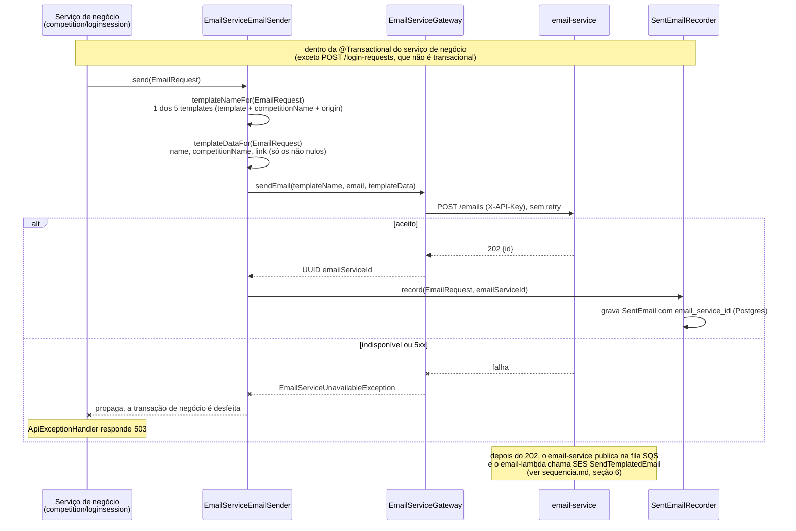
```mermaid
sequenceDiagram
    participant Svc as Serviço de negócio<br/>(competition/loginsession)
    participant Sender as EmailServiceEmailSender
    participant GW as EmailServiceGateway
    participant ESvc as email-service
    participant Rec as SentEmailRecorder

    Note over Svc,Rec: dentro da @Transactional do serviço de negócio<br/>(exceto POST /login-requests, que não é transacional)
    Svc->>Sender: send(EmailRequest)
    Sender->>Sender: templateNameFor(EmailRequest)<br/>1 dos 5 templates (template + competitionName + origin)
    Sender->>Sender: templateDataFor(EmailRequest)<br/>name, competitionName, link (só os não nulos)
    Sender->>GW: sendEmail(templateName, email, templateData)
    GW->>ESvc: POST /emails (X-API-Key), sem retry
    alt aceito
        ESvc-->>GW: 202 {id}
        GW-->>Sender: UUID emailServiceId
        Sender->>Rec: record(EmailRequest, emailServiceId)
        Rec->>Rec: grava SentEmail com email_service_id (Postgres)
    else indisponível ou 5xx
        ESvc--xGW: falha
        GW--xSender: EmailServiceUnavailableException
        Sender--xSvc: propaga, a transação de negócio é desfeita
        Note over Svc: ApiExceptionHandler responde 503
    end
    Note over ESvc: depois do 202, o email-service publica na fila SQS<br/>e o email-lambda chama SES SendTemplatedEmail<br/>(ver sequencia.md, seção 6)
```

## Módulo `user`

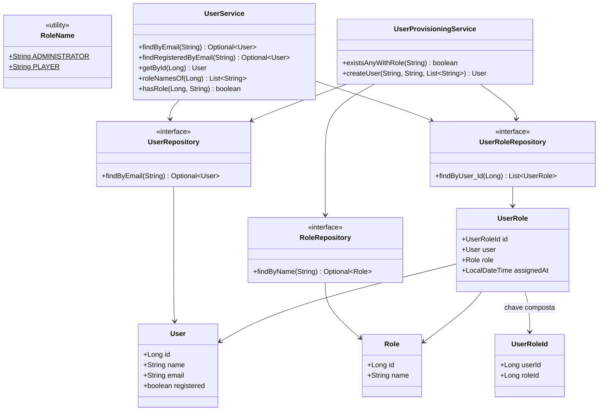
```mermaid
classDiagram
    class User {
        +Long id
        +String name
        +String email
        +boolean registered
    }
    class Role {
        +Long id
        +String name
    }
    class RoleName {
        <<utility>>
        +String ADMINISTRATOR$
        +String PLAYER$
    }
    class UserRoleId {
        +Long userId
        +Long roleId
    }
    class UserRole {
        +UserRoleId id
        +User user
        +Role role
        +LocalDateTime assignedAt
    }
    class UserRepository {
        <<interface>>
        +findByEmail(String) Optional~User~
    }
    class RoleRepository {
        <<interface>>
        +findByName(String) Optional~Role~
    }
    class UserRoleRepository {
        <<interface>>
        +findByUser_Id(Long) List~UserRole~
    }
    class UserProvisioningService {
        +existsAnyWithRole(String) boolean
        +createUser(String, String, List~String~) User
    }
    class UserService {
        +findByEmail(String) Optional~User~
        +findRegisteredByEmail(String) Optional~User~
        +getById(Long) User
        +roleNamesOf(Long) List~String~
        +hasRole(Long, String) boolean
    }

    UserRole --> UserRoleId : chave composta
    UserRole --> User
    UserRole --> Role
    UserRoleRepository --> UserRole
    RoleRepository --> Role
    UserRepository --> User
    UserProvisioningService --> UserRepository
    UserProvisioningService --> RoleRepository
    UserProvisioningService --> UserRoleRepository
    UserService --> UserRepository
    UserService --> UserRoleRepository
```

Módulo-base: nenhuma classe daqui importa `link`, `loginsession`, `loginsecurity` ou qualquer
outro módulo do domínio. É consumido por `loginsession`, `competition`, `email`, `log` e
`bootstrap` — só através de `UserService`/`UserProvisioningService` e das entidades; os três
repositórios são internos ao módulo (spec 05-029).

## Módulo `loginsecurity`

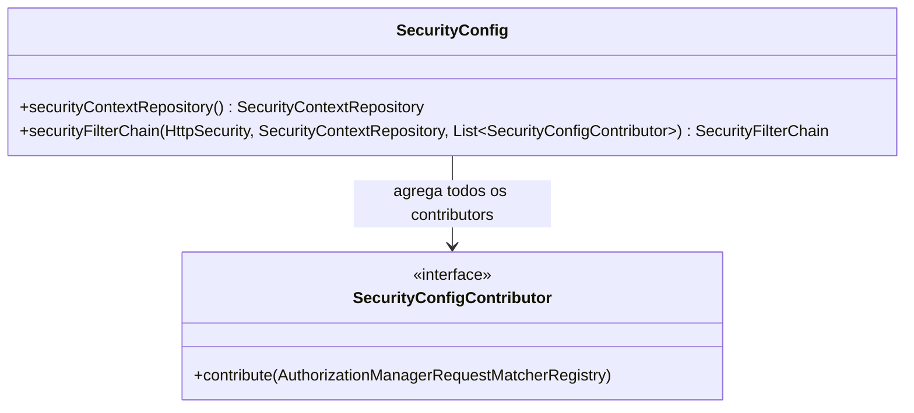
```mermaid
classDiagram
    class SecurityConfigContributor {
        <<interface>>
        +contribute(AuthorizationManagerRequestMatcherRegistry)
    }
    class SecurityConfig {
        +securityContextRepository() SecurityContextRepository
        +securityFilterChain(HttpSecurity, SecurityContextRepository, List~SecurityConfigContributor~) SecurityFilterChain
    }

    SecurityConfig --> SecurityConfigContributor : agrega todos os contributors
```

Também sem dependência de nenhum outro módulo do domínio — é o módulo que os outros implementam
(`LoginSecurityConfigContributor` em `loginsession`, `CompetitionSecurityConfigContributor` em
`competition`, `SwaggerUiSecurityConfigContributor` em `common`), nunca o contrário.

## Módulo `loginsession`

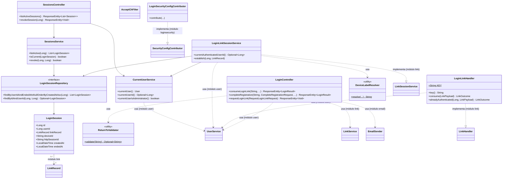
```mermaid
classDiagram
    class LoginSession {
        +Long id
        +Long userId
        +LinkRecord linkRecord
        +String deviceId
        +String httpSessionId
        +LocalDateTime createdAt
        +LocalDateTime endedAt
    }
    class LoginSessionRepository {
        <<interface>>
        +findByUserIdAndEndedAtIsNullOrderByCreatedAtAsc(Long) List~LoginSession~
        +findByIdAndUserId(Long, Long) Optional~LoginSession~
    }
    class LoginController {
        +consumeLoginLink(String, ...) ResponseEntity~LoginResult~
        +completeRegistration(String, CompleteRegistrationRequest, ...) ResponseEntity~LoginResult~
        +requestLoginLink(RequestLoginLinkRequest) ResponseEntity~Void~
    }
    class LoginLinkHandler {
        +String KEY$
        +key() String
        +consume(LinkPayload) LinkOutcome
        +alreadyAuthenticated(Long, LinkPayload) LinkOutcome
    }
    class LoginLinkSessionService {
        +currentAuthenticatedUserId() Optional~Long~
        +establish(Long, LinkRecord)
    }
    class CurrentUserService {
        +currentUser() User
        +currentUserId() Optional~Long~
        +currentUserIsAdministrator() boolean
    }
    class SessionsController {
        +listActiveSessions() ResponseEntity~List~Session~~
        +revokeSession(Long) ResponseEntity~Void~
    }
    class SessionsService {
        +listActive(Long) List~LoginSession~
        +isCurrent(LoginSession) boolean
        +revoke(Long, Long) boolean
    }
    class ReturnToValidator {
        <<utility>>
        +validate(String)$ Optional~String~
    }
    class DeviceLabelResolver {
        <<utility>>
        +resolve(...)$ String
    }
    class AcceptChFilter
    class LoginSecurityConfigContributor {
        +contribute(...)
    }

    LoginSession "0..*" --> "1" LinkRecord : módulo link
    LoginSessionRepository --> LoginSession
    LoginController ..> UserService : usa (módulo user)
    LoginController ..> LinkService : usa (módulo link)
    LoginController ..> EmailSender : usa (módulo email)
    LoginController ..> ReturnToValidator : usa
    LoginLinkHandler ..|> LinkHandler : implementa (módulo link)
    LoginLinkHandler ..> UserService : usa (módulo user)
    LoginLinkSessionService ..|> LinkSessionService : implementa (módulo link)
    LoginLinkSessionService ..> UserService : usa (módulo user)
    LoginLinkSessionService --> CurrentUserService
    LoginLinkSessionService --> LoginSessionRepository
    LoginLinkSessionService ..> DeviceLabelResolver : usa
    SessionsController --> SessionsService
    SessionsController --> CurrentUserService
    CurrentUserService ..> UserService : usa (módulo user)
    SessionsService --> LoginSessionRepository
    LoginSecurityConfigContributor ..|> SecurityConfigContributor : implementa (módulo loginsecurity)
```

`LinkService`/`EmailSender`/`UserService` pertencem aos módulos `link`/`email`/`user` — aparecem
aqui só como o ponto de fronteira que `loginsession` atravessa (ver diagrama de dependências).
`LoginLinkSessionService.establish` recebe o `LinkRecord` já carregado por `LinkService`, em vez
do token, para não precisar ler `LinkRecordRepository` (spec 05-029). `CurrentUserService` é o
único lugar que sabe que o nome da `Authentication` é o e-mail do usuário — `competition` também
o usa. `LoginLinkHandler` nunca sobrescreve
`complete()` (link de login é sempre uma única fase) — só `CompetitionLinkHandler` (módulo
`competition`) o faz, para o registro em duas fases.

### Pedido de login avulso

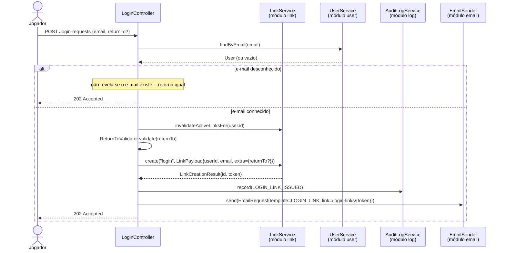
```mermaid
sequenceDiagram
    actor J as Jogador
    participant LC as LoginController
    participant LiS as LinkService<br/>(módulo link)
    participant US as UserService<br/>(módulo user)
    participant AL as AuditLogService<br/>(módulo log)
    participant ES as EmailSender<br/>(módulo email)

    J->>LC: POST /login-requests {email, returnTo?}
    LC->>US: findByEmail(email)
    US-->>LC: User (ou vazio)
    alt e-mail desconhecido
        Note over LC: não revela se o e-mail existe -- retorna igual
        LC-->>J: 202 Accepted
    else e-mail conhecido
        LC->>LiS: invalidateActiveLinksFor(user.id)
        LC->>LC: ReturnToValidator.validate(returnTo)
        LC->>LiS: create("login", LinkPayload{userId, email, extra={returnTo?}})
        LiS-->>LC: LinkCreationResult{id, token}
        LC->>AL: record(LOGIN_LINK_ISSUED)
        LC->>ES: send(EmailRequest{template=LOGIN_LINK, link=/login-links/{token}})
        LC-->>J: 202 Accepted
    end
```

### Consumo de um link de login (`LoginLinkHandler`)

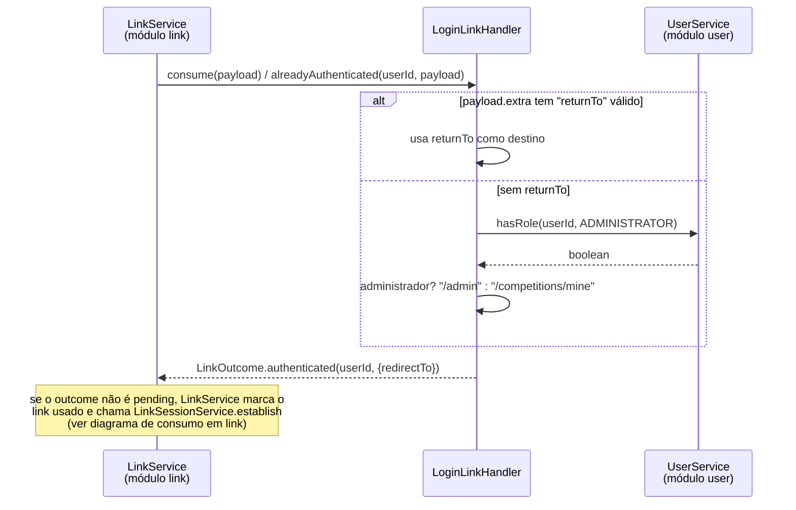
```mermaid
sequenceDiagram
    participant LiS as LinkService<br/>(módulo link)
    participant H as LoginLinkHandler
    participant US as UserService<br/>(módulo user)

    LiS->>H: consume(payload) / alreadyAuthenticated(userId, payload)
    alt payload.extra tem "returnTo" válido
        H->>H: usa returnTo como destino
    else sem returnTo
        H->>US: hasRole(userId, ADMINISTRATOR)
        US-->>H: boolean
        H->>H: administrador? "/admin" : "/competitions/mine"
    end
    H-->>LiS: LinkOutcome.authenticated(userId, {redirectTo})
    Note over LiS: se o outcome não é pending, LinkService marca o<br/>link usado e chama LinkSessionService.establish<br/>(ver diagrama de consumo em link)
```

## Módulo `competition`

```mermaid
classDiagram
    class Competition {
        +Long id
        +String name
        +CompetitionType type
        +LocalDate startDate
        +int durationDays
        +boolean recurring
        +BigDecimal buyFee
        +BigDecimal sellFee
        +CompetitionStatus status
        +User creator
    }
    class Participation {
        +Long id
        +Competition competition
        +User user
        +String email
        +ParticipationStatus status
        +RequestType requestType
        +LocalDate firstEmailSentDate
        +LocalDate joinedAt
    }
    class CompetitionType {
        <<enumeration>>
        PUBLIC
        PRIVATE
    }
    class CompetitionStatus {
        <<enumeration>>
        AWAITING_INVITES
        OPEN
        CLOSED
    }
    class ParticipationStatus {
        <<enumeration>>
        EMAIL_NOT_SENT
        EMAIL_SENT
        LINK_CLICKED
        IN_COMPETITION
    }
    class RequestType {
        <<enumeration>>
        INVITE
        REQUEST
    }
    class CompetitionRepository {
        <<interface>>
        +findByTypeAndStatus(CompetitionType, CompetitionStatus) List~Competition~
    }
    class ParticipationRepository {
        <<interface>>
        +findByCompetition_IdAndStatus(...) List~Participation~
        +findByCompetition_IdAndUser_Id(...) Optional~Participation~
        +findByCompetition_IdAndEmailAndStatusNot(...) Optional~Participation~
        +findByCompetition_Id(Long) List~Participation~
        +findByIdAndCompetition_Id(...) Optional~Participation~
        +findByUser_Id(Long) List~Participation~
    }
    class CompetitionService {
        +create(CompetitionCreateRequest) Competition
        +decideInviteEmailTiming(Long, TimingEnum)
    }
    class CompetitionViewService {
        +listPublicCompetitions() List~CompetitionSummary~
        +listMyCompetitions(Long) MyCompetitions
        +getCompetitionDetail(Long, Long, boolean) Optional~CompetitionDetail~
    }
    class CompetitionAccessResolver {
        <<utility>>
        +resolve(Competition, Participation, boolean)$ Optional~AccessLevel~
    }
    class EntryRequestService {
        +confirmEntry(Long) Participation
        +requestEntry(Long, EntryRequest)
    }
    class PlayerManagementService {
        +listPlayers(Long, ParticipationStatus) List~Participation~
        +invitePlayers(Long, List~String~)
        +updateEmail(Long, Long, String) Participation
        +removePlayer(Long, Long)
        +resendInviteEmail(Long, Long)
        +resendInviteEmails(Long, List~Long~)
    }
    class CompetitionLinkHandler {
        +String KEY$
        +String PARTICIPATION_ID_EXTRA_KEY$
        +key() String
        +consume(LinkPayload) LinkOutcome
        +alreadyAuthenticated(Long, LinkPayload) LinkOutcome
        +complete(LinkPayload, Map) LinkOutcome
    }
    class CompetitionSecurityConfigContributor {
        +contribute(...)
    }
    class CompetitionsController {
        +createCompetition(...) ResponseEntity~Competition~
        +decideInviteEmailTiming(...) ResponseEntity~Void~
        +listPublicCompetitions() ResponseEntity~List~
        +listMyCompetitions() ResponseEntity~MyCompetitions~
        +getCompetitionDetail(Long) ResponseEntity~CompetitionDetail~
    }
    class EntryRequestsController {
        +requestOrConfirmEntry(Long, EntryRequest) ResponseEntity~Participation~
    }
    class PlayersController {
        +listPlayers(...) ResponseEntity~List~
        +invitePlayers(...) ResponseEntity~Void~
        +updatePlayerEmail(...) ResponseEntity~Participation~
        +removePlayer(...) ResponseEntity~Void~
        +resendPlayerInviteEmail(...) ResponseEntity~Void~
        +resendPlayerInviteEmails(...) ResponseEntity~Void~
    }
    class ParticipationMapper {
        <<utility>>
        +toApiModel(Participation)$ Participation
    }
    class CompetitionNotFoundException { <<exception>> }
    class CompetitionValidationException { <<exception>> }
    class EntryRequestValidationException { <<exception>> }
    class PlayerNotFoundException { <<exception>> }
    class PlayerValidationException { <<exception>> }

    Competition "1" --> "0..*" Participation
    Competition --> CompetitionType
    Competition --> CompetitionStatus
    Participation --> ParticipationStatus
    Participation --> RequestType
    CompetitionRepository --> Competition
    ParticipationRepository --> Participation
    CompetitionService --> CompetitionRepository
    CompetitionService --> ParticipationRepository
    CompetitionService ..> CompetitionValidationException : lança
    CompetitionService ..> CompetitionNotFoundException : lança
    CompetitionViewService --> CompetitionRepository
    CompetitionViewService --> ParticipationRepository
    CompetitionViewService ..> CompetitionAccessResolver : usa
    EntryRequestService --> CompetitionRepository
    EntryRequestService --> ParticipationRepository
    EntryRequestService ..> EntryRequestValidationException : lança
    PlayerManagementService --> CompetitionRepository
    PlayerManagementService --> ParticipationRepository
    PlayerManagementService ..> PlayerNotFoundException : lança
    PlayerManagementService ..> PlayerValidationException : lança
    CompetitionLinkHandler ..|> LinkHandler : implementa (módulo link)
    CompetitionLinkHandler --> ParticipationRepository
    CompetitionLinkHandler ..> UserProvisioningService : usa (módulo user)
    CompetitionService ..> UserService : usa (módulo user)
    EntryRequestService ..> UserService : usa (módulo user)
    PlayerManagementService ..> UserService : usa (módulo user)
    CompetitionsController ..> CurrentUserService : usa (módulo loginsession)
    CompetitionService ..> CurrentUserService : usa (módulo loginsession)
    EntryRequestService ..> CurrentUserService : usa (módulo loginsession)
    PlayerManagementService ..> CurrentUserService : usa (módulo loginsession)
    CompetitionSecurityConfigContributor ..|> SecurityConfigContributor : implementa (módulo loginsecurity)
    CompetitionsController --> CompetitionService
    CompetitionsController --> CompetitionViewService
    EntryRequestsController --> EntryRequestService
    EntryRequestsController ..> ParticipationMapper : usa
    PlayersController --> PlayerManagementService
    PlayersController ..> ParticipationMapper : usa
```

`CompetitionLinkHandler` cria o `User` na conclusão do registro (`complete()`) via
`user.UserProvisioningService` — o mesmo serviço do bootstrap do administrador. O resto do módulo
só lê usuários já existentes via `user.UserService`, e descobre quem está logado via
`loginsession.CurrentUserService` — nenhuma classe daqui toca um repositório de `user` (spec
05-029).

As 5 exceções (`CompetitionNotFoundException`, `CompetitionValidationException`,
`EntryRequestValidationException`, `PlayerNotFoundException`, `PlayerValidationException`) moram
em `dev.leilaalgarve.jogoacoes.competition.exception`, não na raiz do pacote — mesmo subpacote
`exception/` da spec 05-008 descrito na seção do módulo `link`.

### Criação de competição privada + convite

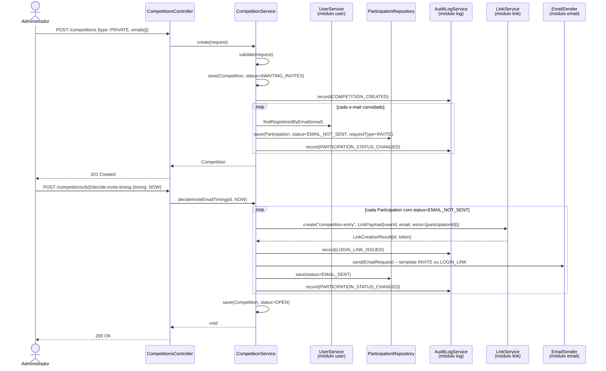
```mermaid
sequenceDiagram
    actor A as Administrador
    participant CC as CompetitionsController
    participant CS as CompetitionService
    participant US as UserService<br/>(módulo user)
    participant PR as ParticipationRepository
    participant AL as AuditLogService<br/>(módulo log)
    participant LiS as LinkService<br/>(módulo link)
    participant ES as EmailSender<br/>(módulo email)

    A->>CC: POST /competitions {type: PRIVATE, emails[]}
    CC->>CS: create(request)
    CS->>CS: validate(request)
    CS->>CS: save(Competition, status=AWAITING_INVITES)
    CS->>AL: record(COMPETITION_CREATED)
    loop cada e-mail convidado
        CS->>US: findRegisteredByEmail(email)
        CS->>PR: save(Participation, status=EMAIL_NOT_SENT, requestType=INVITE)
        CS->>AL: record(PARTICIPATION_STATUS_CHANGED)
    end
    CS-->>CC: Competition
    CC-->>A: 201 Created

    A->>CC: POST /competitions/{id}/decide-invite-timing {timing: NOW}
    CC->>CS: decideInviteEmailTiming(id, NOW)
    loop cada Participation com status=EMAIL_NOT_SENT
        CS->>LiS: create("competition-entry", LinkPayload{userId, email, extra={participationId}})
        LiS-->>CS: LinkCreationResult{id, token}
        CS->>AL: record(LOGIN_LINK_ISSUED)
        CS->>ES: send(EmailRequest) -- template INVITE ou LOGIN_LINK
        CS->>PR: save(status=EMAIL_SENT)
        CS->>AL: record(PARTICIPATION_STATUS_CHANGED)
    end
    CS->>CS: save(Competition, status=OPEN)
    CS-->>CC: void
    CC-->>A: 200 OK
```

### Pedido de entrada em competição pública + consumo do link

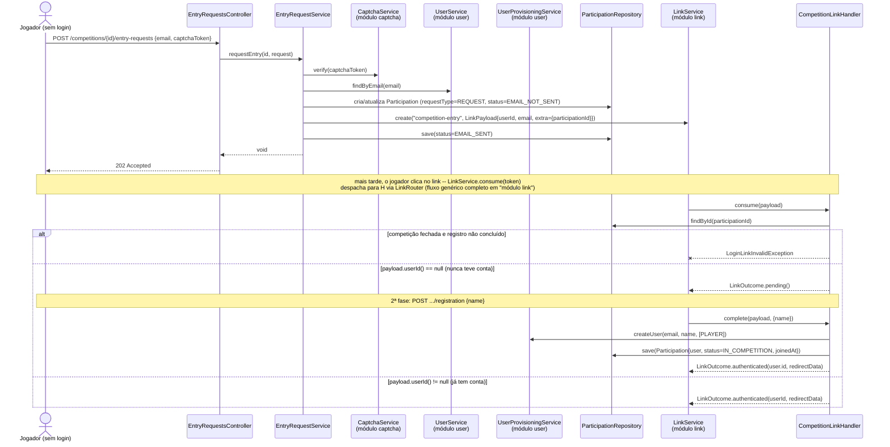
```mermaid
sequenceDiagram
    actor J as Jogador (sem login)
    participant ERC as EntryRequestsController
    participant ERS as EntryRequestService
    participant Cap as CaptchaService<br/>(módulo captcha)
    participant US as UserService<br/>(módulo user)
    participant UPS as UserProvisioningService<br/>(módulo user)
    participant PR as ParticipationRepository
    participant LiS as LinkService<br/>(módulo link)
    participant H as CompetitionLinkHandler

    J->>ERC: POST /competitions/{id}/entry-requests {email, captchaToken}
    ERC->>ERS: requestEntry(id, request)
    ERS->>Cap: verify(captchaToken)
    ERS->>US: findByEmail(email)
    ERS->>PR: cria/atualiza Participation (requestType=REQUEST, status=EMAIL_NOT_SENT)
    ERS->>LiS: create("competition-entry", LinkPayload{userId, email, extra={participationId}})
    ERS->>PR: save(status=EMAIL_SENT)
    ERS-->>ERC: void
    ERC-->>J: 202 Accepted

    Note over J,H: mais tarde, o jogador clica no link -- LinkService.consume(token)<br/>despacha para H via LinkRouter (fluxo genérico completo em "módulo link")

    LiS->>H: consume(payload)
    H->>PR: findById(participationId)
    alt competição fechada e registro não concluído
        H--xLiS: LoginLinkInvalidException
    else payload.userId() == null (nunca teve conta)
        H-->>LiS: LinkOutcome.pending()
        Note over J,H: 2ª fase: POST .../registration {name}
        LiS->>H: complete(payload, {name})
        H->>UPS: createUser(email, name, [PLAYER])
        H->>PR: save(Participation{user, status=IN_COMPETITION, joinedAt})
        H-->>LiS: LinkOutcome.authenticated(user.id, redirectData)
    else payload.userId() != null (já tem conta)
        H-->>LiS: LinkOutcome.authenticated(userId, redirectData)
    end
```

### Gerência de jogadores — reenvio e remoção

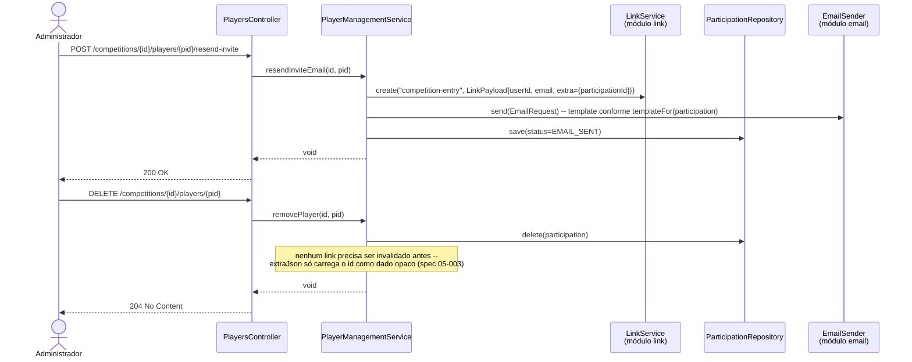
```mermaid
sequenceDiagram
    actor A as Administrador
    participant PC as PlayersController
    participant PS as PlayerManagementService
    participant LiS as LinkService<br/>(módulo link)
    participant PR as ParticipationRepository
    participant ES as EmailSender<br/>(módulo email)

    A->>PC: POST /competitions/{id}/players/{pid}/resend-invite
    PC->>PS: resendInviteEmail(id, pid)
    PS->>LiS: create("competition-entry", LinkPayload{userId, email, extra={participationId}})
    PS->>ES: send(EmailRequest) -- template conforme templateFor(participation)
    PS->>PR: save(status=EMAIL_SENT)
    PS-->>PC: void
    PC-->>A: 200 OK

    A->>PC: DELETE /competitions/{id}/players/{pid}
    PC->>PS: removePlayer(id, pid)
    PS->>PR: delete(participation)
    Note over PS: nenhum link precisa ser invalidado antes --<br/>extraJson só carrega o id como dado opaco (spec 05-003)
    PS-->>PC: void
    PC-->>A: 204 No Content
```

## Módulo `common`

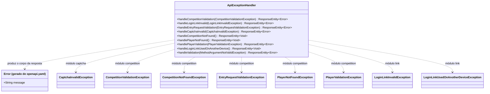
```mermaid
classDiagram
    class ApiExceptionHandler {
        +handleCompetitionValidation(CompetitionValidationException) ResponseEntity~Error~
        +handleLoginLinkInvalid(LoginLinkInvalidException) ResponseEntity~Error~
        +handleEntryRequestValidation(EntryRequestValidationException) ResponseEntity~Error~
        +handleCaptchaInvalid(CaptchaInvalidException) ResponseEntity~Error~
        +handleCompetitionNotFound() ResponseEntity~Void~
        +handlePlayerNotFound() ResponseEntity~Void~
        +handlePlayerValidation(PlayerValidationException) ResponseEntity~Error~
        +handleLoginLinkUsedOnAnotherDevice() ResponseEntity~Void~
        +handleValidation(MethodArgumentNotValidException) ResponseEntity~Error~
    }
    class Error["Error (gerado de openapi.yaml)"] {
        +String message
    }

    ApiExceptionHandler ..> Error : produz o corpo da resposta
    ApiExceptionHandler ..> CaptchaInvalidException : módulo captcha
    ApiExceptionHandler ..> CompetitionValidationException : módulo competition
    ApiExceptionHandler ..> CompetitionNotFoundException : módulo competition
    ApiExceptionHandler ..> EntryRequestValidationException : módulo competition
    ApiExceptionHandler ..> PlayerNotFoundException : módulo competition
    ApiExceptionHandler ..> PlayerValidationException : módulo competition
    ApiExceptionHandler ..> LoginLinkInvalidException : módulo link
    ApiExceptionHandler ..> LoginLinkUsedOnAnotherDeviceException : módulo link
```

Os imports reais (spec 05-008) apontam para `competition.exception.*` e `link.exception.*`, não
para a raiz desses pacotes — ver a nota sobre o subpacote `exception/` nas seções `link` e
`competition`. `CaptchaInvalidException` (módulo `captcha`) é a única exceção que `common`
importa que ainda está na raiz do seu pacote — `captcha` tem uma exceção só, abaixo do limiar da
convenção.

### Tradução de uma exceção de negócio em resposta HTTP

```mermaid
sequenceDiagram
    actor U as Cliente HTTP
    participant Ctrl as Controller<br/>(qualquer módulo)
    participant Svc as Serviço<br/>(qualquer módulo)
    participant AEH as ApiExceptionHandler

    U->>Ctrl: requisição HTTP
    Ctrl->>Svc: chama regra de negócio
    Svc--xCtrl: lança exceção (ex.: CompetitionValidationException)
    Note over Ctrl,AEH: Spring intercepta via @RestControllerAdvice --<br/>o controller não trata a exceção explicitamente
    AEH->>AEH: handleXxx(exceção)
    AEH-->>U: ResponseEntity~Error~ (400/404/409)
```
