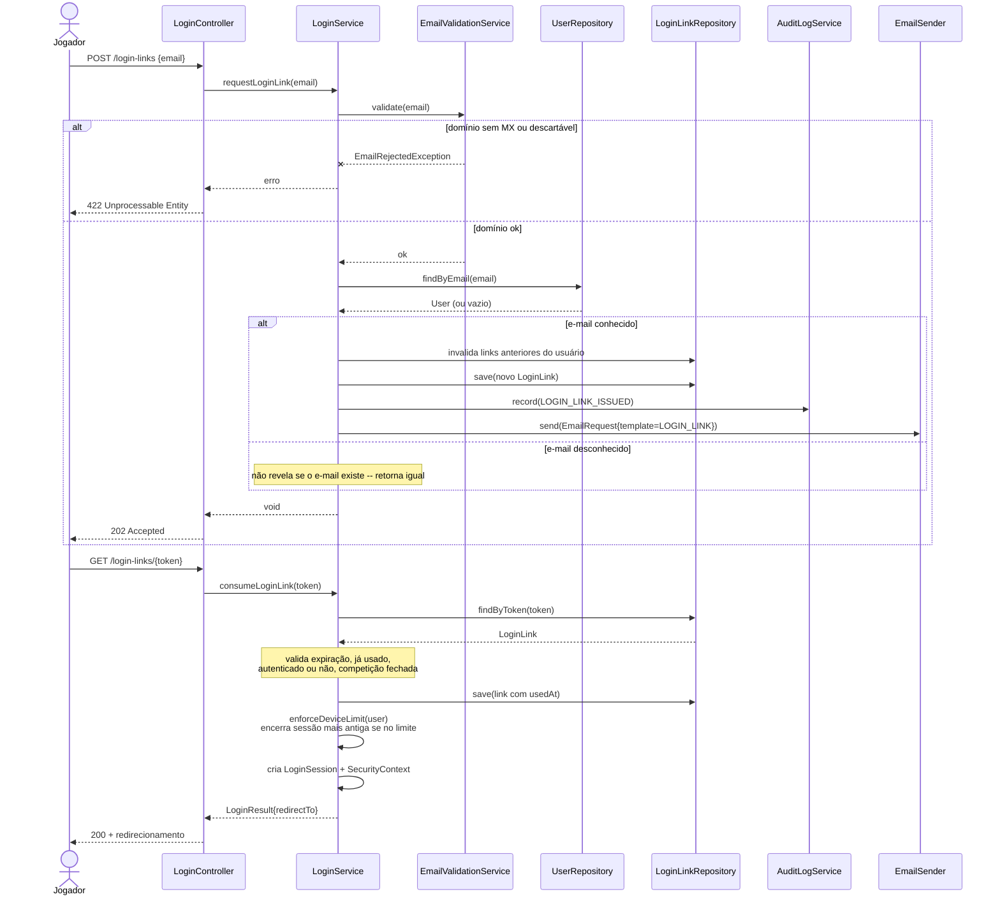
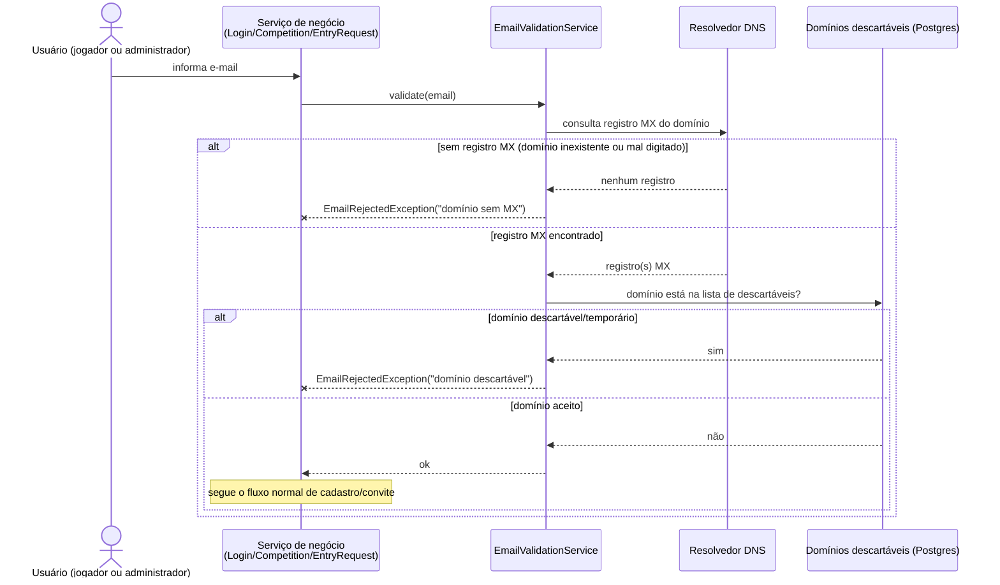
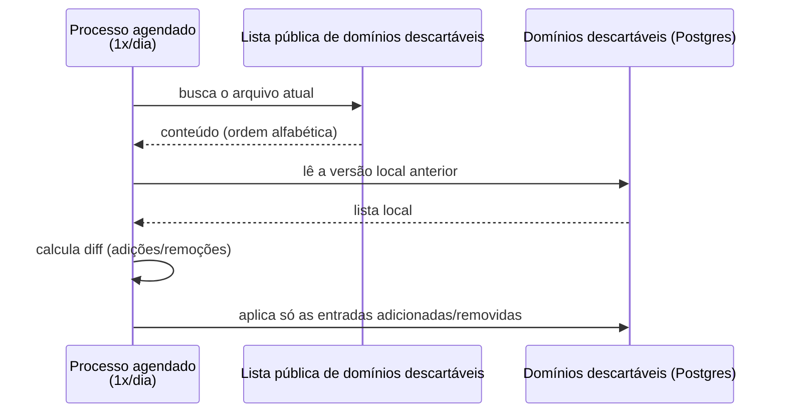
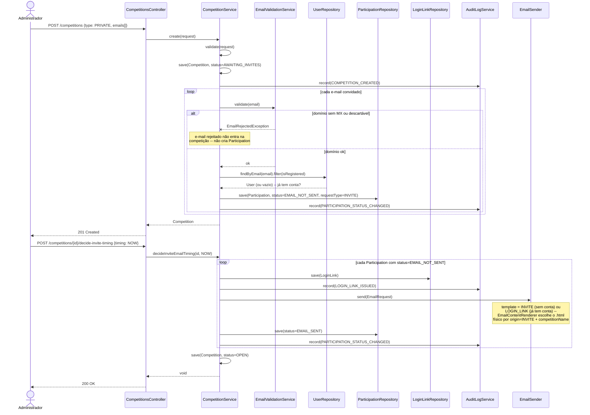
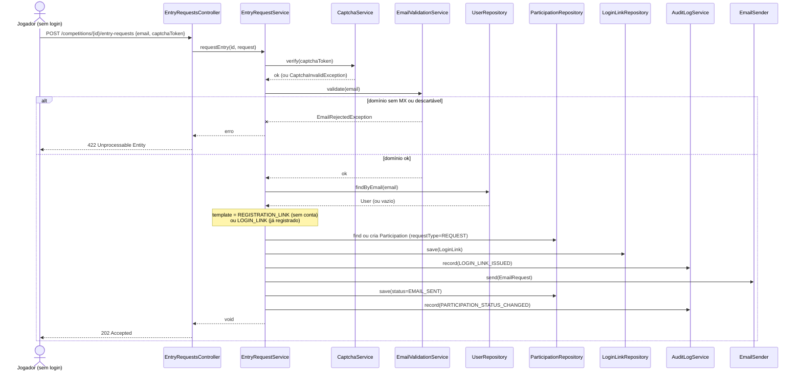
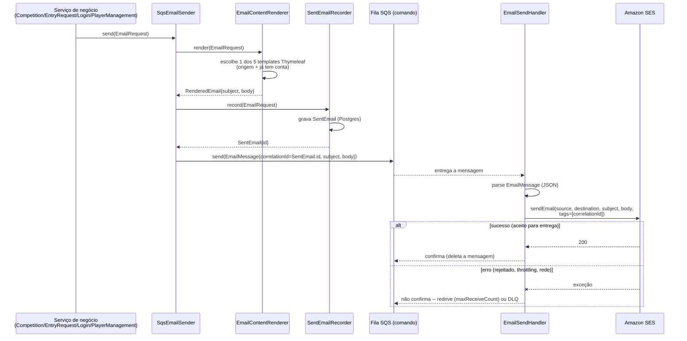

# Diagramas de sequência — Jogo de Ações

Um diagrama por fluxo, cobrindo os pontos de entrada do sistema: login, criação de
competição e convite, verificação de e-mail, pedido de entrada em competição pública,
gerência de jogadores e o pipeline assíncrono de envio de e-mail.

## 1. Login

Pedido de link e consumo em um dispositivo novo — as regras de dispositivo (reuso de link,
limite por usuário) ficam resumidas numa nota; `LoginService.consumeLoginLink` trata todas no
mesmo método.



## 2. Verificação de e-mail antes do cadastro

Checagem síncrona feita no momento em que qualquer e-mail é coletado (convite de
administrador, pedido de entrada, pedido de login) — mesmo ponto onde o captcha já é
validado, quando há um. Falha rejeita o cadastro imediatamente, sem criar `Participation`/
`LoginLink` para um endereço que não vai receber nada. Duas checagens, nessa ordem: registro
MX do domínio (pega domínio inexistente ou digitado errado) e domínio descartável/temporário
contra uma lista de bloqueio local. Não cobre a existência real da caixa postal — isso fica
fora de escopo (não confiável, mal-visto por provedores de e-mail).



A lista de domínios descartáveis é mantida localmente (não é uma consulta externa a cada
e-mail) e atualizada uma vez por dia a partir de uma fonte pública mantida em ordem
alfabética — o que torna barato calcular só o que mudou desde a última atualização, em vez de
reprocessar a lista inteira.



## 3. Criação de competição privada + convite

Duas chamadas: criar a competição (gera `Participation` por e-mail convidado, sem enviar
nada ainda) e decidir o momento do envio.



## 4. Pedido de entrada em competição pública

Jogador sem sessão, com captcha — cobre tanto quem nunca teve conta quanto quem já tem conta
de outra competição (o `EmailTemplate` muda, mas o fluxo é o mesmo).



## 5. Gerência de jogadores — reenvio e remoção

`resendInviteEmail(s)` reaproveita o mesmo `sendInviteEmail` privado usado na criação (fluxo
3); a remoção precisa apagar o `LoginLink` antes da `Participation` por causa da FK real.

```mermaid
sequenceDiagram
    actor A as Administrador
    participant PC as PlayersController
    participant PS as PlayerManagementService
    participant LLR as LoginLinkRepository
    participant PR as ParticipationRepository
    participant AL as AuditLogService
    participant ES as EmailSender

    A->>PC: POST /competitions/{id}/players/{pid}/resend-invite
    PC->>PS: resendInviteEmail(id, pid)
    PS->>PS: sendInviteEmail(participation)
    PS->>LLR: save(LoginLink)
    PS->>AL: record(LOGIN_LINK_ISSUED)
    PS->>ES: send(EmailRequest)
    Note over ES: templateFor(participation):<br/>já tem conta → LOGIN_LINK;<br/>senão, INVITE ou REGISTRATION_LINK<br/>conforme requestType
    PS->>PR: save(status=EMAIL_SENT)
    PS->>AL: record(PARTICIPATION_STATUS_CHANGED)
    PS-->>PC: void
    PC-->>A: 200 OK

    A->>PC: DELETE /competitions/{id}/players/{pid}
    PC->>PS: removePlayer(id, pid)
    PS->>LLR: deleteByParticipation_Id(pid)
    Note over PS: precisa vir antes -- LOGIN_LINK.participation_id<br/>é FK real, diferente de LOG
    PS->>PR: delete(participation)
    PS->>AL: record(PARTICIPATION_STATUS_CHANGED, "removed")
    PS-->>PC: void
    PC-->>A: 204 No Content
```

## 6. Envio assíncrono de e-mail — produtor → SQS → Lambda → SES

O que todo `EmailSender.send(...)` acima dispara: o sistema principal publica numa fila
Amazon SQS, e uma AWS Lambda consome e envia via Amazon SES.


