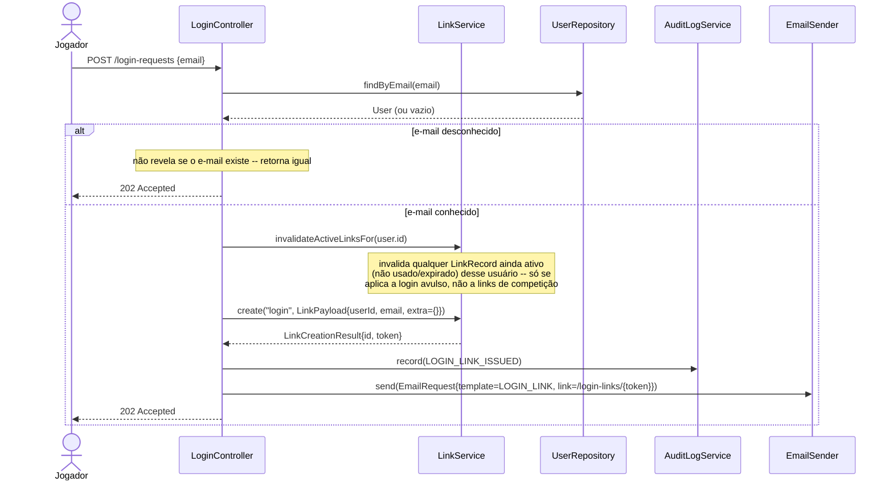
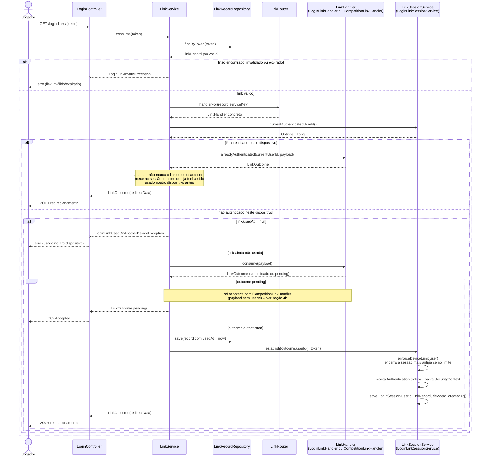
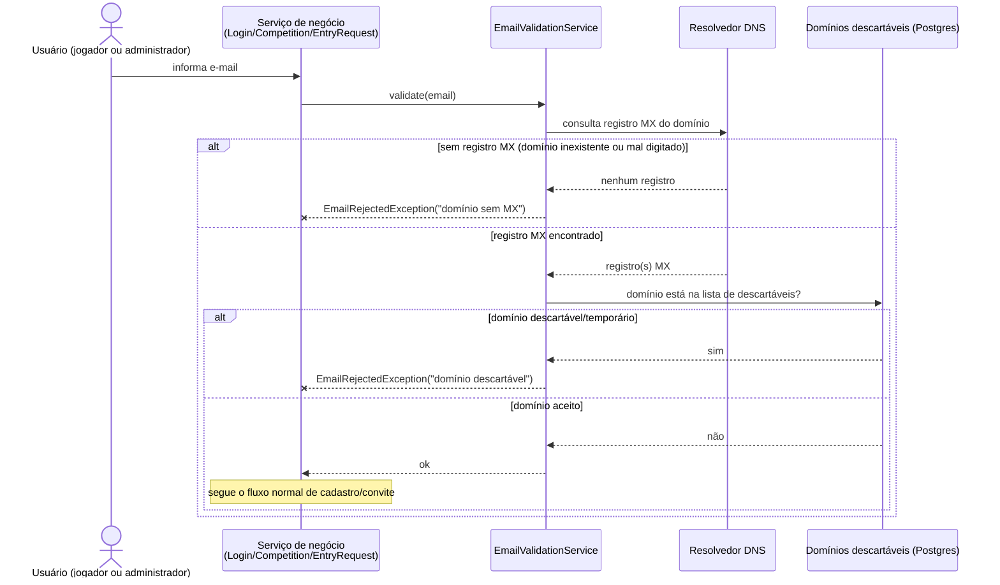
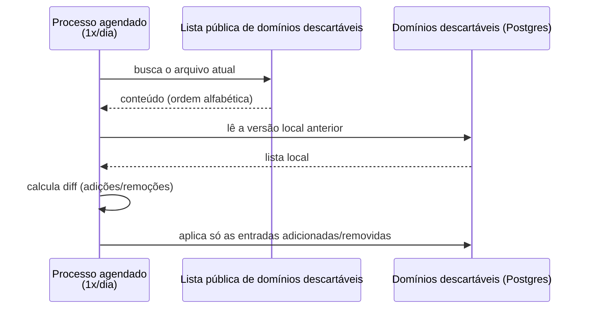
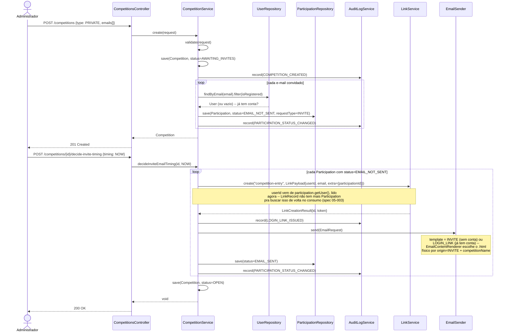
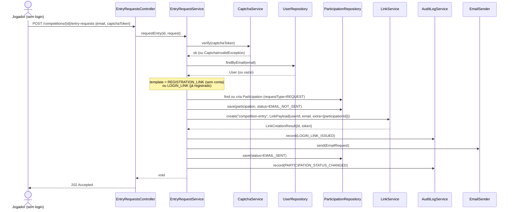
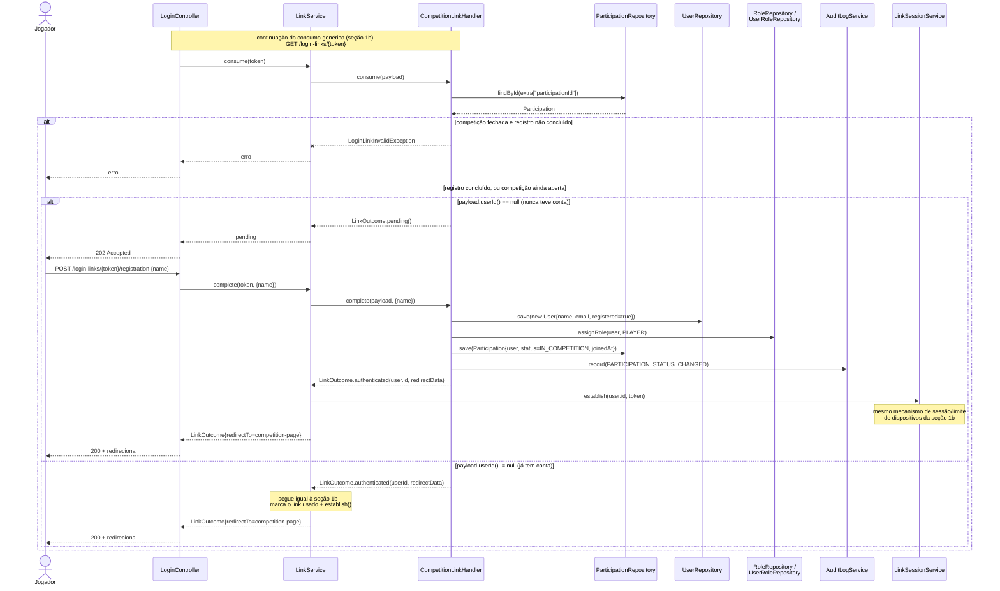
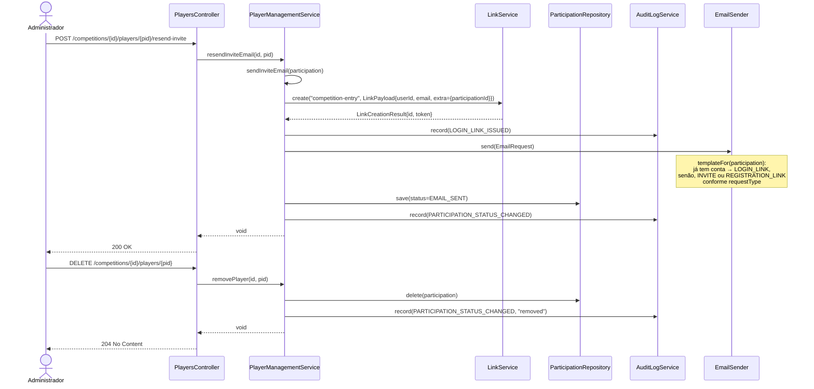
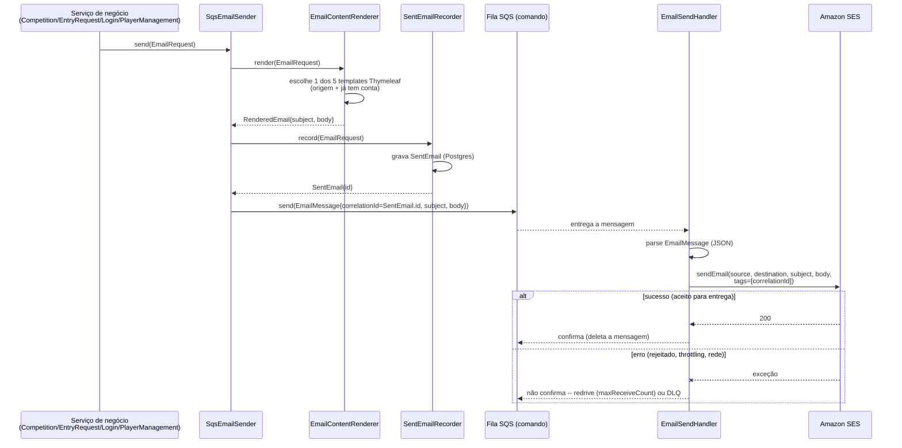

# Diagramas de sequência — Jogo de Ações

Um diagrama por fluxo, cobrindo os pontos de entrada do sistema: login, criação de
competição e convite, verificação de e-mail, pedido de entrada em competição pública,
gerência de jogadores e o pipeline assíncrono de envio de e-mail.

## 1. Login (mecanismo genérico de link — `LinkService`/`LinkRouter`/`LinkHandler`)

Desde a spec 05-003, um único endpoint genérico (`GET /login-links/{token}`) consome **qualquer**
link — tanto o login avulso quanto um link de convite/pedido de entrada de competição — porque
`LinkRouter` despacha pela `service_key` gravada no `LinkRecord` para o `LinkHandler` correto
(`LoginLinkHandler` ou `CompetitionLinkHandler`, ver [`classes.md`](classes.md)). O diagrama 1a
mostra o pedido de um login avulso; o 1b mostra o consumo, genérico o bastante para cobrir os dois
handlers — o ramo específico de `CompetitionLinkHandler` (registro em duas fases) está detalhado
na seção 4b.

### 1a. Pedido de login avulso

### 1b. Consumo do link (genérico)

`LoginLinkHandler.consume`/`alreadyAuthenticated` decidem o destino (`admin-page` ou
`competitions-list`) consultando o papel do usuário (`UserRoleRepository`) — omitido do diagrama
por brevidade, é uma chamada só.

## 2. Verificação de e-mail antes do cadastro

> ⚠️ **Não implementado.** `EmailValidationService`/`MxRecordResolver`/`DisposableDomainRepository`/
> `DisposableDomain`/`EmailRejectedException`/`DisposableDomainRefreshJob` não existem no código
> atual (`app/src/main/java/`) nem há tabela `disposable_domain` em nenhuma migração Flyway —
> conferido nesta sessão (2026-09-16) ao revisar o módulo `login` para a próxima spec. Esta seção
> documenta um mecanismo que só existe aqui e em [`der.md`](der.md#notas-de-modelagem)/
> [`classes.md`](classes.md#verificação-de-e-mail), nunca implementado. Mantido como está por ora
> (fora do escopo desta revisão) — decidir depois se vira uma spec própria ou se a documentação é
> que deve ser corrigida.

Checagem síncrona feita no momento em que qualquer e-mail é coletado (convite de
administrador, pedido de entrada, pedido de login) — mesmo ponto onde o captcha já é
validado, quando há um. Falha rejeita o cadastro imediatamente, sem criar `Participation`/
`LoginLink` para um endereço que não vai receber nada. Duas checagens, nessa ordem: registro
MX do domínio (pega domínio inexistente ou digitado errado) e domínio descartável/temporário
contra uma lista de bloqueio local. Não cobre a existência real da caixa postal — isso fica
fora de escopo (não confiável, mal-visto por provedores de e-mail).

A lista de domínios descartáveis é mantida localmente (não é uma consulta externa a cada
e-mail) e atualizada uma vez por dia a partir de uma fonte pública mantida em ordem
alfabética — o que torna barato calcular só o que mudou desde a última atualização, em vez de
reprocessar a lista inteira.

## 3. Criação de competição privada + convite

Duas chamadas: criar a competição (gera `Participation` por e-mail convidado, sem enviar
nada ainda) e decidir o momento do envio.

## 4. Pedido de entrada em competição pública

Jogador sem sessão, com captcha — cobre tanto quem nunca teve conta quanto quem já tem conta
de outra competição (o `EmailTemplate` muda, mas o fluxo é o mesmo).

### 4b. Consumo de um link de competição (dois casos)

Detalha o ramo `H.consume(payload)`/`H.complete(...)` da seção 1b quando `record.serviceKey ==
"competition-entry"` — os dois casos citados no cenário "New player logs in.../Registered player
confirms entry..." de `login.feature`.

## 5. Gerência de jogadores — reenvio e remoção

`resendInviteEmail(s)` reaproveita o mesmo `sendInviteEmail` privado usado na criação (fluxo
3). A remoção não precisa mais apagar nada em `link/` antes da `Participation` — desde a spec
05-003, `LinkRecord.extraJson` só carrega o `participationId` como dado opaco, sem FK real (ao
contrário da antiga `LoginLink.participation_id`), então um link clicado depois de o jogador
remover só falha ao resolver a participação, como qualquer outro link inválido.

## 6. Envio assíncrono de e-mail — produtor → SQS → Lambda → SES

O que todo `EmailSender.send(...)` acima dispara: o sistema principal publica numa fila
Amazon SQS, e uma AWS Lambda consome e envia via Amazon SES.

