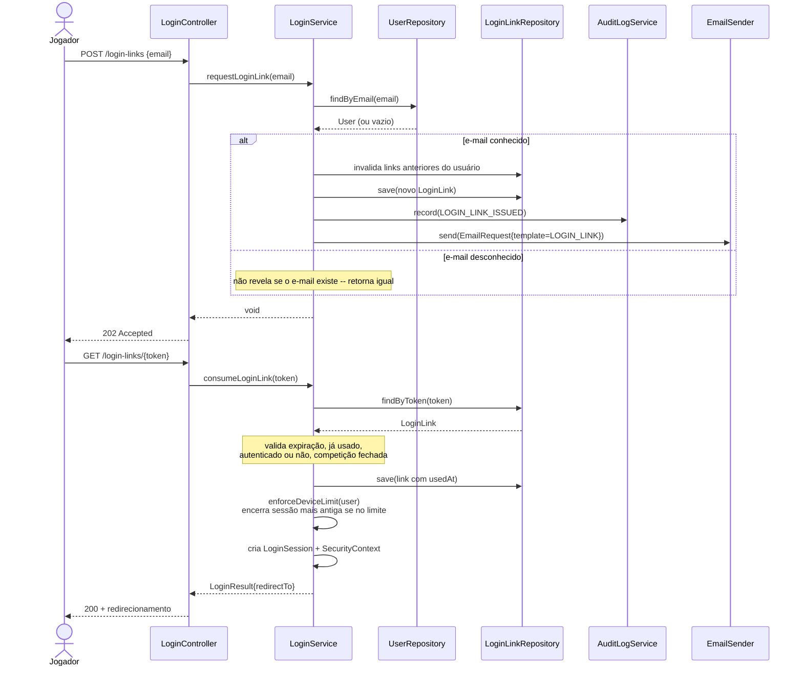
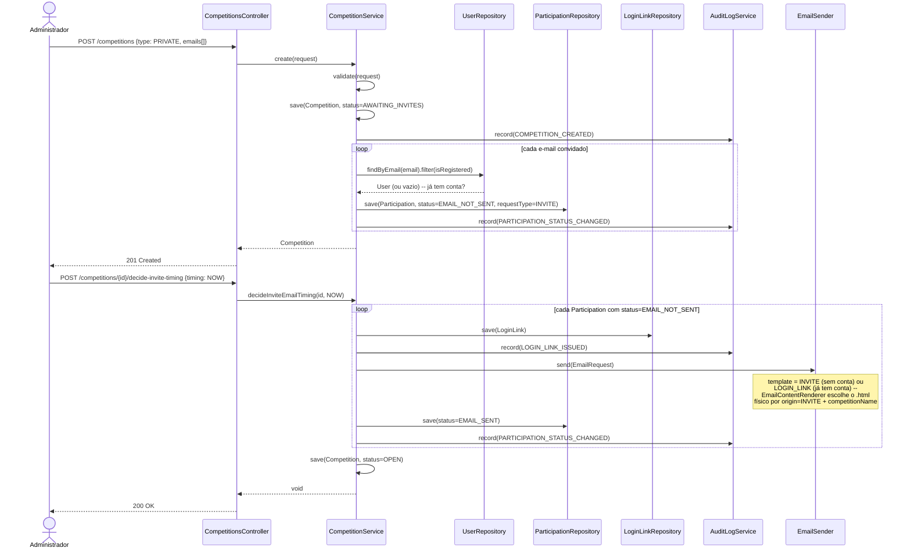
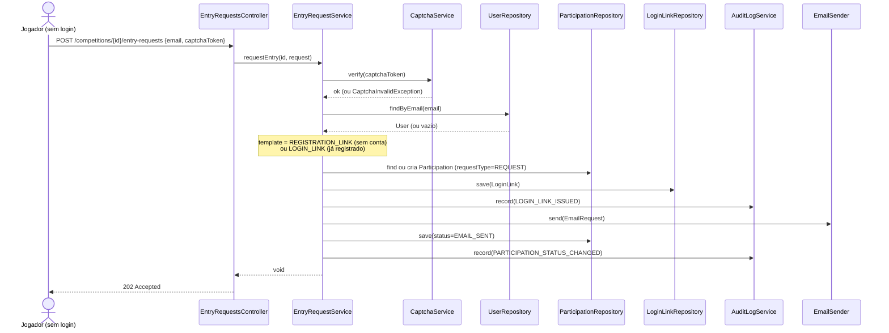
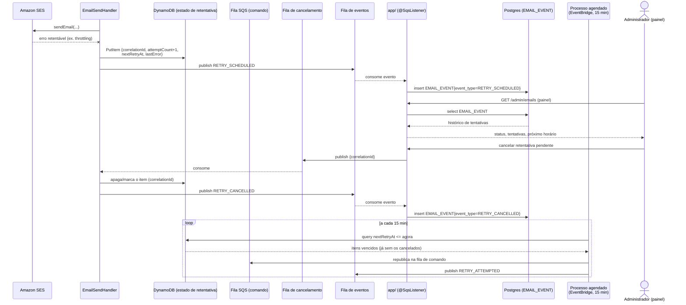

# Diagramas de sequência — Jogo de Ações

Um diagrama por fluxo, na mesma divisão dos arquivos `.feature` em
`app/src/test/resources/features` (Iterações 2–3) mais o pipeline assíncrono de e-mail
(Iteração 4). Os cinco primeiros descrevem código que existe e passa nos testes; o último é
desenho de decisão, não implementado — ver [`docs/iteracao-4.md`](../iteracao-4.md).

## 1. Login (`login.feature`)

Pedido de link e consumo em um dispositivo novo — as regras de dispositivo (reuso de link,
limite por usuário) ficam resumidas numa nota; `LoginService.consumeLoginLink` trata todas no
mesmo método.



## 2. Criação de competição privada + convite (`create_competition.feature`)

Duas chamadas: criar a competição (gera `Participation` por e-mail convidado, sem enviar
nada ainda) e decidir o momento do envio.



## 3. Pedido de entrada em competição pública (`request_competition_entry.feature`)

Jogador sem sessão, com captcha — cobre tanto quem nunca teve conta quanto quem já tem conta
de outra competição (o `EmailTemplate` muda, mas o fluxo é o mesmo).



## 4. Gerência de jogadores — reenvio e remoção (`manage_competition_players.feature`)

`resendInviteEmail(s)` reaproveita o mesmo `sendInviteEmail` privado usado na criação (fluxo
2); a remoção precisa apagar o `LoginLink` antes da `Participation` por causa da FK real.

```mermaid
sequenceDiagram
    actor A as Administrador
    participant PC as PlayersController
    participant PS as PlayerManagementService
    participant LLR as LoginLinkRepository
    participant PR as ParticipationRepository
    participant AL as AuditLogService
    participant ES as EmailSender

    A->>PC: POST /competitions/{id}/players/{pid}/resend-invite
    PC->>PS: resendInviteEmail(id, pid)
    PS->>PS: sendInviteEmail(participation)
    PS->>LLR: save(LoginLink)
    PS->>AL: record(LOGIN_LINK_ISSUED)
    PS->>ES: send(EmailRequest)
    Note over ES: templateFor(participation):<br/>já tem conta -> LOGIN_LINK;<br/>senão, INVITE ou REGISTRATION_LINK<br/>conforme requestType
    PS->>PR: save(status=EMAIL_SENT)
    PS->>AL: record(PARTICIPATION_STATUS_CHANGED)
    PS-->>PC: void
    PC-->>A: 200 OK

    A->>PC: DELETE /competitions/{id}/players/{pid}
    PC->>PS: removePlayer(id, pid)
    PS->>LLR: deleteByParticipation_Id(pid)
    Note over PS: precisa vir antes -- LOGIN_LINK.participation_id<br/>é FK real, diferente de LOG
    PS->>PR: delete(participation)
    PS->>AL: record(PARTICIPATION_STATUS_CHANGED, "removed")
    PS-->>PC: void
    PC-->>A: 204 No Content
```

## 5. Envio assíncrono de e-mail — produtor → SQS → Lambda → SES (Iteração 4)

O que todo `EmailSender.send(...)` acima dispara quando a implementação ativa é
`SqsEmailSender` (perfis `staging`/`production`; `docker`/CI publica de verdade contra
LocalStack desde a Iteração 4, mas não é o padrão ainda — `sandbox`/testes usam
`StubEmailSender`, que pula direto para "grava `SentEmail`").

```mermaid
sequenceDiagram
    participant Svc as Serviço de negócio<br/>(Competition/EntryRequest/Login/PlayerManagement)
    participant Sender as SqsEmailSender
    participant Renderer as EmailContentRenderer
    participant Rec as SentEmailRecorder
    participant SQS as Fila SQS (comando)
    participant Lambda as EmailSendHandler
    participant SES as Amazon SES

    Svc->>Sender: send(EmailRequest)
    Sender->>Renderer: render(EmailRequest)
    Renderer->>Renderer: escolhe 1 dos 5 templates Thymeleaf<br/>(origem + já tem conta)
    Renderer-->>Sender: RenderedEmail{subject, body}
    Sender->>Rec: record(EmailRequest)
    Rec->>Rec: grava SentEmail (Postgres)
    Rec-->>Sender: SentEmail{id}
    Sender->>SQS: send(EmailMessage{correlationId=SentEmail.id, subject, body})
    Note over SQS: LocalStack em docker/CI;<br/>fila real em staging/production (bloqueado por acesso AWS)

    SQS-->>Lambda: entrega a mensagem
    Lambda->>Lambda: parse EmailMessage (JSON)
    Lambda->>SES: sendEmail(source, destination, subject, body,<br/>tags=[correlationId])
    alt sucesso (aceito para entrega)
        SES-->>Lambda: 200
        Lambda-->>SQS: confirma (deleta a mensagem)
    else erro (rejeitado, throttling, rede)
        SES--xLambda: exceção
        Lambda-->>SQS: não confirma -- redrive (maxReceiveCount) ou DLQ
    end
```

## 6. Retentativa com política por erro + painel (decidido, não implementado)

Desenho da decisão 4 (`docs/iteracao-4.md`) — nenhuma classe/endpoint deste diagrama existe
no código ainda. `app/` só publica em fila (comando + cancelamento) e só lê a fila de eventos
— nunca acessa DynamoDB/SES diretamente; isso continua exclusivo da Lambda.


