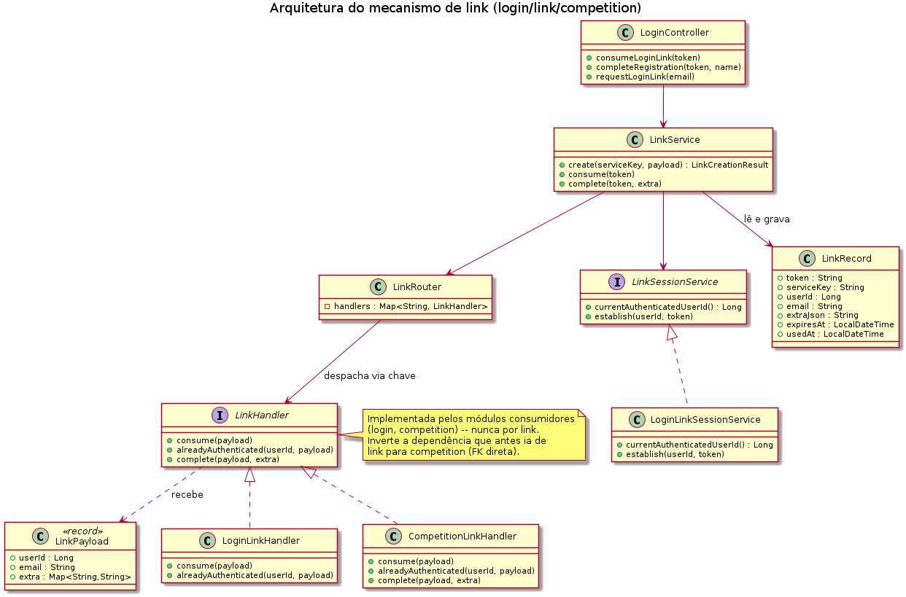
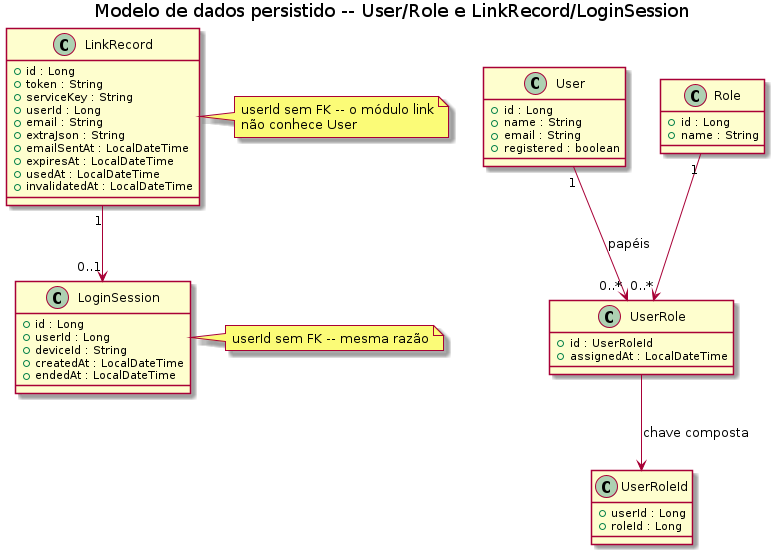
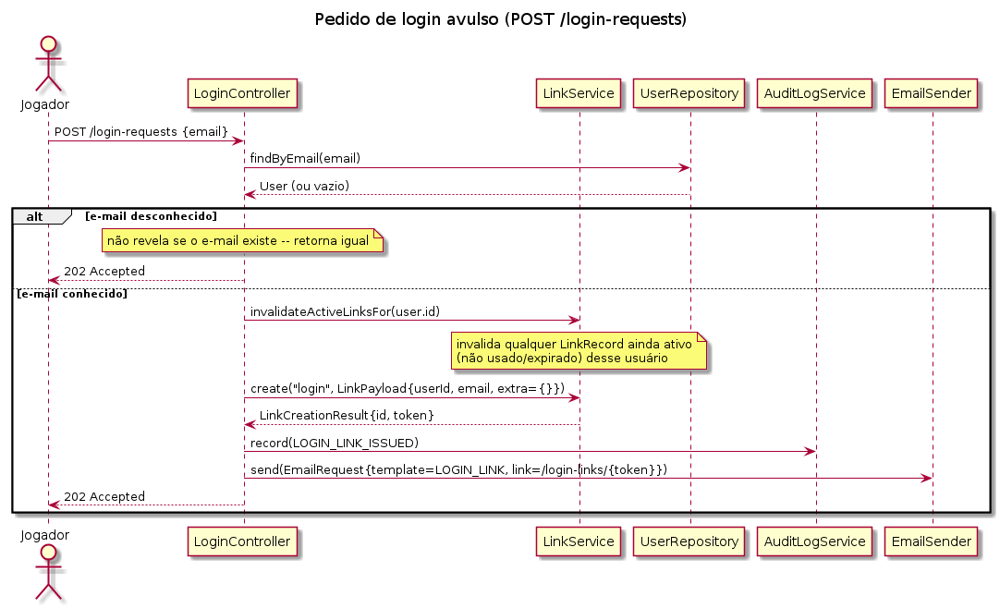
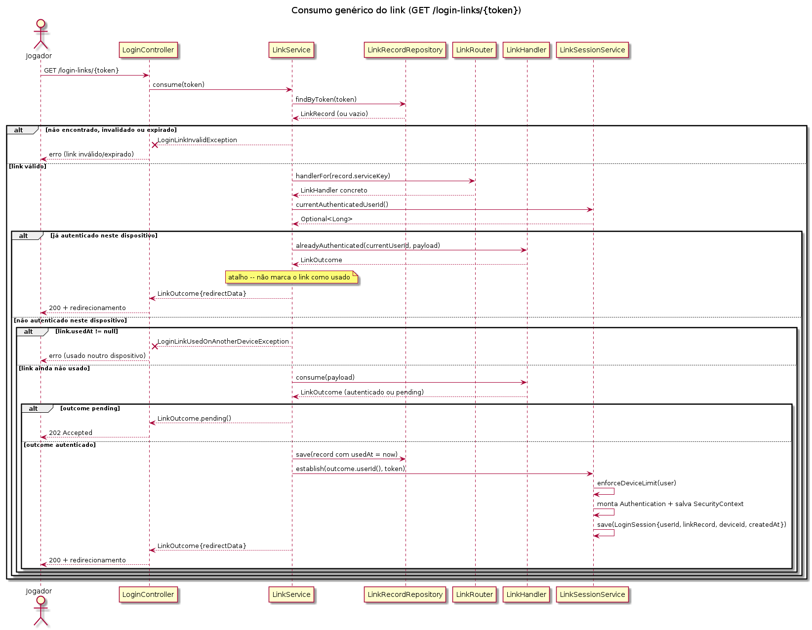
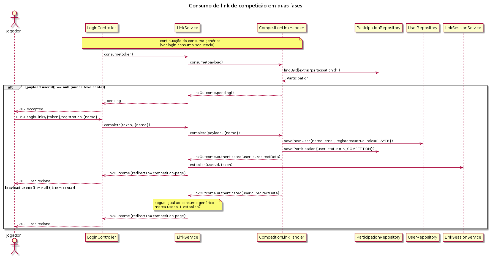

# **Projeto Jogo de Ações**

# **Introdução**

Um jogo de simulação de investimentos em bolsa: administradores criam competições — públicas (qualquer jogador pode pedir entrada) ou privadas (só quem é convidado por e-mail). Os jogadores, em uma competição por tempo determinado, começam com o mesmo saldo e, no final, se determina quem conseguiu a melhor performance. O escopo do projeto no contexto da disciplina inclui:

## **Aplicação Jogo de Ações**

* login por link recebido por e-mail  
* solicitação de ingresso clicando no link da competição pública e fornecendo o e-mail para recebimento do link  
* convites com link enviados por email para ingresso em uma competição privada  
* limites de login em diferentes dispositivos  
* o administrador pode remover jogadores de competições   
* verificação do formato dos endereços de email

## **Serviço de Email**

* verificação do formato dos endereços de email  
* verificação dos registros MX e A no DNS  
* cadastro de domínios bloqueados  
* cadastro de domínios temporários  
* cadastro de domínios liberados  
* cadastro de emails bloqueados  
* inclusão automática do e-mail no cadastro de bloqueados dependendo da falha do envio  
* envio de e-mails via SQS usando SES, usando o sistema de DLQ (dead-letter queue)  
* fila para recebimento de status de emails que não são imediatos como, por exemplo, bounce  
* retentativa de envio automática dependendo do erro  
* verificação de acesso ao serviço usando API-KEY

## **Função Lambda**

* envio de emails usando uma fila SQS para determinar os dados e o template  
* uso do DynamoDB para evitar o envio de emails duplicados

 

# **Status do projeto**

O projeto jogo de ações foi iniciado como um projeto para portfólio, por esse motivo não está no mesmo estado dos projetos desenvolvidos pela turma na disciplina anterior. Ele foi desenvolvido com ajuda de IA: Claude, Anthropic, modo IA da Google e app Gemini para Android.

O desenvolvimento foi pensado de forma que se assemelhasse a um projeto empresarial. Primeiro foram determinadas as iterações, com o resumo dos requisitos de cada, criando um roadmap. Esse roadmap serve como guia, podendo ser repensado ao longo do tempo. Depois veio a especificação. Escolhemos BDD por gerar uma especificação executável, que pode ser entendida pelo cliente e equipe de teste. Ao mesmo tempo, a estruturação torna a comunicação com a IA mais clara.

Com o BDD inicial, foi gerado e revisado o DER. Decidimos que certas tabelas, como as de log de auditoria, deveriam aceitar apenas inserção e leitura. O BDD foi revisado eliminando comandos repetidos. A definição de inúmeros campos foi 

Criar prompts efetivos para a IA não é uma tarefa simples. Tanto que existe uma disciplina emergente de Engenharia de Prompt. Assim, em vez de tentar construir o prompt perfeito, procuramos formas de inferir se a IA possui as informações suficientes para realizar as tarefas. Para isso decidimos por BDD \- Behavior Driven Development. 

BDD foi no início uma evolução do TDD \- Test Driven Development. Um dos problemas encontrados no TDD era o risco de alto acoplamento entre os testes e o código. Se testava o que cada método fazia e não o comportamento esperado do sistema. Esta metodologia também incorpora princípios do DDD \- Domain Driven Development. DDD prega o uso de uma língua ubíqua entre o cliente e o time de desenvolvimento. Esta língua deve ser usada na comunicação, documentação e código. 

BDD define o que o sistema deve fazer em instruções estruturadas. Essas instruções podem ser em inglês ou qualquer outro idioma suportado. O formato permite a compreensão pelo cliente e a estruturação facilita a compreensão pela IA. A partir do BDD, se pode criar testes automatizados para verificação dos requisitos do sistema.  Além de gerar e verificar o DER, optamos pela abordagem API-first antes da implantação em Java. No caso do tratamento de erro do e-mail, pedimos geração de diagramas de sequências. 

## **Etapa 1 — Organização Arquitetural**

| Requisito | Situação |
| :---- | :---- |
| Fluxo Controller → Service → Repository → BD, sem acesso direto do controller ao repository | Atendido |
| Validação via Bean Validation | Atendido — via contrato OpenAPI (docs/openapi.yaml), que gera as anotações no DTO |
| Tratamento de exceções centralizado | Atendido — ApiExceptionHandler com @ControllerAdvice |
| Duas ou mais consultas Spring Data além do CRUD básico | Atendido — bem mais que duas, em vários repositórios |
| Documentação da API via OpenAPI/Swagger | Atendido como contrato estático (docs/openapi.yaml); falta uma UI interativa (Swagger UI) rodando junto da aplicação — ver seção 5 |
| Organização de pacotes por domínio/funcionalidade, não por camada técnica | Atendido — pacotes reorganizados por domínio (link/, login/, competition/, log/, email/, captcha/, common/); ver "Principais tarefas realizadas na Etapa 1" abaixo |
| README com módulos, dependência entre eles e candidato a serviço independente | Parcial — a informação existe implicitamente, mas não está escrita no README nesse formato |

### **Principais tarefas realizadas na Etapa 1**

Reorganizamos os pacotes de `app/` por domínio de negócio (`link`, `login`, `competition`, `log`, `email`, `captcha`, `common`), abandonando a separação anterior por camada técnica (`web`/`service`/`repository`/`domain`).

Como estudo de caso desse princípio, revisamos em seguida o mecanismo de login por link mágico enviado por e-mail. Antes da revisão, o pacote responsável pelo link tinha uma referência direta (chave estrangeira) para a competição — o mecanismo genérico de link "sabia" sobre um caso de uso específico, violando a separação de responsabilidades entre módulos. Invertemos essa dependência aplicando o Dependency Inversion Principle: os módulos consumidores (`login`, para login avulso; `competition`, para convite/pedido de entrada) passaram a implementar uma interface (`LinkHandler`) e a depender do mecanismo genérico, nunca o contrário. Essa direção de dependência é verificável estaticamente — nenhum import de `login`/`competition` existe dentro do pacote `link`.

O diagrama abaixo mostra a arquitetura resultante: um serviço genérico (`LinkService`) orquestra o ciclo de vida do link, um roteador (`LinkRouter`) despacha pela chave de serviço gravada no link para o `LinkHandler` correto, e cada módulo consumidor implementa essa interface.

O modelo de dados acompanha essa inversão: as tabelas do mecanismo genérico (`link_record`, `login_session`) não têm mais chave estrangeira para as tabelas dos módulos consumidores.

Os diagramas de sequência a seguir documentam o fluxo completo, do pedido do link ao consumo. Primeiro, o pedido de um login avulso:

O consumo do link é genérico — o mesmo endpoint (`GET /login-links/{token}`) atende tanto ao login avulso quanto à confirmação de entrada em competição, despachando pela chave de serviço gravada no link no momento em que ele foi criado:

Por fim, quando o link é de competição e o jogador nunca teve conta, o consumo inicial fica pendente até um segundo passo (fornecer o nome) completar o cadastro:

## **Etapa 2 — Separação e Comunicação entre Serviços**

| Requisito | Situação |
| :---- | :---- |
| Serviço independente com responsabilidade própria e justificada | Atendido — email-lambda/ já existe como aplicação separada |
| Comunicação síncrona via REST \+ OpenFeign | **Não atendido** — a comunicação existente com email-lambda é assíncrona (fila SQS), não síncrona via Feign; nenhuma dependência Feign existe no projeto |
| DTOs de comunicação entre serviços | Atendido dentro do que já existe (mensagens da fila), mas não no formato REST/Feign pedido |
| Teste de disponibilidade/indisponibilidade do serviço | Não aplicável ainda, por depender da comunicação síncrona acima |
| Tag etapa-2 | **Não atendido** |

*Observação: o que existe hoje (mensageria assíncrona) atende melhor ao espírito da Etapa 4 do que ao da Etapa 2, que pede explicitamente comunicação síncrona.*  
*Atualização (planejamento posterior a este mapeamento): a extração deixou de ser um microsserviço isolado só para a checagem de MX/domínio descartável — vira um **Serviço de E-mail** reutilizável (ver docs/context/iteracao-5.md), com essa checagem como uma de suas responsabilidades entre outras (registro de templates, envio para aplicações clientes via API key). jogo-acoes consome esse serviço via OpenFeign, fechando o requisito de comunicação síncrona desta Etapa.*

## **Etapa 3 — Configuração e Execução dos Serviços**

| Requisito | Situação |
| :---- | :---- |
| Profiles para ao menos dois ambientes | Atendido, além do mínimo — sandbox/docker/staging/production |
| Configuração via variáveis de ambiente | Atendido (ex.: SPRING\_DATASOURCE\_URL, SPRING\_CLOUD\_AWS\_SQS\_ENDPOINT no docker-compose.yml) |
| Banco relacional real fora do ambiente local de desenvolvimento | Atendido — PostgreSQL nos perfis docker/staging/production |
| Cada serviço com persistência própria | Atendido para os serviços que existem hoje; a depender de como a Etapa 2 for resolvida, o novo serviço precisará da própria também |
| Spring Cloud Config Server | **Não atendido** — não existe em nenhum lugar do projeto |
| Containerização de cada aplicação | Parcial — há Dockerfile para a aplicação principal; falta para o(s) serviço(s) que ainda vão ser criados |
| Orquestração via Docker Compose de todos os componentes (app, serviço, bancos, Config Server) | Parcial — docker-compose.yml hoje sobe app \+ banco \+ fila simulada, mas não um Config Server nem um segundo serviço |

## **Etapa 4 — Comunicação Assíncrona e Processamento em Lote**

| Requisito | Situação |
| :---- | :---- |
| Mensageria assíncrona real (produtor/fila/consumidor) | Atendido — SqsEmailSender publica em fila SQS real (LocalStack em dev/CI), consumida pela Lambda que dispara o SES |
| Tecnologia de mensageria \= a definida pelo professor em aula | A confirmar — o enunciado cita RabbitMQ como exemplo; o projeto usa Amazon SQS. Precisa de confirmação se conta como "tecnologia equivalente" |
| Processamento em lote com Spring Batch (Job/Step/ItemReader/ItemProcessor/ItemWriter) | **Não atendido** — planejado como job dentro do novo Serviço de E-mail (ver docs/context/iteracao-5.md), para a importação da lista de domínios temporários hospedada no GitHub |

### **Principais tarefas realizadas na Etapa 4**

#### Processamento em Lote - Atualização da tabela de domínios de emails temporários

Para evitar cadastro de usuários usando emails temporários, usamos listas gratuitas publicadas na internet.

