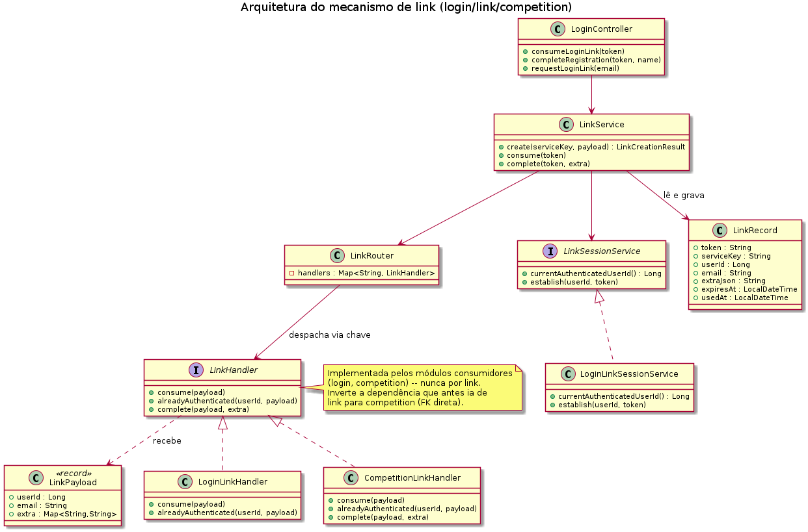
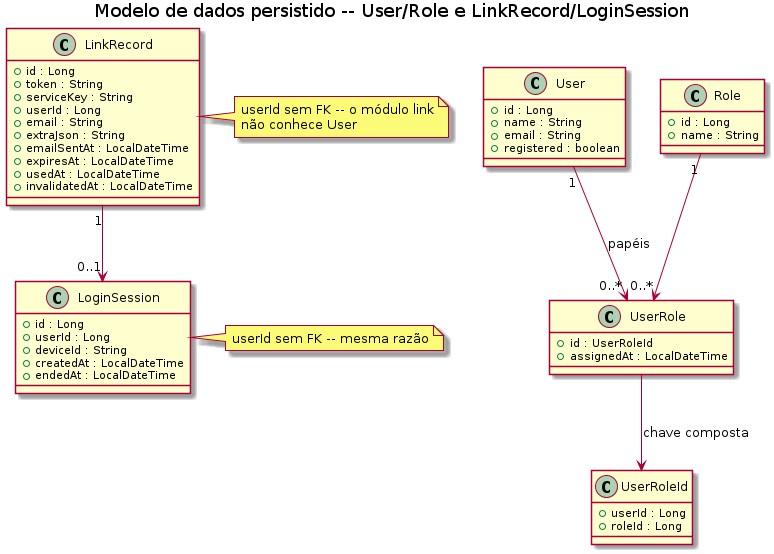
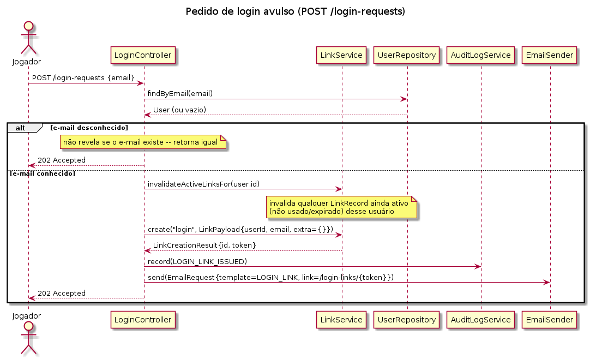
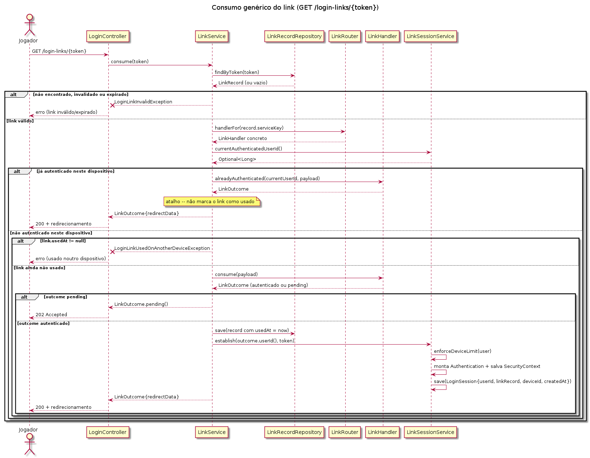
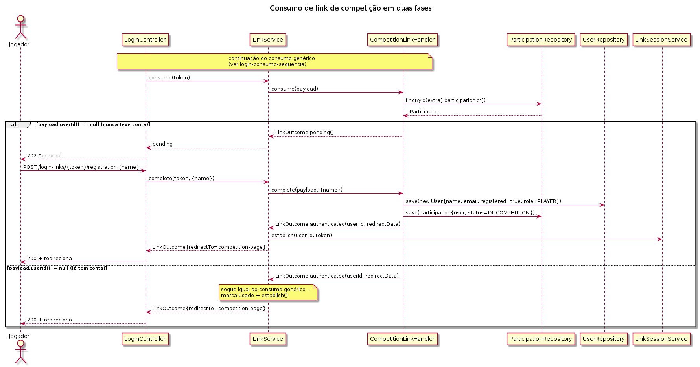

# **Projeto Jogo de Ações**

# **Introdução**

Um jogo de simulação de investimentos em bolsa: administradores criam competições — públicas (qualquer jogador pode pedir entrada) ou privadas (só quem é convidado por e-mail). Os jogadores, em uma competição por tempo determinado, começam com o mesmo saldo e, no final, se determina quem conseguiu a melhor performance. O escopo do projeto no contexto da disciplina inclui:

## **Aplicação Jogo de Ações**

* login por link recebido por e-mail  
* solicitação de ingresso clicando no link da competição pública e fornecendo o e-mail para recebimento do link  
* convites com link enviados por e-mail para ingresso em uma competição privada  
* limites de login em diferentes dispositivos  
* o administrador pode remover jogadores de competições   
* verificação do formato dos endereços de e-mail

## **Serviço de E-mail**

* verificação do formato dos endereços de e-mail  
* verificação dos registros MX e A no DNS  
* cadastro de domínios bloqueados  
* cadastro de domínios temporários  
* cadastro de domínios liberados  
* cadastro de e-mails bloqueados  
* inclusão automática do e-mail no cadastro de bloqueados dependendo da falha do envio  
* envio de e-mails via SQS e SES, com fila de mensagens não processadas (DLQ, *dead-letter queue*)  
* fila para receber status de envio que não são imediatos, como o *bounce*  
* retentativa de envio automática dependendo do erro  
* verificação de acesso ao serviço usando API-KEY

## **Função Lambda**

* envio de e-mails a partir de uma fila SQS, cujas mensagens definem os dados e o template  
* uso do DynamoDB para evitar o envio de e-mails duplicados

# Objetivos Gerais

A inteligência artificial faz parte de uma evolução tecnológica que promete revolucionar a forma de trabalhar. Por isso, buscamos uma forma de integrar essa vanguarda tecnológica ao nosso trabalho. A teoria é importante, e livros e cursos sobre o tema estão sendo lançados no mercado. No entanto, a prática também é essencial. Para colocar em prática conceitos derivados de pesquisa e experiência, buscamos um projeto que se aproximasse de uma aplicação real, e não apenas de algumas classes e protótipos.

O desenvolvimento foi pensado de forma que se assemelhasse a um projeto empresarial. Procuramos conceitos e metodologias modernas, usando como base o que aprendemos durante o curso, mas não nos limitando apenas a elas. Primeiro determinamos as iterações, com o resumo dos requisitos de cada, criando um roadmap. Esse roadmap serve como guia, podendo ser repensado ao longo do tempo. Depois especificamos o sistema. 

Decidimos vestir o chapéu de uma startup de tecnologia disposta a lançar um jogo educativo sobre compra e venda de ações. Ser uma startup traz alguns requisitos embutidos:
* baixo custo inicial de deploy;
* capacidade de atender ao crescimento da demanda.

Independentemente do futuro do projeto e de sua capacidade de trazer retorno financeiro, também nos propomos a criar um portfólio e a fortalecer nossa marca pessoal. O projeto ainda serve para aprendermos a usar a IA de forma efetiva na geração de código seguro, testável e de fácil manutenção. 

Parte da execução desse projeto foi aprovada como trabalho da disciplina de Arquitetura Avançada. Este documento trata do que desenvolvemos especificamente para atender aos requisitos da disciplina. 

# Metodologia de desenvolvimento

Criar prompts efetivos para a IA não é uma tarefa simples, tanto que já existe uma disciplina emergente dedicada a isso, a Engenharia de Prompt. Assim, em vez de tentar construir o prompt perfeito, procuramos formas de estruturar melhor a informação e de inferir se a IA entendeu o problema. Antes da disciplina, usávamos uma metodologia própria que combinava uma linguagem estruturada para especificar o sistema (Gherkin), um diagrama DER para definir o banco de dados e o modelo do sistema, a abordagem API-First, para verificar rapidamente os endpoints propostos, e arquivos que guardam o contexto da IA, evitando repetir instruções entre conversas.

O BDD (*Behavior-Driven Development*) surgiu como uma evolução do TDD (*Test-Driven Development*). Um dos problemas encontrados no TDD era o risco de alto acoplamento entre os testes e o código: testava-se o que cada método fazia, e não o comportamento esperado do sistema. O BDD também incorpora princípios do DDD (*Domain-Driven Design*), que prega o uso de uma linguagem ubíqua entre o cliente e o time de desenvolvimento. Essa linguagem deve ser usada na comunicação, na documentação e no código. 

Além disso, o BDD define o que o sistema deve fazer em instruções estruturadas, que podem ser escritas em inglês ou em qualquer outro idioma suportado. O formato permite a compreensão pelo cliente, e a estruturação facilita a compreensão pela IA. A partir dos cenários BDD, criamos testes automatizados que verificam os requisitos do sistema, ou seja, temos uma especificação executável. 

No início da disciplina, descobrimos a metodologia SDD (*Spec-Driven Development*). Essa metodologia define arquivos e processos específicos para o desenvolvimento de software com IA. Como algumas empresas e ferramentas já a utilizam, a IA já a conhece e sabe trabalhar com ela. Existe inclusive um repositório no GitHub, o Spec Kit, com vários arquivos-modelo. 

Essa metodologia busca detalhar ao máximo a especificação, as decisões técnicas e as tarefas antes da implementação. Ela pode lembrar o modelo cascata, mas há uma diferença essencial: cada especificação cobre uma pequena porção do sistema, e a IA a usa como base para a implementação.

Usamos:
* `constitution.md`: define os princípios e as regras que valem para todo o código;
* `spec.md`: define o que deve ser implementado;
* `plan.md`: registra as decisões técnicas da implementação;
* `tasks.md`: lista as tarefas a executar.

Começamos a usar SDD na Iteração 5 do projeto. Os métodos anteriores (cenários BDD, TDD e API-First) continuam em uso sempre que relevantes. No TDD, a IA cria os testes primeiro e verifica que eles falham antes da implementação. Também usamos diagramas sempre que necessário. Por exemplo, na incepção do projeto, pedimos a criação de um diagrama DER para verificar o modelo sugerido e visualizar melhor as modificações necessárias. Definimos os diagramas em texto, o que facilita a interpretação e a edição, e há várias ferramentas gratuitas para isso. No código, escolhemos o Mermaid.js, por ser suportado nativamente pelo GitHub. Neste documento, geramos os diagramas com PlantUML, porque as imagens geradas podem ser incluídas no LaTeX. 


# Refatoração dos cenários BDD

Mesmo com uma metodologia e uma sintaxe novas para nós, ao definir os passos dos cenários Gherkin, percebemos, ao fim da Iteração 1, que vários cenários repetiam os mesmos passos para preencher os campos válidos: um cenário para cada campo inválido testado. Isso contrariava o princípio de reúso. Resolvemos o problema com uma fábrica (*Object Mother*) e um *builder*, este gerado automaticamente a partir do arquivo `openapi.yaml`.

O cenário abaixo, do arquivo `create_competition.feature`, mostra o problema ao fim da Iteração 1. Para testar apenas o nome vazio, o cenário precisava repetir os passos que preenchem todos os outros campos com valores válidos, os mesmos passos de todos os outros cenários de campo inválido:

```gherkin
Scenario: Administrator tries to create a competition without a name
  Given they choose the public competition option
  And leave the competition name empty
  And define the start date
  And define the duration
  And define the buy brokerage fee
  And define the sell brokerage fee
  When they click the "create" button
  Then the system rejects the competition creation and shows an error message about the missing name
```

Na Iteração 3, deixamos no cenário apenas o que o distingue dos demais. Os valores válidos dos outros campos passaram a vir da fábrica `CompetitionMother`, que devolve um `CompetitionCreateRequest` já preenchido, e o passo sobrescreve somente o campo em teste:

```gherkin
Scenario: Administrator tries to create a competition without a name
  Given they choose the public competition option
  And leave the competition name empty
  When they click the "create" button
  Then the system rejects the competition creation and shows an error message about the missing name
```

# **Desenvolvimento para a disciplina de Arquitetura Avançada**

## **Etapa 1 — Organização Arquitetural**

Na tabela abaixo, a coluna "Antes" mostra a situação do projeto no levantamento inicial, feito em 02/09/2026, comparando o projeto com os requisitos da disciplina. A coluna "Ao fim da Etapa 1" mostra a situação na tag `etapa-1`, de 30/09/2026.

| Requisito | Antes (02/09/2026) | Ao fim da Etapa 1 (tag `etapa-1`) |
| :---- | :---- | :---- |
| Fluxo Controller → Service → Repository → BD, sem acesso direto do controller ao repository | Atendido | Atendido |
| Validação via Bean Validation | Atendido — via contrato OpenAPI (docs/openapi.yaml), que gera as anotações no DTO | Atendido |
| Tratamento de exceções centralizado | Atendido — ApiExceptionHandler com @ControllerAdvice | Atendido |
| Duas ou mais consultas Spring Data além do CRUD básico | Atendido — bem mais que duas, em vários repositórios | Atendido |
| Documentação da API via OpenAPI/Swagger | Atendido como contrato estático (docs/openapi.yaml); falta uma UI interativa (Swagger UI) rodando junto da aplicação | Atendido — o Swagger UI roda junto da aplicação, sobre o contrato estático (spec 05-009); ver "Preparação do sistema para testes com Swagger" abaixo |
| Organização de pacotes por domínio/funcionalidade, não por camada técnica | **Não atendido** — pacotes organizados por camada técnica: web/, service/, repository/, domain/, email/, captcha/ | Atendido — pacotes reorganizados por domínio (link/, login/, competition/, log/, email/, captcha/, common/); ver "Principais tarefas realizadas na Etapa 1" abaixo |
| README com módulos, dependência entre eles e candidato a serviço independente | Parcial — a informação existe implicitamente, mas não está escrita no README nesse formato | Parcial — os módulos e as dependências entre eles estão documentados em docs/diagrams/modulos.md, não no README |
| Tag etapa-1 | **Não atendido** | Atendido |

### **Principais tarefas realizadas na Etapa 1**

Reorganizamos os pacotes de `app/` por domínio de negócio (`link`, `login`, `competition`, `log`, `email`, `captcha`, `common`), abandonando a separação anterior por camada técnica (`web`/`service`/`repository`/`domain`).

Como estudo de caso desse princípio, revisamos em seguida o mecanismo de login por link mágico enviado por e-mail. Antes da revisão, o pacote responsável pelo link tinha uma referência direta (chave estrangeira) para a competição — o mecanismo genérico de link "sabia" sobre um caso de uso específico, violando a separação de responsabilidades entre módulos. Invertemos essa dependência aplicando o Dependency Inversion Principle: os módulos consumidores (`login`, para login avulso; `competition`, para convite/pedido de entrada) passaram a implementar uma interface (`LinkHandler`) e a depender do mecanismo genérico, nunca o contrário. Com essa inversão, o pacote `link` não importa nenhum tipo dos módulos `login` e `competition`.

O diagrama abaixo mostra a arquitetura resultante: um serviço genérico (`LinkService`) orquestra o ciclo de vida do link, um roteador (`LinkRouter`) despacha pela chave de serviço gravada no link para o `LinkHandler` correto, e cada módulo consumidor implementa essa interface.



O modelo de dados acompanha essa inversão: as tabelas do mecanismo genérico (`link_record`, `login_session`) não têm mais chave estrangeira para as tabelas dos módulos consumidores.



Os diagramas de sequência a seguir documentam o fluxo completo, do pedido do link ao consumo. Primeiro, o pedido de um login avulso:



O consumo do link é genérico — o mesmo endpoint (`GET /login-links/{token}`) atende tanto ao login avulso quanto à confirmação de entrada em competição, despachando pela chave de serviço gravada no link no momento em que ele foi criado:



Por fim, quando o link é de competição e o jogador nunca teve conta, o consumo inicial fica pendente até um segundo passo (fornecer o nome) completar o cadastro:



#### Preparação do sistema para testes com Swagger

O Swagger UI, gerado a partir do contrato `docs/openapi.yaml`, monta e envia requisições HTTP para a API diretamente do navegador. Usamos essa ferramenta nos testes manuais da aplicação. Complementamos esses testes com uma suíte de testes de caixa-preta em Python (`behave` e `pytest`), que exercita a API por fora, como um cliente real, e reproduz automaticamente muitos dos problemas que encontraríamos repetindo os testes à mão.

Para testar a aplicação dessa forma, resolvemos cinco problemas.

**1. Validação do captcha.** As rotas de pedido de entrada em competição exigem um token de captcha (ALTCHA), obtido ao resolver um desafio de prova de trabalho. Como o projeto não tem um frontend que resolva esse desafio, criamos o perfil `blackbox`, empilhado sobre o perfil `docker`, no qual a aplicação aceita qualquer captcha. Nem a suíte de testes Java nem a produção ativam esse perfil, então o captcha real continua protegendo os demais ambientes.

**2. Informações sobre a execução.** Quando testamos a aplicação por fora, vemos apenas a resposta HTTP. Para acompanhar o que acontece por dentro, disponibilizamos o Adminer, uma interface web de consulta ao banco PostgreSQL, e incluímos logs de execução. Para os logs, decidimos usar programação orientada a aspectos (AOP), por ser a forma mais elegante de implementar uma especificação como "logar todas as entradas e saídas de controladores". Os *advices* definem os pontos do código em que são executados, por exemplo, em torno da execução de um método. Assim, escrevemos o código de log em um único lugar, em vez de modificar cada método (ASPECT..., [20--]). Criamos três aspectos: um para os controladores REST, um para os repositórios de acesso ao banco e um para as mensagens enviadas à fila. Todos registram em nível DEBUG, mostram só o primeiro elemento de listas longas e ficam desligados no perfil de produção.

**3. Leitura de e-mails.** O login e a entrada em competições dependem de um link que enviamos por e-mail e que a API nunca devolve na resposta. Nos ambientes de teste, o LocalStack simula o Amazon SES e oferece uma API para consultar os e-mails enviados. A suíte Python usa essa API para extrair o link de cada e-mail. Para os testes com Swagger, adicionamos ao ambiente um projeto de código aberto (`localstack-aws-ses-email-viewer`) que lista e exibe esses e-mails no navegador.

**4. Dados de competições criadas no passado.** Alguns estados do sistema, como competições já iniciadas ou encerradas, dependem de tempo decorrido. Criamos scripts Python que geram uma massa de dados repetível usando apenas a API, como faria um cliente real. Para os estados que dependem de datas passadas, executamos a aplicação com o relógio deslocado para o passado (`libfaketime`), sem alterar o código.

**5. Cabeçalhos de dispositivo.** A aplicação identifica o dispositivo de cada sessão pelos cabeçalhos `Sec-CH-UA*` (*Client Hints*) e `User-Agent`. Para simular logins em dispositivos diferentes, precisamos alterar esses cabeçalhos, mas o navegador impede que uma página envie cabeçalhos iniciados por `Sec-`. Cogitamos usar um proxy que aplicasse os cabeçalhos, mas o Swagger UI já gera, para cada requisição, o comando `curl` equivalente, com os cabeçalhos preenchidos. Executamos esse comando no terminal, que não tem essa restrição, e assim realizamos esses testes pela linha de comando.

#### Testes para mitigação de riscos na arquitetura

Nas especificações que modularizaram o sistema, registramos os riscos que a própria divisão em módulos introduzia: o uso de *strings* em pontos do código que o compilador não verifica, como os caminhos de rota nas regras de segurança e as chaves dos tratadores de link; a definição de permissões espalhada por diferentes módulos; e a documentação, no contrato OpenAPI, de quem pode acessar cada rota, que pode divergir da regra realmente aplicada. Documentar esses riscos não impede que os erros ocorram. Por isso, criamos testes automatizados para mitigá-los. Comentaremos testes semelhantes das etapas posteriores na seção correspondente.

**Permissões definidas por cada módulo.** Dividimos a configuração de segurança para que cada módulo com endpoints registre as próprias regras de acesso, por meio de uma implementação de `SecurityConfigContributor`. Essa divisão traz dois riscos: um módulo novo esquecer de registrar suas regras e dois módulos registrarem regras para as mesmas rotas. Um teste com ArchUnit verifica que todo módulo com um controlador REST possui um `SecurityConfigContributor` no mesmo pacote. O teste `RouteOwnershipTest` lê as rotas que o Spring MVC realmente registrou e verifica que cada primeiro segmento de caminho pertence a um único módulo e que nenhum módulo mapeia a raiz (`/`). Como dois módulos nunca disputam o mesmo caminho, a ordem em que aplicamos as regras de cada módulo não altera o resultado. Se ainda assim uma rota ficar sem regra, ela cai na regra central, que exige autenticação: o erro fecha o acesso, nunca o abre.

**Uso de *strings* no código.** As regras de segurança identificam as rotas por *strings*, e cada tratador de link se registra no roteador por uma chave, também uma *string*. O compilador não detecta um erro de digitação nem uma chave repetida. O teste `LinkRouterKeyUniquenessTest` verifica que todo tratador declara uma chave não nula e única e comprova que uma chave repetida impede a aplicação de iniciar. Um caminho digitado errado numa regra de segurança altera o comportamento de acesso da rota, e os cenários da suíte comportamental (Cucumber) detectam essa mudança.

**Documentação de quem pode acessar cada rota.** Seguimos a abordagem API-First, e o contrato `docs/openapi.yaml` documenta, na extensão `x-roles`, quais papéis podem acessar cada operação. Essa extensão é apenas documentação: nada a aplica em tempo de execução. O teste `OpenApiRolesConsistencyTest` compara, para cada operação do contrato, os papéis documentados com a decisão real de autorização do Spring Security, para três perfis de acesso: anônimo, jogador e administrador. O teste `OpenApiRoutesConsistencyTest` verifica que toda rota implementada está no contrato e que toda operação do contrato está implementada.


## **Etapa 2 — Separação e Comunicação entre Serviços**

| Requisito | Situação |
| :---- | :---- |
| Serviço independente com responsabilidade própria e justificada | Atendido — email-lambda/ já existe como aplicação separada |
| Comunicação síncrona via REST \+ OpenFeign | **Não atendido** — a comunicação existente com email-lambda é assíncrona (fila SQS), não síncrona via Feign; nenhuma dependência Feign existe no projeto |
| DTOs de comunicação entre serviços | Atendido dentro do que já existe (mensagens da fila), mas não no formato REST/Feign pedido |
| Teste de disponibilidade/indisponibilidade do serviço | Não aplicável ainda, por depender da comunicação síncrona acima |
| Tag etapa-2 | **Não atendido** |

*Observação: o que existe hoje (mensageria assíncrona) atende melhor ao espírito da Etapa 4 do que ao da Etapa 2, que pede explicitamente comunicação síncrona.*  
*Atualização (planejamento posterior a este mapeamento): a extração deixou de ser um microsserviço isolado só para a checagem de MX/domínio descartável — vira um **Serviço de E-mail** reutilizável (ver docs/context/iteracao-5.md), com essa checagem como uma de suas responsabilidades entre outras (registro de templates, envio para aplicações clientes via API key). jogo-acoes consome esse serviço via OpenFeign, fechando o requisito de comunicação síncrona desta Etapa.*


### **Principais tarefas realizadas na Etapa 2**

#### Testes para mitigação de riscos na arquitetura

Nesta etapa, reforçamos os limites entre os módulos de `app/`. Dividimos o antigo módulo `login` em três: `user`, com os dados de usuário e papéis; `loginsession`, com o pedido e o consumo do link de login e a gestão de sessões; e `loginsecurity`, com a configuração de segurança HTTP. Com a divisão, o risco passou a ser um módulo depender de outro contornando esses limites.

**Dependências entre módulos.** Dois testes com ArchUnit protegem os limites entre os módulos. O primeiro verifica que os módulos de base (`user`, `loginsecurity` e `link`) não dependem uns dos outros nem do módulo `loginsession`, que depende dos três. O segundo verifica que cada repositório só é acessado de dentro do próprio módulo, de modo que os módulos se comuniquem apenas por meio de serviços. Escrevemos esse segundo teste antes das correções: ele começou falhando, listando cada acesso indevido que precisávamos corrigir, e passou quando terminamos a refatoração.

## **Etapa 3 — Configuração e Execução dos Serviços**

| Requisito | Situação |
| :---- | :---- |
| Profiles para ao menos dois ambientes | Atendido, além do mínimo — sandbox/docker/staging/production |
| Configuração via variáveis de ambiente | Atendido (ex.: SPRING\_DATASOURCE\_URL, SPRING\_CLOUD\_AWS\_SQS\_ENDPOINT no docker-compose.yml) |
| Banco relacional real fora do ambiente local de desenvolvimento | Atendido — PostgreSQL nos perfis docker/staging/production |
| Cada serviço com persistência própria | Atendido para os serviços que existem hoje; a depender de como a Etapa 2 for resolvida, o novo serviço precisará da própria também |
| Spring Cloud Config Server | **Não atendido** — não existe em nenhum lugar do projeto |
| Containerização de cada aplicação | Parcial — há Dockerfile para a aplicação principal; falta para o(s) serviço(s) que ainda vão ser criados |
| Orquestração via Docker Compose de todos os componentes (app, serviço, bancos, Config Server) | Parcial — docker-compose.yml hoje sobe app \+ banco \+ fila simulada, mas não um Config Server nem um segundo serviço |

## **Etapa 4 — Comunicação Assíncrona e Processamento em Lote**

| Requisito | Situação |
| :---- | :---- |
| Mensageria assíncrona real (produtor/fila/consumidor) | Atendido — SqsEmailSender publica em fila SQS real (LocalStack em dev/CI), consumida pela Lambda que dispara o SES |
| Tecnologia de mensageria \= a definida pelo professor em aula | A confirmar — o enunciado cita RabbitMQ como exemplo; o projeto usa Amazon SQS. Precisa de confirmação se conta como "tecnologia equivalente" |
| Processamento em lote com Spring Batch (Job/Step/ItemReader/ItemProcessor/ItemWriter) | **Não atendido** — planejado como job dentro do novo Serviço de E-mail (ver docs/context/iteracao-5.md), para a importação da lista de domínios temporários hospedada no GitHub |

### **Principais tarefas realizadas na Etapa 4**

#### Processamento em Lote - Atualização da tabela de domínios de emails temporários

Para evitar cadastro de usuários usando emails temporários, usamos listas gratuitas publicadas na internet.


# Bibliografia

ASPECT Oriented Programming (AOP) in Spring Framework. *GeeksforGeeks*, [20--]. Disponível em: https://www.geeksforgeeks.org/advance-java/aspect-oriented-programming-aop-in-spring-framework/. Acesso em: 5 out. 2026.

GRAZIANO, Alfonso. **AI-Native Software Engineering**. Sebastopol, CA: O'Reilly Media, 2026. E-book. Versão preliminar (*early release*); publicação prevista para fev. 2027. Disponível em: https://learning.oreilly.com/library/view/ai-native-software-engineering/0642572352530/. Acesso em: 24 set. 2026.

SMART, John Ferguson. **BDD in Action**: Behavior-Driven Development for the Whole Software Lifecycle. Shelter Island, NY: Manning Publications, 2014. E-book. ISBN 978-1-61729-165-4. Disponível em: https://learning.oreilly.com/library/view/bdd-in-action/9781617291654/. Acesso em: 24 set. 2026.

[https://github.com/github/spec-kit/blob/main/templates/tasks-template.md ](https://github.com/github/spec-kit) Acessado 16/10/2026

https://www.techknow.com.br/post/spec-driven-development Acessado 16/102026


