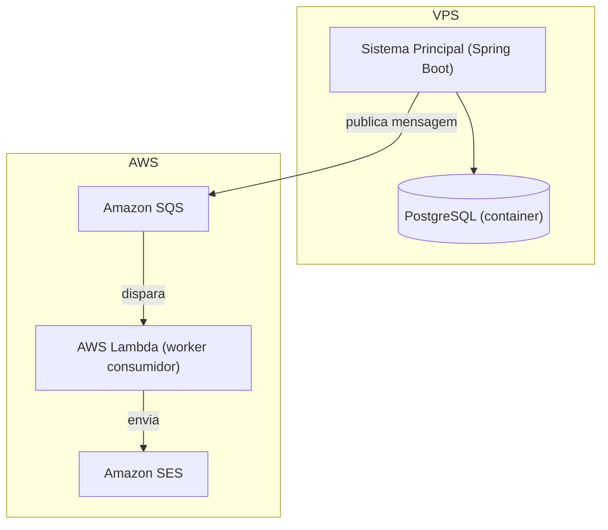

# Roadmap de Iterações — Jogo de Ações

Este documento organiza por iteração o que precisa ser feito, combinando o que já está
especificado no repositório (`src/test/resources/features`, `docs/diagrams/der.md`) com a
decisão de arquitetura de envio de e-mail discutida separadamente (VPS + AWS SQS/Lambda/SES).

> **Nota:** as iterações 4 e 5 foram inferidas a partir de um diagrama de arquitetura
> resumido, sem o restante da conversa que o originou. Os detalhes de contrato de mensagem,
> retries e observabilidade são um ponto de partida razoável, não uma decisão fechada —
> ajuste conforme o que foi de fato definido naquele chat.

## Arquitetura de referência (envio assíncrono de e-mail)

A ideia é que o sistema principal nunca envie e-mail diretamente: ele publica uma mensagem
na fila (convite, link de login, confirmação de entrada, etc.) e um worker assíncrono
(Lambda) é quem efetivamente dispara o envio via SES. Isso desacopla o fluxo síncrono da
aplicação (criar competição, pedir entrada, gerar link de login) da latência/instabilidade
de terceiros no envio de e-mail.

## Iteração 1 — Especificação de domínio (concluída)

- Arquivos `.feature` (Gherkin, em inglês) cobrindo:
  - `create_competition`: criação de competição pública/privada, validações, controle de acesso.
  - `login`: autenticação via link mágico enviado por e-mail.
  - `manage_competition_players`: gerência da lista de jogadores/convidados de uma competição.
  - `request_competition_entry`: pedido de entrada de jogador em competição pública.
- DER do domínio (`docs/diagrams/der.md`): `USER` + `ROLE`/`USER_ROLE`, `COMPETITION`,
  `PARTICIPATION`, `LOGIN_LINK`.

**Entregável:** especificação executável (viva) do domínio, pronta para servir de base ao
desenvolvimento.

## Iteração 2 — Esqueleto da aplicação e persistência

**Objetivo:** ter o projeto Spring Boot rodando com o modelo de dados do DER persistido em
PostgreSQL, sem ainda expor as regras de negócio.

- Setup do projeto Spring Boot (Web, Data JPA, Validation).
- Mapeamento JPA das entidades do DER (`User`, `Role`, `UserRole`, `Competition`,
  `Participation`, `LoginLink`) e dos enums (`CompetitionType`, `CompetitionStatus`,
  `ParticipationStatus`, `RequestType`).
- Migrations versionadas (Flyway ou Liquibase) refletindo o schema do DER.
- Docker Compose local (app + PostgreSQL) para desenvolvimento.
- Configuração do runner de Cucumber (glue code inicial) para os `.feature` existentes,
  mesmo que os *steps* ainda não tenham implementação real.

**Fora de escopo:** regras de negócio, envio de e-mail, autenticação.

## Iteração 3 — Fluxos principais (síncronos, e-mail via stub)

**Objetivo:** implementar as regras de negócio dos quatro `.feature` já especificados,
usando um envio de e-mail "fake" (log ou stub) para não depender ainda da infraestrutura
AWS.

- Criação de competição (pública/privada) com todas as validações já especificadas
  (nome obrigatório, data futura, duração > 0, taxas não-negativas, lista de e-mails
  válida) e controle de acesso por papel (`USER_ROLE`).
- Pedido de entrada em competição pública (jogador novo, registrado deslogado, registrado
  logado) e negação de pedido em competição privada.
- Geração e validação de `LOGIN_LINK` (token, expiração, uso único) e os fluxos de
  confirmação de entrada / redirecionamento descritos em `login.feature`.
- Gerência da lista de jogadores de uma competição: filtro por status, reenvio de e-mail,
  edição de e-mail (com validação de formato e duplicidade), remoção de jogador,
  cancelamento de convite pendente, convite de novos jogadores a uma competição privada
  já criada.
- Implementação dos *steps* de Cucumber para todos os cenários das quatro *features*.

**Entregável:** todos os cenários dos `.feature` passando, com envio de e-mail
representado por um stub (ex.: interface `EmailSender` com implementação de log).

## Iteração 4 — Infraestrutura assíncrona de e-mail (SQS + Lambda + SES)

**Objetivo:** substituir o stub de e-mail da Iteração 3 pela arquitetura real descrita no
diagrama acima.

- Definir o contrato da mensagem publicada na fila (tipo de e-mail — convite, link de
  login, confirmação — destinatário, dados de template, id de correlação).
- Sistema principal: implementação de `EmailSender` que publica na fila Amazon SQS em vez
  de enviar diretamente.
- AWS Lambda consumindo a fila e disparando o envio via Amazon SES.
- Fila de dead-letter (DLQ) para mensagens que falharem após as tentativas configuradas.
- Provisionamento da infraestrutura AWS (SQS, Lambda, SES) — de preferência como código
  (Terraform/CDK) para ser reproduzível.
- IAM com privilégio mínimo: o sistema principal só pode publicar na fila; a Lambda só
  pode consumir a fila e usar o SES.
- Verificação de domínio/remetente no SES e saída do modo sandbox (necessário para enviar
  a destinatários não verificados em produção).

**Fora de escopo:** métricas/alertas (ver Iteração 5).

## Iteração 5 — Deploy, observabilidade e hardening

**Objetivo:** colocar o sistema em produção na VPS com visibilidade sobre o pipeline de
e-mail.

- Deploy do sistema principal na VPS via Docker Compose (app + PostgreSQL), com backups do
  banco.
- Observabilidade do pipeline assíncrono: profundidade da fila SQS, erros/retries da
  Lambda, taxa de bounce/complaint do SES.
- Alertas para falhas persistentes (mensagens indo para a DLQ).
- Testes de ponta a ponta dos cenários de erro já especificados (link inválido/expirado,
  e-mail inválido, falha no captcha) validando o comportamento também com a infraestrutura
  real de e-mail.
- Revisão de segurança do fluxo de login por link mágico (expiração curta, uso único,
  proteção contra reenvio abusivo).

## Iteração 6 — BDD da competição (negociação de ações) e novo DER

**Objetivo:** especificar em Gherkin os fluxos de negociação de ações dentro de uma
competição e desenhar o modelo de dados financeiro que vai sustentá-los.

- Cenários BDD cobrindo: compra e venda de ação, aplicação da corretagem (`buy_fee`/
  `sell_fee` já definidas em `create_competition.feature`), consulta de posição e saldo,
  extrato de lançamentos, fechamento da competição e apuração de resultado.
- Universo de ativos restrito aos 4 tickers disponíveis no plano gratuito da Brapi —
  usados como fixture/exemplo nos cenários.
- Novo DER com contabilidade em partida dobrada real, sem tabelas mutáveis:
  - `ACCOUNT` — uma conta caixa e uma conta de posição por ativo, por participação
    (`PARTICIPATION`).
  - `TRANSACTION` — cabeçalho insert-only (compra, venda, saldo inicial, corretagem).
  - `TRANSACTION_LINE` — as linhas de débito/crédito de cada `TRANSACTION` (valor em R$ e,
    quando aplicável, quantidade de ações), com a soma dos débitos sempre igual à soma dos
    créditos.
  - `STOCK` — cadastro dos ativos negociáveis.
  - `PRICE_QUOTE` — cotações coletadas, com origem (tempo real ou recuperação de lacuna).
- Sem Ibovespa — comparação de portfólio fica só entre jogadores (ver Iteração 11).

**Fora de escopo:** implementação (Iteração 7).

## Iteração 7 — Persistência e regras de negociação

**Objetivo:** implementar o DER da Iteração 6 e as regras de negócio por trás dos cenários
BDD.

- Migrations e mapeamento JPA das novas entidades.
- Implementação dos *steps* de Cucumber dos cenários de negociação.
- Serviço de compra/venda gerando `TRANSACTION` + `TRANSACTION_LINE` corretas (débito na
  conta do ativo/crédito no caixa na compra, e o inverso na venda), aplicando a corretagem
  como lançamento próprio.
- Cálculo de posição e saldo sempre por soma dos lançamentos (nunca por campo mutável).

## Iteração 8 — Coleta de cotações (Brapi)

**Objetivo:** job de coleta periódica de cotações, com tratamento de indisponibilidade.

Endpoints da Brapi confirmados manualmente (plano gratuito, `GET https://brapi.dev/api/v2/stocks/...`):

| Endpoint | Uso |
|---|---|
| `quote?symbols=X` | Cotação atual — `regularMarketPrice` e `regularMarketTime` (precisão de segundo). |
| `historical?symbols=X&range=1d&interval=15m` | Histórico intradiário a cada 15 min — **confirmado disponível no plano gratuito**, sem erro/bloqueio de plano. |
| `dividends?symbols=X` | Dividendos — fora do escopo atual. |

- Agendamento configurável de polling em `quote` para os 4 ativos disponíveis.
- Gravação em `PRICE_QUOTE` (`price = regularMarketPrice`, `collected_at = regularMarketTime`).
- Mecanismo de watermark (último instante coletado com sucesso) para detectar lacunas na
  volta do ar.
- **Recuperação de lacuna confirmada como viável**: ao detectar um intervalo sem cotações
  (ex.: sistema fora do ar), preencher os pontos faltantes chamando `historical` com
  `interval=15m` para o período da lacuna, marcando esses registros com origem
  `BACKFILL` em `PRICE_QUOTE` (em vez de `REALTIME`). Testar se intervalos menores que
  15 min (`5m`, `1m`) também estão disponíveis no plano gratuito antes de decidir a
  granularidade do polling em si — o teste feito cobriu apenas `15m`.

## Iteração 9 — Telas dos fluxos já especificados (login, competição, jogadores)

**Objetivo:** construir a interface dos fluxos das Iterações 1–3 (login por link mágico,
criação e gerência de competição, pedido de entrada), com acessibilidade validada desde
já — não deixada para o final.

- Telas de login/link mágico, criação de competição, gerência de lista de jogadores, pedido
  de entrada.
- Critério de aceite de cada tela: navegação completa testada com leitor de tela (NVDA e/ou
  VoiceOver), incluindo os estados de erro (link inválido/expirado, e-mail inválido,
  captcha).

## Iteração 10 — Telas de negociação e portfólio

**Objetivo:** construir a interface de compra/venda e acompanhamento de posição.

- Telas de compra/venda de ação, extrato de lançamentos (`TRANSACTION`/`TRANSACTION_LINE`),
  posição atual e saldo.
- Mesmo critério de aceite da Iteração 9: navegação testada com leitor de tela.

## Iteração 11 — Gráficos (preço, portfólio, comparação entre jogadores)

**Objetivo:** visualização gráfica dos dados coletados, sem acessibilidade ainda (tratada
nas Iterações 12–15).

- Gráfico de evolução de preço por ativo, a partir de `PRICE_QUOTE`.
- Snapshots periódicos do valor do portfólio (caixa + posições ao preço do momento), para
  permitir comparação de evolução entre dois jogadores sem recalcular tudo sob demanda.
- Comparação de portfólio entre jogadores (Ibovespa fora de escopo).

## Iteração 12 — Acessibilidade de gráficos: pesquisa e modelagem — descrição por pontos importantes

**Objetivo:** definir como detectar e descrever os pontos relevantes de uma série temporal
(picos, vales, mudanças de tendência) para gerar uma descrição textual do gráfico.

- Pesquisa de algoritmos de detecção de pontos relevantes.
- Modelagem de como compor a descrição textual a partir desses pontos (o que priorizar,
  nível de detalhe, idioma).

## Iteração 13 — Acessibilidade de gráficos: implementação — descrição por pontos importantes

**Objetivo:** implementar o modo de descrição textual definido na Iteração 12.

- Implementação do algoritmo de detecção de pontos (parte pesada em Rust/WebAssembly).
- Geração da descrição textual e integração com leitor de tela (texto alternativo/
  `aria-live`).
- Validação com leitor de tela real.

## Iteração 14 — Acessibilidade de gráficos: pesquisa e modelagem — sonorização

**Objetivo:** definir a experiência de sonorização do gráfico (som grave para valores
baixos, agudo para altos; posição estéreo da esquerda para a direita representando o
tempo).

- Pesquisa de mapeamento valor→frequência e tempo→posição estéreo, e das APIs de áudio
  disponíveis (Web Audio API) e sua integração com Rust/WebAssembly.
- Modelagem da experiência (faixa de frequências, duração/velocidade de reprodução,
  controles do usuário).

## Iteração 15 — Acessibilidade de gráficos: implementação — sonorização

**Objetivo:** implementar o modo de sonorização definido na Iteração 14.

- Motor de síntese/geração de sinal em Rust compilado para WebAssembly (parte pesada).
- Integração com Web Audio API no front (reprodução, controle estéreo).
- Validação com usuários/leitores de tela.
