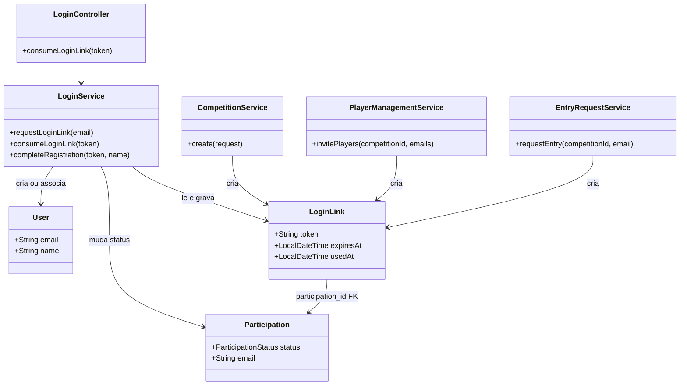
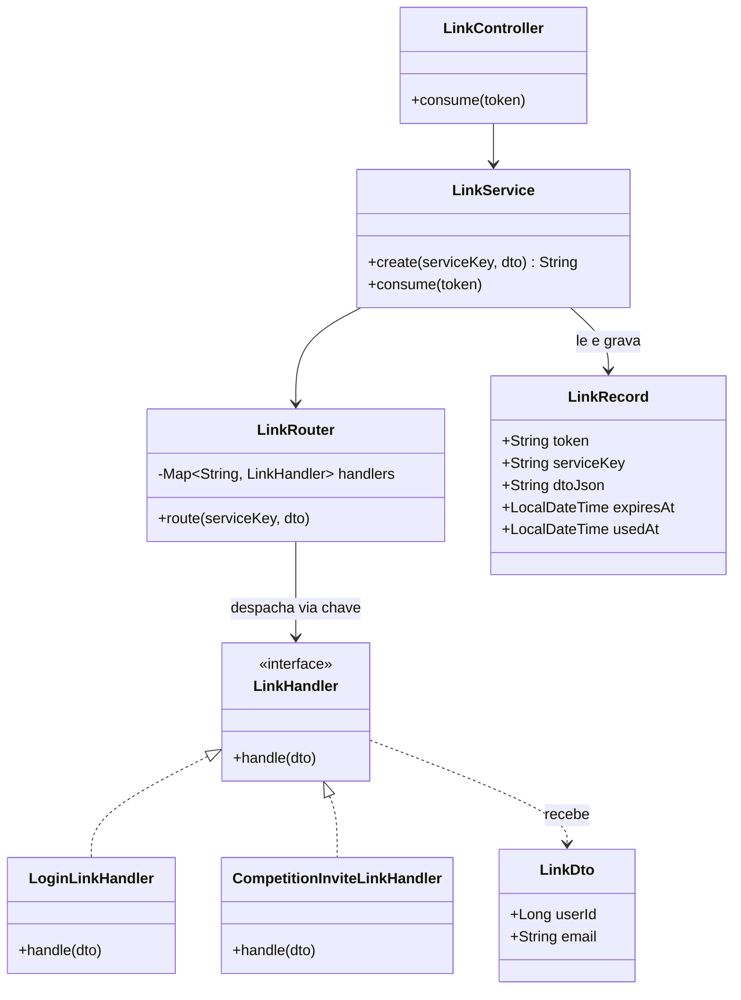

# Spec: Desacoplar o módulo `link` dos seus consumidores

**Status:** rascunho
**Issue:** —
**Iteração:** iteration-5

## Resumo

Redesenhar o módulo `link` (mecanismo de link mágico por token, ver spec 05-002) para que ele
**não conheça** os módulos que o usam (`login`, `competition`) — hoje o acoplamento é direto
nos dois sentidos. Ao mesmo tempo, aumentar a segurança do fluxo: a URL do link passa a
carregar **só o token**, eliminando qualquer parâmetro manipulável que hoje possa influenciar
o que a aplicação faz.

## Motivação

Dois objetivos, declarados nesta sessão:

1. **Acoplamento**: o módulo `link` hoje sabe sobre conceitos de outros módulos
   (`Participation`, `Competition`) — por exemplo, `LoginLink` tem uma FK direta pra
   `Participation`. Isso significa que `link` não pode ser entendido, testado ou reaproveitado
   sem conhecer `competition`. O objetivo é inverter essa dependência: os módulos consumidores
   dependem de `link` (implementando uma interface dele), e `link` não importa nenhum tipo
   deles.
2. **Segurança**: se a URL do link carregasse mais que o token (ex. um id de competição, um
   tipo de ação), alguém poderia manipular esses parâmetros manualmente na URL e tentar
   alcançar um estado ou destino não pretendido. Reduzir a URL a só o token elimina essa
   superfície de ataque — toda informação relevante já está amarrada ao token no banco, não
   exposta nem manipulável pelo cliente.

## Cenários (comportamento esperado)

Não há `.feature` novo previsto nesta spec — o comportamento observável de fora (usuário
clica num link, é autenticado/registrado, é redirecionado) não muda; o que muda é como o
sistema decide o que fazer, por dentro. Critério de aceite: os cenários de `login.feature`/
`request_competition_entry.feature` que já passam hoje continuam passando sem alteração de
texto Gherkin, usando o novo mecanismo por baixo.

## Requisitos funcionais

- **URL do link carrega só o token.** O endpoint que consome o link recebe exclusivamente o
  token — nenhum outro parâmetro de rota/query influencia o resultado.
- **Persistência do link**: a tabela grava, por link, três campos — `token`, a **chave do
  serviço** (identifica qual implementação/consumidor esse link pertence) e o **JSON do DTO**
  (payload específico de quem criou o link, opaco para o mecanismo genérico).
- **DTO**: tem no mínimo dois campos — `id do usuário` e `email` — comuns a qualquer
  consumidor. Campos adicionais específicos de cada consumidor fazem parte do mesmo JSON
  (formato exato — herança de DTO vs. campo genérico de extensão — é decisão em aberto, ver
  abaixo).
- **`LinkRouter`**: componente que recebe a chave de serviço gravada no link e despacha para a
  implementação correta, usando um **mapa** (chave de serviço → implementação).
- **Interface** (ex. `LinkHandler`) que recebe o DTO já desserializado — cada implementação
  concreta faz a chamada de negócio correspondente (ex.: uma implementação de login estabelece
  sessão; uma implementação de convite de competição confirma participação). Essas
  implementações vivem nos módulos consumidores (`login`, `competition`), não no módulo
  `link`.
- **Toda implementação tem uma chave própria** (o valor gravado como "chave do serviço") **e
  um teste de verificação dedicado** — não basta o teste do mecanismo genérico de roteamento,
  cada implementação prova que funciona por si.

## Requisitos não-funcionais

- **Direção de dependência**: o módulo `link` não importa nenhum tipo dos módulos
  `login`/`competition`. A dependência é sempre do consumidor para `link` (implementa a
  interface, se registra no `LinkRouter`), nunca o contrário — verificável estaticamente
  (nenhum import de `{base}.login.*`/`{base}.competition.*` dentro de `{base}.link.*`).
- **Segurança**: nenhuma informação fora do token pode alterar qual ação é executada ou com
  quais dados — elimina manipulação de URL como vetor de acesso indevido.

## Fora de escopo

- Mudar o conteúdo/visual do e-mail que carrega o link.
- Expiração/uso único do token — mecanismo já existente, mantido como está.
- Rate limiting novo para o endpoint de consumo do link.
- Mapear exaustivamente todo fluxo atual (login avulso, convite de competição, pedido de
  entrada) para uma implementação de `LinkHandler` específica — a lista exata de
  implementações necessárias é levantada no `plan.md`, não fechada aqui.

## Diagramas de classes

### Antes (acoplamento atual)

`LoginLink` conhece `Participation` diretamente (FK), e três serviços de `competition` criam
`LoginLink` diretamente — acoplamento nos dois sentidos entre o que seria o módulo `link` e o
módulo `competition`.

### Depois (com `LinkRouter` + interface)

`LinkService`/`LinkRouter`/`LinkRecord`/`LinkHandler`/`LinkDto` (módulo `link`) não referenciam
nenhum tipo de `login`/`competition`. `LoginLinkHandler` e `CompetitionInviteLinkHandler`
(nomes ilustrativos — ver "Decisões em aberto") vivem nos módulos consumidores e dependem de
`link`, nunca o contrário.

## Decisões em aberto

- **Formato exato do DTO com campos extras por implementação**: subclasse de um `LinkDto` base
  (`userId`+`email`), ou um DTO único com um campo genérico de extensão (ex.
  `Map<String,String> extra`)? Afeta como o JSON é desserializado antes de chegar em cada
  `LinkHandler`.
- **Mapeamento exato dos fluxos atuais para implementações de `LinkHandler`**: quantas
  implementações existem de fato hoje (login avulso, convite de competição, pedido de entrada
  podem ser 1, 2 ou 3 `LinkHandler`s distintos) — precisa revisar `LoginService`/
  `EntryRequestService`/`PlayerManagementService` linha a linha antes de implementar; os nomes
  usados nos diagramas acima são ilustrativos, não confirmados.
- **Onde vive a chave de serviço como constante**: enum no módulo `link`, ou cada
  implementação declara a própria string sem um catálogo central? Um catálogo central
  reintroduziria acoplamento (`link` precisaria saber os nomes); a proposta é cada
  implementação só se registrar no `LinkRouter` com sua própria chave, sem `link` ter uma
  lista fechada.
- **Migração de dados**: `LoginLink`/`Participation` hoje têm uma FK real — migrar isso pra
  `LinkRecord` (token/serviceKey/dtoJson) exige popular o JSON a partir do estado atual, ou
  essa spec só vale pra links novos? A decidir antes de implementar (não há dados de produção
  ainda, então provavelmente não é um problema real, mas vale confirmar).
