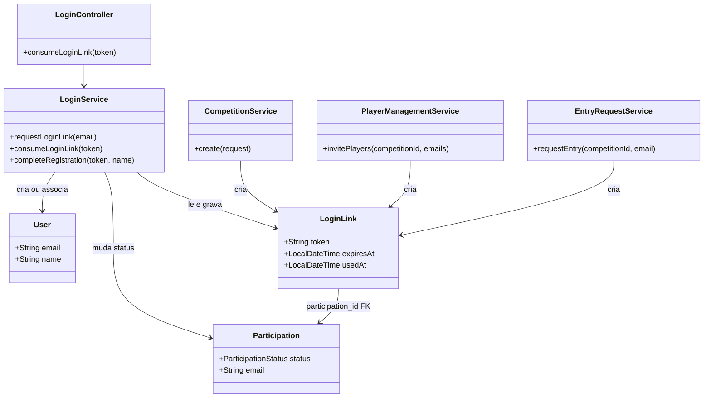
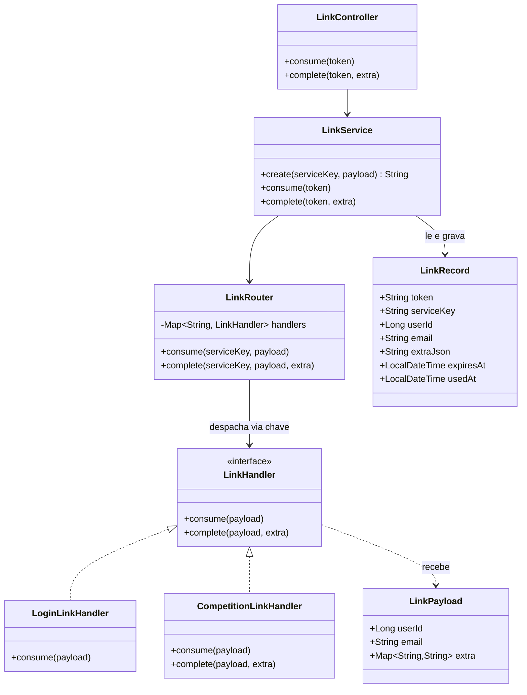

# Spec: Desacoplar o módulo `link` dos seus consumidores

**Status:** rascunho
**Issue:** —
**Iteração:** iteration-5

## Resumo

Redesenhar o módulo `link` (mecanismo de link mágico por token, ver spec 05-002) para que ele
**não conheça** os módulos que o usam (`login`, `competition`) — hoje o acoplamento é direto
nos dois sentidos. Ao mesmo tempo, aumentar a segurança do fluxo: a URL do link passa a
carregar **só o token**, eliminando qualquer parâmetro manipulável que hoje possa influenciar
o que a aplicação faz.

## Motivação

Dois objetivos, declarados nesta sessão:

1. **Acoplamento**: o módulo `link` hoje sabe sobre conceitos de outros módulos
   (`Participation`, `Competition`) — por exemplo, `LoginLink` tem uma FK direta pra
   `Participation`. Isso significa que `link` não pode ser entendido, testado ou reaproveitado
   sem conhecer `competition`. O objetivo é inverter essa dependência: os módulos consumidores
   dependem de `link` (implementando uma interface dele), e `link` não importa nenhum tipo
   deles.
2. **Segurança**: se a URL do link carregasse mais que o token (ex. um id de competição, um
   tipo de ação), alguém poderia manipular esses parâmetros manualmente na URL e tentar
   alcançar um estado ou destino não pretendido. Reduzir a URL a só o token elimina essa
   superfície de ataque — toda informação relevante já está amarrada ao token no banco, não
   exposta nem manipulável pelo cliente.

## Cenários (comportamento esperado)

Não há `.feature` novo previsto nesta spec — o comportamento observável de fora (usuário
clica num link, é autenticado/registrado, é redirecionado) não muda; o que muda é como o
sistema decide o que fazer, por dentro. Critério de aceite: os cenários de `login.feature`/
`request_competition_entry.feature` que já passam hoje continuam passando sem alteração de
texto Gherkin, usando o novo mecanismo por baixo.

## Requisitos funcionais

- **URL do link carrega só o token.** O endpoint que consome o link recebe exclusivamente o
  token — nenhum outro parâmetro de rota/query influencia o resultado.
- **Persistência do link**: a tabela grava `token`, a **chave do serviço** (identifica qual
  implementação/consumidor esse link pertence), `id do usuário` e `email` como **colunas
  próprias** (não escondidos dentro de um JSON opaco — evita perda de integridade referencial
  e permite consulta/índice direto por esses campos), mais um **JSON de extensão** só com o
  que sobra de específico de cada implementação (o campo `extra` do payload, ver abaixo).
- **DTO único** (`LinkPayload`, em `{base}.link.dto` — sem sufixo "Dto" no nome, seguindo a
  convenção de sub-pacotes definida na spec 05-002), sem hierarquia de subclasses: `id do
  usuário` e `email` como campos fixos, mais um campo genérico de extensão (`extra`) para o
  que cada implementação precisar além disso (ver `plan.md` para o formato exato desse campo).
- **`LinkRouter`**: componente que recebe a chave de serviço gravada no link e despacha para a
  implementação correta, usando um **mapa** (chave de serviço → implementação).
- **Interface** (`LinkHandler`) que recebe o `LinkPayload` já desserializado — cada
  implementação concreta faz a chamada de negócio correspondente (login estabelece sessão;
  convite/pedido de entrada de competição confirma participação — ver `plan.md` para o motivo
  de os dois segundos casos serem uma única implementação). Essas implementações vivem nos
  módulos consumidores (`login`, `competition`), não no módulo `link`.
- **Toda implementação tem uma chave própria** (o valor gravado como "chave do serviço") **e
  um teste de verificação dedicado** — não basta o teste do mecanismo genérico de roteamento,
  cada implementação prova que funciona por si.

## Requisitos não-funcionais

- **Direção de dependência**: o módulo `link` não importa nenhum tipo dos módulos
  `login`/`competition`. A dependência é sempre do consumidor para `link` (implementa a
  interface, se registra no `LinkRouter`), nunca o contrário — verificável estaticamente
  (nenhum import de `{base}.login.*`/`{base}.competition.*` dentro de `{base}.link.*`).
- **Segurança**: nenhuma informação fora do token pode alterar qual ação é executada ou com
  quais dados — elimina manipulação de URL como vetor de acesso indevido.

## Fora de escopo

- Mudar o conteúdo/visual do e-mail que carrega o link.
- Expiração/uso único do token — mecanismo já existente, mantido como está.
- Rate limiting novo para o endpoint de consumo do link.
- `EntryRequestService.confirmEntry` — não usa token/link nenhum (jogador já autenticado
  confirmando entrada direto da sessão), fora do alcance desta spec.

## Diagramas de classes

### Antes (acoplamento atual)

`LoginLink` conhece `Participation` diretamente (FK), e três serviços de `competition` criam
`LoginLink` diretamente — acoplamento nos dois sentidos entre o que seria o módulo `link` e o
módulo `competition`.

### Depois (com `LinkRouter` + interface)

`LinkService`/`LinkRouter`/`LinkRecord`/`LinkHandler`/`LinkPayload` (módulo `link`) não
referenciam nenhum tipo de `login`/`competition`. `LoginLinkHandler` (módulo `login`) e
`CompetitionLinkHandler` (módulo `competition` — cobre convite **e** pedido de entrada
pública, mesmo formato de link e mesmo comportamento de consumo para os dois, ver `plan.md`)
vivem nos módulos consumidores e dependem de `link`, nunca o contrário. `complete` só existe
de fato em `CompetitionLinkHandler` — `LoginLinkHandler` nunca precisa de uma segunda fase.

## Decisões em aberto

Nenhuma decisão de requisito em aberto. As decisões técnicas desta spec — formato do DTO
(`LinkPayload`), onde vive a chave de serviço, migração de dados, e o mapeamento exato dos
fluxos atuais para `LoginLinkHandler`/`CompetitionLinkHandler` — foram todas resolvidas e
estão registradas em `plan.md` ("Decisões de arquitetura").
