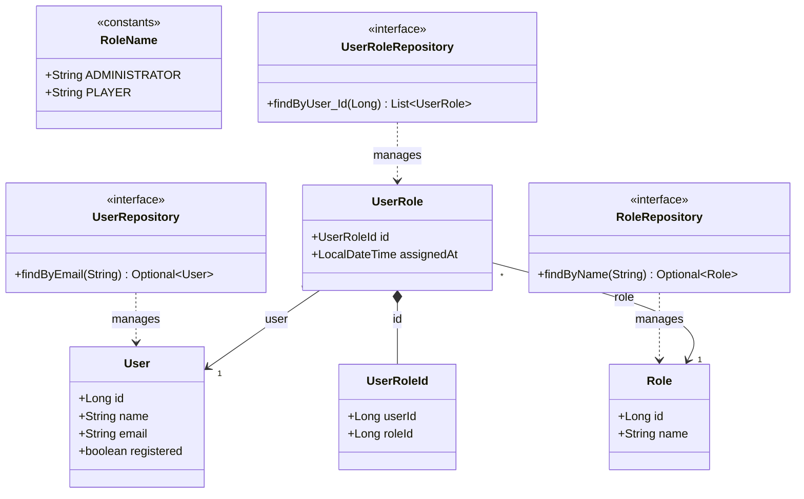
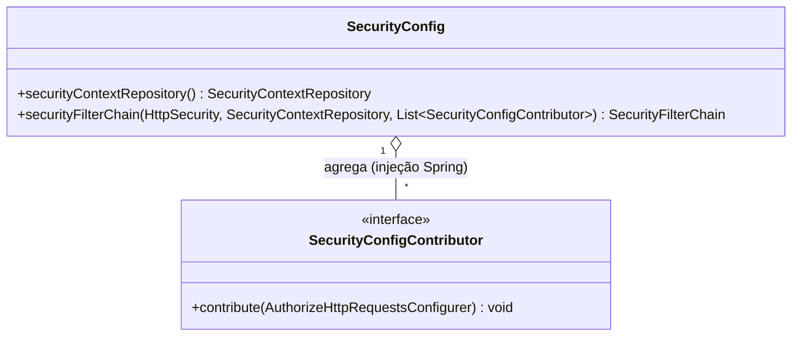
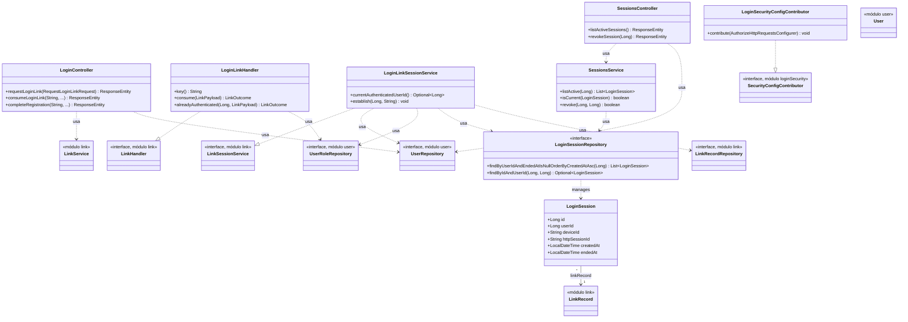
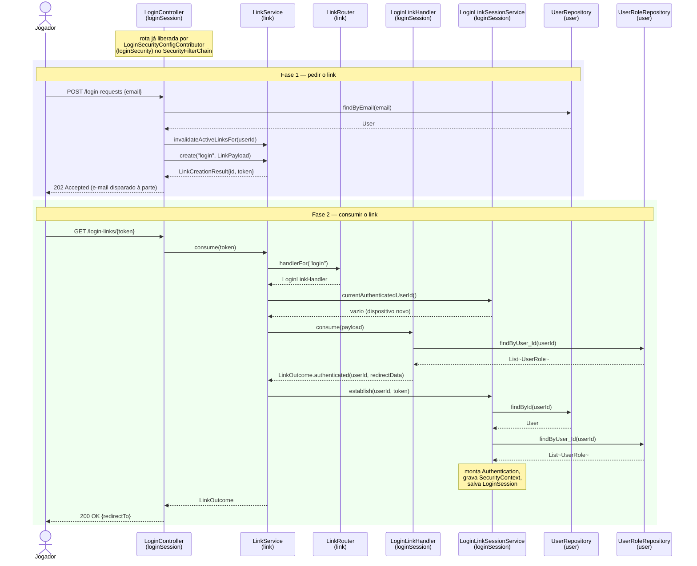

# Spec: Dividir `login`/`link` em `user`, `loginSession` e `loginSecurity`

**Status:** implementada (tabela conferida contra o `master` em 2026-10-06; ver `tasks.md`)
**Issue:** [#96](https://github.com/lalgarve/jogo-acoes/issues/96) (épico) — decorre da
[Issue #95](https://github.com/lalgarve/jogo-acoes/issues/95) (comunicação entre módulos deve
passar por serviço, nunca repositório cruzado)
**Iteração:** iteration-5 (Etapa 2 antecipada)

## Resumo

Reorganiza os pacotes `login/` e `link/` de hoje em três módulos com responsabilidade única,
cada um "módulo" no sentido da disciplina (um pacote de domínio/funcionalidade, mesma convenção
já usada por `captcha`/`link`/`email`/`competition`):

- **`user`** — `User`, `UserRepository`, `Role`, `RoleName`, `RoleRepository`, `UserRole`,
  `UserRoleId`, `UserRoleRepository`. Módulo-base: não depende de nenhum dos outros dois.
- **`loginSession`** — `LoginSession`, `LoginSessionRepository` (movidos de `link/` pra cá),
  `LoginController`, `LoginLinkHandler`, `LoginLinkSessionService`, `SessionsController`,
  `SessionsService`, `LoginSecurityConfigContributor`. Depende de `user` e de `link`
  (implementa `LinkHandler`/`LinkSessionService`) e de `loginSecurity` (implementa
  `SecurityConfigContributor`).
- **`loginSecurity`** — `SecurityConfig`, `SecurityConfigContributor`. Módulo-base: não depende
  de nenhum dos outros dois; é o que os outros módulos (não só `loginSession`) implementam.

`link/` continua existindo como módulo próprio (não listado nesta spec porque seu conteúdo não
muda), só perde `LoginSession`/`LoginSessionRepository` pra `loginSession`.

**Regra geral que motiva a divisão**: nenhuma dependência cruzada — se A depende de B, B não pode
depender de A, especialmente entre módulos. Hoje `login/` é um pacote só que mistura três
responsabilidades (dado de usuário/papel, mecânica de sessão de login, configuração de
segurança), e isso é parte do que a Issue #95 flagrou: lógica de "quem é o usuário atual"
duplicada em quatro arquivos de `competition/`, todos reimplementando algo que já deveria ser
um serviço de um módulo bem definido.

## Motivação

A Issue #95 mapeou vários lugares onde um pacote acessa o repositório de outro diretamente em
vez de passar por um serviço — sintoma de que os limites de módulo do projeto existem na pasta,
mas não são reforçados na prática. Investigar isso levou a uma pergunta mais de base: o próprio
pacote `login/` hoje empilha três preocupações diferentes (dado de usuário/papel; mecânica de
pedir/consumir link de login e gerir sessões; configuração de segurança HTTP), o que torna
difícil até enxergar onde uma dependência cruzada começa. Dividir em três módulos deixa a
dependência de cada um explícita e verificável.

De quebra, resolve uma inconsistência notada nesta sessão: `LoginSession` mora em `link/` desde
a Iteração 2 só porque tem uma relação `@OneToOne` com `LinkRecord` (também em `link/`), mas
quem de fato manipula essa entidade (`LoginLinkSessionService`, `SessionsController`,
`SessionsService`) sempre morou em `login/`. Isso nunca foi um problema de dependência proibida
(a spec 05-003 já permite `login` depender de `link`), mas é mais histórico que arquitetural —
movê-la pra `loginSession` junto com quem a usa é mais honesto sobre onde ela pertence.

## Diagramas

### Classes — `user`

Sem dependência de `link`/`loginSession`/`loginSecurity` — módulo-base.

### Classes — `loginSecurity`

Também sem dependência de ninguém — é o módulo que os outros implementam (`LoginSecurityConfigContributor`
em `loginSession`, os contribuidores de `competition`/`blackbox-proxy` etc.), nunca o contrário.

### Classes — `loginSession`

Depende de `link` (implementa `LinkHandler`/`LinkSessionService`, usa `LinkRecord`/`LinkService`/
`LinkRecordRepository`), de `user` (usa `User`/`UserRepository`/`UserRoleRepository`) e de
`loginSecurity` (implementa `SecurityConfigContributor`). Nenhum dos três depende de volta —
sem ciclo.

### Sequência — processo de login, módulo a módulo

## Requisitos funcionais

- Criar os pacotes `user/`, `loginSession/`, `loginSecurity/` em `app/`; mover cada classe listada
  no "Resumo" pro pacote correto (mesmo `package` statement, sem mudar comportamento).
- `LoginSession`/`LoginSessionRepository` saem de `link/` e entram em `loginSession/` — mantêm o
  `@OneToOne` pra `LinkRecord` (permitido, já que `loginSession` pode depender de `link`).
- Nenhuma mudança de schema/migration — só reorganização de pacote Java.
- `docs/diagrams/classes.md`/`modulos.md`/`sequencia.md` atualizados pra refletir a nova divisão,
  substituindo as seções que hoje descrevem `login`/`link` misturados.

## Requisitos não-funcionais

- Nenhuma mudança de comportamento observável — mesma API, mesmas rotas, mesmos testes passando.
- Nenhuma dependência cruzada entre `user`, `loginSession`, `loginSecurity`, `link` — verificável
  estaticamente (candidato a regra nova em `ArchitectureTest`, mesmo espírito da Issue #95).

## Fora de escopo

- Resolver os outros achados da Issue #95 (duplicação de `currentUser()` em `competition/`,
  `SentEmailRecorder`) — fica para a spec que implementar aquela issue; esta spec só reorganiza
  `login`/`link`, não cria o serviço de "usuário atual" que `competition/` deveria consumir.
- Qualquer mudança de comportamento do mecanismo de link/sessão — reorganização pura.

## Decisões em aberto

1. Nome exato dos três pacotes — `user`/`loginSession`/`loginSecurity` como o usuário definiu
   nesta sessão, ou ajustar pra convenção de nomenclatura já usada no projeto (pacotes atuais são
   todos minúsculos sem camelCase: `login`, `link`, `competition`) — `loginsession`/
   `loginsecurity` em vez de `loginSession`/`loginSecurity`?
2. Atualizar `docs/diagrams/*.md` como parte desta spec, ou numa spec/commit separado depois da
   implementação (evita documentar algo que ainda não existe no código)?
